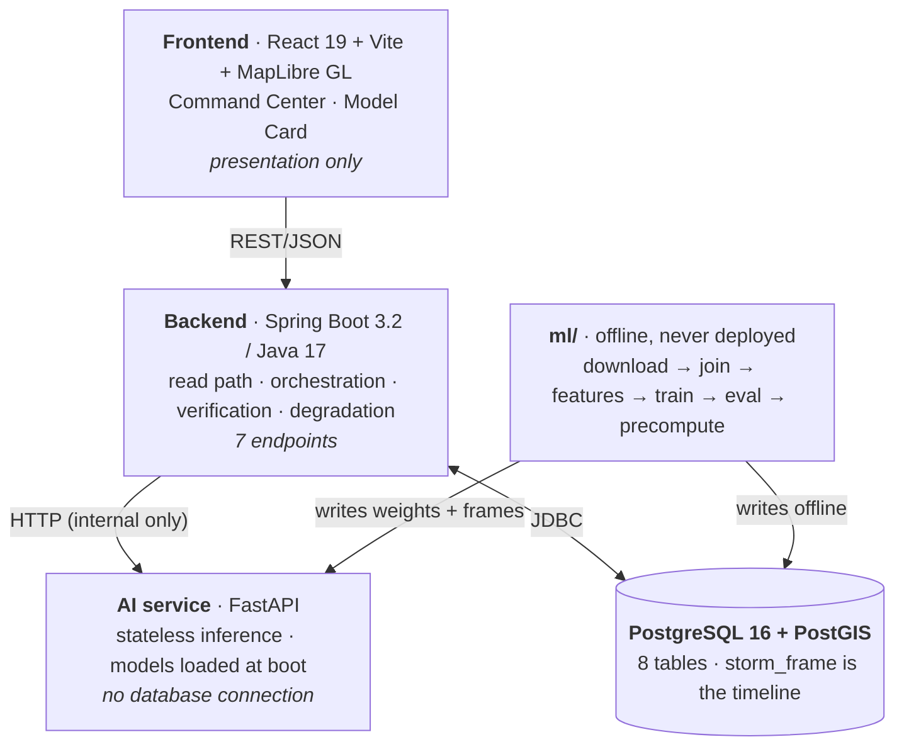
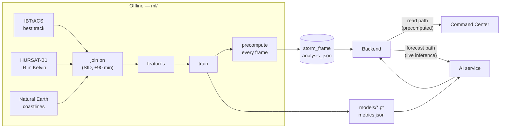

# CycloVision

**A flight recorder for tropical cyclones.**

---

## The official problem statement

> "To develop an Artificial Intelligence (AI) / Machine Learning (ML) based system for
> identification, classification, and prediction of different tropical cyclone patterns
> using multi-source satellite data."

## Objective

Turn raw multi-source cyclone data into understandable, auditable intelligence — and make
every claim the system produces checkable against what actually happened.

## Product vision

You select a storm. You scrub its lifetime. At every instant you see the satellite image,
the storm's position, what the AI reads in the cloud structure, what it predicts happens
next, how confident it is, why — and, because the storms are historical, **what actually
happened**.

That last clause is the product. Most systems say *"our AI predicts X"*. CycloVision says
*"at 06 UTC on 2 May it predicted X; here is 3 May; it was N kilometres off."*

---

## The four differentiators

These four are **locked**. No additional major feature is in scope unless it clearly
strengthens one of them.

| | Feature | What it is |
|---|---|---|
| **A** | **Cyclone Evolution Replay** | One timeline scrubber synchronises the satellite frame, storm position, observed track, structural measurements, intensity estimate and AI analysis. |
| **B** | **Rewind & Verify** | Forecast from any past moment using only data available at or before it, reveal the observed outcome, and report the error in kilometres and knots. |
| **C** | **Analogue Ensemble** | Historical analogues used as an *independent second forecast* — what happened next to storms that evolved like this one — never a decorative "similar storms" card. |
| **D** | **Structural Signature + Grad-CAM** | Deterministic physical measurements from the raw brightness-temperature field, a transparent rule engine on top, paired with the trained model's attention map. |

---

## Architecture at a glance



Two boundaries carry weight:

- **`ml/` owns all data engineering.** The backend never parses IBTrACS or HURSAT. Doing
  it in Java would mean writing the same join twice, in two languages, with two chances to
  disagree about what a match is.
- **`ai-service/` is stateless.** No database connection. It receives a feature payload and
  returns predictions. It is never handed data later than the requested as-of time, and it
  never produces verification.

## Technology stack

| Layer | Choice | Version here |
|---|---|---|
| Frontend | React, Vite, TypeScript, Tailwind v4, MapLibre GL, Recharts, TanStack Query, Zustand, Radix | React 19.2, Vite 8.2, TS 6.0 |
| Backend | Spring Boot, Java, JPA, Flyway, WebClient, springdoc | Spring Boot 3.2.4, Java 17 |
| AI service | FastAPI, Pydantic, NumPy; PyTorch + timm, XGBoost, scikit-learn, Captum, SHAP (Phase 3+) | FastAPI 0.141, Python 3.13 |
| Database | PostgreSQL + PostGIS | 16.4 / 3.4 |
| Offline ML | pandas, xarray, netCDF4, shapely, PyTorch, XGBoost | see `ml/requirements-train.txt` |

---

## Repository structure

| Path | Responsibility | Runtime? |
|---|---|---|
| `frontend/` | Command Center and Model Card. Two routes, two drawers. | runtime |
| `backend/` | Serves precomputed data, orchestrates one AI call, adds verification. | runtime |
| `ai-service/` | Structural metrics, model inference, provenance registry. | runtime |
| `ml/` | Ingest, features, training, evaluation, frame precomputation. | **offline only** |
| `data/` | Gitignored bulk. `MANIFEST.md` is committed and records every source. | offline |
| `models/` | Weights (gitignored) plus `metrics.json` and `model_card.md` (committed). | both |
| `docs/` | This documentation package. | — |
| `scripts/` | PowerShell: `dev-up`, `dev-down`, `test-all`, `demo-check`. | — |

Full breakdown with per-file responsibilities: **[`docs/project-structure.md`](docs/project-structure.md)**.

---

## Conceptual data flow



The timeline reads precomputed rows. Only the forecast path touches a model, which is what
keeps scrubbing instant and keeps a dead AI service from breaking the primary interaction.

---

## Development phases

| Phase | Goal | Status |
|---|---|---|
| **0** | Architecture and runnable skeleton | ✅ complete |
| **1** | Data validation and ingestion | ⬜ not started |
| **2** | Structural analysis on real data | ⬜ |
| **3** | Model training | ⬜ |
| **4** | Precomputation | ⬜ |
| **5** | Backend integration | ⬜ |
| **6** | Frontend completion | ⬜ |
| **7** | Verification and demo polish | ⬜ |

Objectives, prerequisites, outputs and completion criteria per phase:
**[`docs/development-phases.md`](docs/development-phases.md)**.

---

## Honesty rules

These are not stylistic preferences. They are enforced in code, and they are the reason
this project can be trusted under questioning.

### We do not claim a trained Dvorak classifier

There is no free, labelled Dvorak pattern dataset at scale. CycloVision therefore does
**not** train, and does **not** claim, a Dvorak pattern classifier.

What it does instead: measure the underlying physical quantities a Dvorak analyst reads by
eye — eye geometry, symmetry, convective vigour, cloud displacement — directly from the
brightness-temperature field, then assign a morphological regime with a **transparent rule
engine whose thresholds are displayed in the UI**. The regime names are Dvorak-*inspired*
labels for morphologies we can actually measure. See
[`docs/structural-signature.md`](docs/structural-signature.md).

### Every output states what produced it

Nothing heuristic, placeholder or untrained is ever presented as a trained model's output.

| Tag | Meaning | Example |
|---|---|---|
| `OBSERVED` | Ground truth from a dataset. Never a model output. | IBTrACS wind speed; the verification block |
| `TRAINED_MODEL` | Trained and evaluated on held-out storms; carries a metric **and** its baseline | CNN intensity estimate, ΔVmax, P(RI), track |
| `DERIVED_MEASUREMENT` | Deterministic computation over real data. Not fitted. | The seven structural metrics |
| `STATISTICAL_BASELINE` | From the empirical distribution of held-out errors | Confidence cone radii (p67, p90) |
| `ANALOGUE_ENSEMBLE` | Empirical outcome distribution of retrieved analogues | "14 of 20 intensified" |
| `RULE_ENGINE` | Transparent hand-written rules, thresholds shown | Regime label, risk score, situation report |
| `LLM_NARRATION` | Wording over already-computed values; originates no number | Optional report rephrasing (deferred) |
| `DEMO_DATA` | Placeholder. No trained model produced this. | Everything in Phase 0 |

The mechanism, and the four independent ways it is enforced, are in
[`docs/provenance.md`](docs/provenance.md).

> **Current state:** Phase 0 stamps almost everything `DEMO_DATA`, and the UI shows a
> banner saying so. That is correct, not a bug — no model is trained yet, so forecast
> values are reported as **absent rather than estimated**.

---

## Documentation index

**Start here**

| Document | What it covers |
|---|---|
| [`docs/product.md`](docs/product.md) | The product: user, journey, modes, interaction model |
| [`docs/features.md`](docs/features.md) | Every feature — purpose, I/O, provenance, limitations |
| [`docs/architecture.md`](docs/architecture.md) | Layers, invariants, data flow, what each layer may not do |
| [`docs/project-structure.md`](docs/project-structure.md) | Every folder and file, and what belongs in it |

**Data and models**

| Document | What it covers |
|---|---|
| [`docs/data-sources.md`](docs/data-sources.md) | IBTrACS, HURSAT-B1, Natural Earth; fields, formats, licensing |
| [`docs/data-pipeline.md`](docs/data-pipeline.md) | The 14 offline stages, with I/O and failure conditions |
| [`docs/ml-pipeline.md`](docs/ml-pipeline.md) | Features, fusion vector, splits, training, artefacts |
| [`docs/models.md`](docs/models.md) | Every model and component: algorithm, baseline, metric, fallback |
| [`docs/structural-signature.md`](docs/structural-signature.md) | The seven metrics and the regime rule engine, in detail |

**The differentiators**

| Document | What it covers |
|---|---|
| [`docs/rewind-and-verify.md`](docs/rewind-and-verify.md) | Temporal masking, the reveal, error computation, leakage avoidance |
| [`docs/analogue-ensemble.md`](docs/analogue-ensemble.md) | Window, KNN, exclusions, outcome aggregation, interpretation |
| [`docs/provenance.md`](docs/provenance.md) | The eight tags and the four enforcement mechanisms |

**Implementation**

| Document | What it covers |
|---|---|
| [`API_CONTRACT.md`](API_CONTRACT.md) | **Canonical type contract.** TypeScript is the source of truth |
| [`docs/api.md`](docs/api.md) | Every endpoint: caller, DB access, AI invocation, errors |
| [`docs/database.md`](docs/database.md) | All eight tables, constraints, indexes, readers and writers |
| [`docs/ai-service.md`](docs/ai-service.md) | FastAPI internals; Phase 0 placeholders vs final behaviour |
| [`docs/frontend.md`](docs/frontend.md) | Routes, components, state ownership, map layers, design tokens |
| [`docs/development.md`](docs/development.md) | Local setup, ports, running, troubleshooting |

**Process**

| Document | What it covers |
|---|---|
| [`docs/development-phases.md`](docs/development-phases.md) | Phases 0–7 with completion criteria and premature-work warnings |
| [`docs/testing.md`](docs/testing.md) | Test strategy mapped to architectural invariants |
| [`docs/demo-flow.md`](docs/demo-flow.md) | The 4-minute demonstration, second by second |
| [`docs/decisions.md`](docs/decisions.md) | Every locked architectural decision and its reason |
| [`docs/future-work.md`](docs/future-work.md) | Deferred extension points and where they plug in |

---

## Quick start

```powershell
docker compose up -d postgres      # PostGIS on :5433
.\scripts\dev-up.ps1               # backend :8090 · ai-service :8000 · frontend :5173
.\scripts\test-all.ps1             # every suite
```

| Service | URL |
|---|---|
| App | http://localhost:5173 |
| API health | http://localhost:8090/api/health |
| Swagger UI | http://localhost:8090/swagger-ui.html |
| AI service docs | http://localhost:8000/docs |

Ports 5433 and 8090 are deliberate — see [`docs/development.md`](docs/development.md).

`GET /api/health` returning `DEGRADED` and `GET /api/storms` returning `[]` are the
**correct** Phase 0 responses.

---

## Contributing

The API contract is locked. It is written **once**, as TypeScript, in
[`API_CONTRACT.md`](API_CONTRACT.md); Java records and Pydantic models mirror it. Change a
field in all three and run all three suites — nothing detects drift automatically.

Locked decisions are recorded in [`docs/decisions.md`](docs/decisions.md). Reopening one
is a deliberate act, not a refactor.
