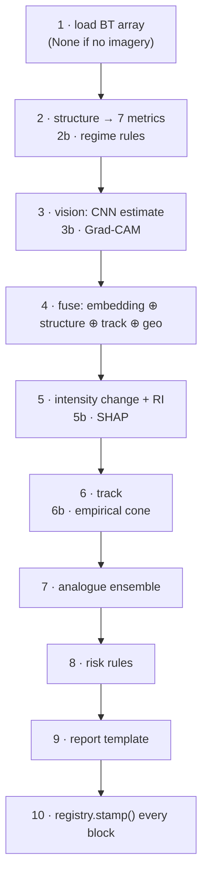

# AI service

FastAPI. Stateless inference. One service with modular internals.

Throughout this document, **Phase 0 behaviour** (what runs today) is stated separately from
**final behaviour** (what runs once models are trained). Blurring the two is the specific
dishonesty this project is built to avoid.

---

## What it is, and is not

| It does | It does not |
|---|---|
| Load model weights once at startup | Connect to a database |
| Read BT arrays under `FRAMES_DIR`, read-only | Download anything |
| Compute structure, inference, risk, report | Contain training code |
| Stamp provenance via the registry | See data later than `asOf` |
| | Produce a verification block |

### Why there is no database connection

Three reasons, in order of importance:

1. **It cannot leak the future.** With no query access, the service can only see what the
   backend hands it — and the backend hands it a masked history. Invariant **I1** stops
   being a matter of care and becomes a matter of capability.
2. **It is restartable and testable in isolation.** No connection pool, no migrations, no
   transaction semantics. `pytest` runs the whole suite with no infrastructure.
3. **Ownership stays clear.** All persistence lives in one place. Two services writing the
   same tables is how schemas drift.

The cost is that the backend must assemble every feature payload. That is a fair trade: it
is a serialisation problem, not a correctness one.

---

## Module map

```
app/
├── main.py            FastAPI app; lifespan → registry.load_all()
├── config.py          three paths and a version string
├── registry.py        ★ the ONLY constructor of a provenance stamp
├── schemas/           common · frame · forecast · analogue · health
├── routers/           health · full · frame · analogues
├── structure/         polar · metrics · regime_rules      ← real, working, tested
├── inference/         base (protocols) · placeholders
├── pipeline/          full_analysis — composes and stamps
├── risk/rules.py      the weighted formula
├── report/template.py deterministic interpolation
└── io/bt_loader.py    path-guarded .npy loading
```

---

## Startup and lifespan

```python
@asynccontextmanager
async def lifespan(app: FastAPI):
    settings = get_settings()
    logger.remove(); logger.add(sys.stderr, level=settings.log_level)
    load_all(settings)          # every model, once
    yield
```

**Models load once, here.** Loading per request would put multi-second latency on the
most-used path in a demo.

The startup log deliberately shouts:

```
model bundle 'phase0' loaded: 9 components, 0 trained.
Every output will be stamped DEMO_DATA until Phase 2.
```

A service that quietly pretended otherwise would undermine the one thing this project is
careful about.

### Configuration

`app/config.py`, via `pydantic-settings`. Four values, no database URL by design:

| Setting | Default | Purpose |
|---|---|---|
| `models_dir` | `../models` | Where weights live |
| `frames_dir` | `../data/frames` | Root for BT arrays; **nothing outside it can be read** |
| `bundle_version` | `phase0` | Stamped on every response for traceability |
| `log_level` | `INFO` | |

---

## The registry — invariant I3

`app/registry.py` exists to make one class of mistake impossible rather than merely
discouraged.

**It is the only place a `Source` is constructed in the entire service.** A component
declares what it *would* claim if loaded and working; the registry decides what it actually
gets to claim.

```python
def effective_provenance(self) -> Provenance:
    if self.declared_provenance == Provenance.TRAINED_MODEL and not self.is_trained:
        return Provenance.DEMO_DATA
    if not self.available:
        return Provenance.DEMO_DATA
    return self.declared_provenance
```

Registration itself refuses a trained-model claim with no held-out metric:

```python
raise ValueError(
    f"component '{key}' claims TRAINED_MODEL but reports no held-out metric; "
    f"a claim we cannot show evidence for is not allowed"
)
```

### Per-request availability

`registry.stamp("structure", available=False)` downgrades a single call without changing
the component's registration.

This exists for a real case: the structural metrics module is genuine, tested code, but it
can only measure a frame that *has* imagery. On a frame without one it is loaded and
working yet cannot run — so its output for **that request** is `DEMO_DATA`. Correctness here
is per-value, not per-component.

### Registered components

Nine. `load_all()` registers real implementations where they exist and placeholders where
they do not.

| Key | Declared | Phase 0 effective | Why |
|---|---|---|---|
| `ir_intensity` | `TRAINED_MODEL` | `DEMO_DATA` | not trained |
| `dvmax_ri` | `TRAINED_MODEL` | `DEMO_DATA` | not trained |
| `track_cliper` | `TRAINED_MODEL` | `DEMO_DATA` | not trained; persistence stands in |
| `track_cone` | `STATISTICAL_BASELINE` | `DEMO_DATA` | no held-out errors to take percentiles of |
| `analogue` | `ANALOGUE_ENSEMBLE` | `DEMO_DATA` | index not built |
| `structure` | `DERIVED_MEASUREMENT` | **per-frame** | real code; needs a BT array |
| `regime_rules` | `RULE_ENGINE` | `DEMO_DATA` | thresholds not yet tuned |
| `risk_rules` | `RULE_ENGINE` | `DEMO_DATA` | the formula lacks a required term |
| `report_template` | `RULE_ENGINE` | **`RULE_ENGINE`** | interpolates computed values; originates nothing |

> ⚠️ `report_template` has no `model_registry` row, so the Model Card omits it. See
> [`api.md`](api.md) §D1.

---

## Schemas

Pydantic models mirroring `API_CONTRACT.md` one-for-one. Two carry invariants.

### `schemas/forecast.py` — invariant I1

`InferFullRequest` has exactly five fields, none of which can hold a future observation:

```python
@model_validator(mode="after")
def enforce_temporal_mask(self) -> "InferFullRequest":
    offenders = [p.t for p in self.history if p.t > self.asOf]
    if offenders:
        raise ValueError(f"temporal mask violation: … earliest offender {min(offenders)}")
    return self
```

**It rejects rather than repairs.** Silently dropping the offending points would hide the
very failure this guard exists to catch.

`InferFullResponse` has no `verification`, `degraded` or `servedFrom` field — invariant
**I2**, asserted structurally by a test over `model_fields`.

### `schemas/frame.py` — two provenance stamps

`StructureBlock` carries `metricsSource` **and** `regimeSource`. The measurements are
deterministic physics; the regime label is an interpretation on top. Merging the stamps
would let a hand-written threshold borrow a measurement's credibility.

---

## Routers

Thin by design: validate, call, return. No logic.

| Router | Endpoint | Notes |
|---|---|---|
| `health.py` | `GET /health` | Effective provenance for all nine components |
| `full.py` | `POST /infer/full` | The only call in normal operation |
| `frame.py` | `POST /infer/frame` | Used by offline precomputation |
| `analogues.py` | `POST /infer/analogues` | Standalone query |

---

## Structure modules — real, working, tested

The only part of the AI service that genuinely computes something today.

### `polar.py`

Resamples a Cartesian BT field onto a polar grid — 60 radial rings to 300 km, 72 azimuths
(5° resolution), bilinear.

Samples outside the input grid are **NaN, not clamped**: an undersized input degrades to
missing data rather than silently repeating its edge pixels.

`background_temperature()` takes the median of the 200–300 km annulus. Subtracting it is
what makes the symmetry decomposition comparable between a frame over a warm ocean and one
over a cooler one.

### `metrics.py`

Seven deterministic measurements. Full methodology, including the eye-enclosure requirement
and the wavenumber normalisation:
[`structural-signature.md`](structural-signature.md).

Absent values are `None`, never guessed. Raises `ValueError` on a non-2-D or all-NaN field.

### `regime_rules.py`

Transparent thresholds → regime + `rulesApplied[]`. Every threshold is a module constant
and every fired rule is returned to the UI.

Phase 0: registered **uncalibrated**, so its output stamps `DEMO_DATA`. Phase 3 tunes the
thresholds on held-out storms and flips it to `RULE_ENGINE`.

---

## Inference modules

### `base.py` — the protocols

Four `Protocol` classes: `FrameModel`, `IntensityChangeModel`, `TrackModel`,
`AnalogueIndex`. Each declares `key`, `version` and **`is_trained`**.

`is_trained` is not decorative — the registry reads it to decide what a component may
claim, so a model that sets it untruthfully gets downgraded rather than believed.

These protocols are what let Phase 0 ship a runnable system and Phase 3 swap in trained
models without touching the pipeline, the contract, or the frontend.

### `placeholders.py` — Phase 0 only

| Placeholder | Returns | Why |
|---|---|---|
| `PlaceholderIntensityEstimator` | `None` for every field | An untrained CNN genuinely has nothing to say about an image |
| `PlaceholderIntensityChangeModel` | `None`, empty SHAP | Same |
| `PersistenceTrackModel` | Straight-line extrapolation; **no cone radii** | See below |
| `PlaceholderAnalogueIndex` | `k: 0`, no matches | There is no historical index to search |

**Why persistence rather than random numbers.** Random values make a demo look alive when it
is not — precisely the dishonesty the provenance system exists to prevent. Persistence is
also the baseline the real track model must beat in Phase 3, so wiring it in now means the
comparison is already plumbed.

**Why it returns no cone.** A cone is meant to be percentiles of measured error, and
persistence has no such measurement yet. An invented radius would be the single most
misleading number the product could display, because the cone's width *is* the visual
statement about uncertainty.

Every placeholder is registered `available=False`, so everything it produces is stamped
`DEMO_DATA`. **It is structurally impossible for a Phase 0 output to claim
`TRAINED_MODEL`.**

### Phase 3 replacements

`ir_intensity.py`, `dvmax_ri.py`, `track_cliper.py`, `analogue_index.py`, `gradcam.py`,
`shap_explain.py`. Each implements its protocol; `load_all()` registers it with
`is_trained=True`, a `MetricInfo`, and `available=True`. No other file changes.

---

## The pipeline

`pipeline/full_analysis.py` — the only place components are wired together, and the last
step before a response leaves.



Two things it will not do: see data later than `asOf` (the schema rejects that before this
code runs), and produce a verification block.

**`OBSERVED` is the one provenance the pipeline asserts without the registry** — when
echoing back the input it was handed, it is not producing anything.

**Absent input yields absent output.** No BT array → structure and vision return empty
blocks stamped `DEMO_DATA`, not zeros.

---

## Risk engine

`risk/rules.py`. A weighted formula, returned **with** the score:

```
0.35·vmaxNorm + 0.25·riProbability + 0.25·(1 − coastDistNorm) + 0.15·categoryNorm
```

Thresholds: >0.80 CRITICAL, >0.60 HIGH, >0.35 MODERATE, else LOW.

**All four terms are required.** If any is missing the score is `None` and only the
available terms are returned — a partial score presented as a whole one is exactly the kind
of number this project refuses to produce.

Rules rather than a model because a supervised risk model needs labelled outcome severity
on a discrete scale, which does not cleanly exist in IBTrACS. Fitting one on proxies would
produce a number that looks authoritative and means very little.

> ⚠️ The score is currently **structurally uncomputable**: `HistoryPoint` has no `category`
> field, so `categoryNorm` can never be supplied. See [`api.md`](api.md) §D2.

---

## Report generation

`report/template.py`. Plain string interpolation over already-computed values. Instant,
offline, and **it cannot invent a number — it can only restate ones that exist.**

Sentences are emitted only when their inputs exist. With nothing trained it correctly
produces:

> "…No trained model has contributed to this summary: the model bundle is not yet trained,
> so forecast fields are unavailable rather than estimated."

An LLM pass is deferred; it would be tagged `LLM_NARRATION` and permitted to rephrase but
never to originate a figure, with the template output retained for comparison.

---

## BT loader

`io/bt_loader.py`. Reads the `.npy` Kelvin arrays, not the display PNGs — quantising to
8 bits loses about half a Kelvin per level, enough to move the metric thresholds.

Every path is resolved under `FRAMES_DIR` and checked, because these paths arrive over HTTP
from another service:

```python
if not candidate.is_relative_to(root):
    raise FrameNotAvailable("refusing to read outside the frames directory")
```

**A missing file returns `None`, not an error.** A frame without imagery is normal, so it is
a return value; a traversal attempt or an unreadable file is not, so it raises.

---

## Testing

Six modules, no infrastructure required. 74 tests passing.

| Module | Guards |
|---|---|
| `test_temporal_mask.py` | **I1** — rejection, boundary inclusion, contract shape |
| `test_provenance.py` | **I3** — downgrades, evidence requirement, Phase 0 bundle state |
| `test_contract_shapes.py` | **I2** + contract — every block stamped, no verification field |
| `test_structure_metrics.py` | Physics, on synthetic fields with known answers |
| `test_regime_rules.py` | Reachability, transparency, boundaries |
| `test_health.py` | Startup and reporting |

Synthetic fields are the right test for the metrics: a perfect annulus **must** score
symmetry ≈ 1, and a warm hole in a cold ring **must** be detected at the radius it was
constructed at. No real satellite data is needed to prove the physics is implemented
correctly — which is why these run in Phase 0, before any dataset exists.

---

## Phase 0 vs final behaviour

| Aspect | Phase 0 (today) | Final (Phase 3+) |
|---|---|---|
| Components registered | 9 | 9 |
| Trained | 0 | 4 |
| `GET /health` | `DEGRADED` | `UP` |
| Structural metrics | real, but no BT arrays exist | real, on real frames |
| Regime label | `DEMO_DATA` (uncalibrated) | `RULE_ENGINE` (tuned) |
| Vision estimate | `None` | Vmax + category + Grad-CAM |
| Intensity change | `None` | ΔVmax + P(RI) + SHAP |
| Track | persistence, no cone | CLIPER + empirical cone |
| Analogues | `k: 0` | k = 20 with outcomes |
| Risk | `None` (two blockers) | scored, with terms |
| Report | works, states nothing is trained | works, summarises real results |

The transition requires **no contract change and no frontend change** — only trained
weights and updated registrations. That is what the protocols in `base.py` are for.
