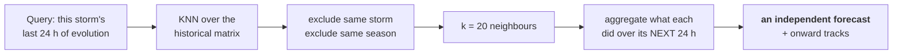

# Analogue ensemble

**Differentiator C.** Historical analogues used as an *independent second forecast* — never
as a decorative "similar storms" card.

> **Status: not implemented.** The contract, endpoint, drawer, exclusion rules and database
> table exist. The index is empty, so it returns `k: 0` stamped `DEMO_DATA`. Phase 3 builds
> it.

---

## The idea

The blueprint's original framing was: *"here are three storms that looked similar."* That is
a nice card and nothing more.

The reframing that makes it a feature: **retrieve neighbours on the last 24 hours of
evolution, then aggregate what happened to them next.**

That converts a lookup into a forecast — and specifically into a forecast that is
**statistically independent** of the gradient-boosted models, so agreement between the two
is genuine evidence rather than one model repeating itself.

Analog Ensemble (AnEn) is a real, published forecasting technique in meteorology. This is
not a hackathon invention dressed up in scientific language.



---

## The 24-hour evolution window

The query is a **trajectory through feature space**, not a snapshot.

Two storms can look identical at one instant and be doing completely different things — one
intensifying through that state, one decaying through it. A snapshot cannot tell them apart;
24 hours of evolution can.

Each row of the historical matrix is one such window, keyed by `(sid, obs_time)` where
`obs_time` is the window's **end** — the equivalent of "now" for that historical moment.

### Feature representation

Standardised (z-scored) across the corpus:

| Feature | Why |
|---|---|
| `vmaxKt` | Current intensity |
| `deltaVmax12h` | Short-term trend |
| `deltaVmax24h` | The evolution signal |
| `pressureHpa` | Independent intensity measure |
| `lat` | Latitude strongly conditions behaviour |
| `translationSpeedKt` | Fast movers behave differently |
| `headingDeg` | Direction of travel |
| `month` | Seasonal environment proxy |
| `axisymmetry` | **Structural** — organisation |
| `minBtK` | **Structural** — convective vigour |
| `cdoFraction100km` | **Structural** — core extent |

The three structural features are what make this *multi-source* rather than a track-only
lookup. Two storms with identical tracks but different degrees of organisation are correctly
treated as different.

> **Standardisation is not optional, and the scaler must be persisted.** Latitude spans ~40
> units, `axisymmetry` spans 1. Without z-scoring, latitude alone would dominate the
> distance metric. Querying with a differently-scaled vector silently returns nonsense
> neighbours — no error, just wrong answers.

### Causality

Every feature in the window must be computable from observations at or before the window's
end. `deltaVmax24h` is backward-looking. This is invariant **I1** applied to the analogue
features, exactly as in [`rewind-and-verify.md`](rewind-and-verify.md).

---

## Nearest-neighbour search

| | |
|---|---|
| **Library** | `sklearn.NearestNeighbors` |
| **Metric** | Euclidean over z-scored features *(cosine is a Phase 3 alternative to evaluate)* |
| **Index** | Precomputed, held in memory, loaded once at boot |
| **k** | **20** |
| **Latency** | Sub-millisecond for a corpus of this size |

No approximate search (FAISS or similar). The corpus is tens of thousands of windows at
most; exact search is fast enough, and exactness removes a class of "why did this neighbour
appear?" questions.

### Why k = 20

| k | Problem |
|---|---|
| 5 | Outcome statistics are too noisy. "3 of 5 intensified" is not a distribution. |
| **20** | **Enough for a meaningful fraction, few enough that the closest matches are genuinely close.** |
| 100 | Dominated by loosely-similar storms; the aggregate regresses to climatology. |

At k = 20, "5 of 20 rapidly intensified — 25% against a 5% base rate" is a statement with
enough support to be worth making, and each retained neighbour is still recognisably
similar.

---

## Exclusion rules

Returned in the response as `exclusions: ["same-storm", "same-season"]` and displayed in the
drawer.

### Same storm — mandatory

A storm must not be its own analogue. Adjacent windows of the same cyclone are
near-duplicates, and retrieving them would produce a spectacularly confident, entirely
circular forecast.

### Same season — mandatory for verification honesty

Excludes storms from the same year, not merely the same storm.

The reason is subtler: storms in the same season share large-scale environmental conditions
— the same ENSO state, the same monsoon phase, the same basin-wide SST anomaly. A same-season
neighbour partially encodes *the answer we are trying to forecast*. Including one would be a
leak with a plausible-looking cover story.

### What is *not* excluded

Different storms in different years from the same basin. That is the point — basin-level
similarity is signal, not leakage.

---

## Outcome aggregation — where it becomes a forecast

For each retrieved neighbour, look up **what happened to it over the following 24 hours**.

```json
{
  "k": 20,
  "outcome": {
    "intensifiedCount": 14,
    "weakenedCount": 6,
    "meanDeltaVmax24hKt": 16,
    "riCount": 5,
    "riFraction": 0.25,
    "riBaseRate": 0.052
  }
}
```

| Field | Meaning |
|---|---|
| `intensifiedCount` / `weakenedCount` | Direction, by simple sign |
| `meanDeltaVmax24hKt` | Central tendency of the outcome distribution |
| `riCount`, `riFraction` | How many underwent RI (≥30 kt / 24 h) |
| `riBaseRate` | **The climatological rate, always alongside** |

**The base rate always travels with the fraction.** "5 of 20 rapidly intensified" is
meaningless until the reader knows the background rate is about 1 in 20. Together they say
something: roughly five times climatology.

The aggregate is presented **first** in the drawer; the individual storms come second. The
aggregate *is* the forecast; the named storms are the evidence for it. Reversing that order
is exactly how this becomes a "similar storms" card again.

### The independent cross-check

The demo line that this feature exists to enable:

> *"Our fused model says +8 knots. Independently, 14 of the 20 closest historical analogues
> intensified, averaging +16. Two completely different methods agreeing is evidence; one
> model asserting is not."*

And when they disagree, that is worth saying too — disagreement is information about
confidence.

---

## Onward tracks

Each match carries `onwardTrack`: the positions that storm occupied over its following
24 hours, rendered as faint spaghetti beside the model's cone.

It answers *"where did storms like this actually end up?"* geographically, which the numeric
outcome cannot.

> ⚠️ **Coordinate order.** Stored and transmitted as `[lat, lon]` pairs. MapLibre requires
> `[lon, lat]`, and `layers/track.ts` swaps them. The `API_CONTRACT.md` example is
> authoritative.

Rendered at low opacity in the neutral colour, beneath everything else — context, not
subject.

---

## What an analogue result means, and does not

This distinction belongs in the demo narration, not only in the docs.

### It means

- **These historical moments were the closest matches** to the current storm's recent
  evolution, in a defined feature space.
- **This is what those storms did next.** An empirical distribution over real outcomes.
- **This forecast is statistically independent** of the trained models.
- **Similarity is quantified** and shown per match, so a weak match is visible as a weak
  match.

### It does not mean

- **Not causal.** Similar antecedents do not cause similar outcomes. The features are a
  useful summary, not a complete description of the atmosphere.
- **Not a probability.** "14 of 20 intensified" is a sample frequency from k = 20, with
  wide uncertainty. It is not a calibrated 70% probability.
- **Not conditional on everything that matters.** The window omits SST, shear and upper-level
  divergence. Two storms matching on our features may sit in very different environments.
- **Not "this storm will behave like Fani".** It is *"storms whose recent evolution
  resembled this one went on to do the following"* — a materially weaker and more honest
  claim.
- **Not reliable for unusual storms.** A genuinely unprecedented storm has no good
  analogues, and the similarity scores will show it. **Low similarity must be read as low
  similarity**, which is why the score is displayed per match rather than hidden.

---

## Provenance

Tagged `ANALOGUE_ENSEMBLE`, deliberately distinct from `TRAINED_MODEL`.

Nothing here is fitted. It is retrieval plus aggregation over observed outcomes. Borrowing
`TRAINED_MODEL` would overstate it; `OBSERVED` would understate the retrieval step, which
involves real choices (feature set, k, exclusions, metric).

---

## Implementation notes

| Concern | Decision |
|---|---|
| Index build | `ml/train/build_analogue_index.py` → `models/analogue_index_v1.npz` |
| Loaded | Once at AI service boot, held in memory |
| Scaler | Persisted with the index; **never re-fit at query time** |
| Storage | `analogue_match` rows per forecast run, with outcomes and onward tracks |
| Names | `match_sid` joins to `storm` for display names |
| `match_time` | Matters as much as `match_sid` — an analogue is a *moment*, not a storm |

### Phase 0 placeholder

`PlaceholderAnalogueIndex` returns `k: 0`, no matches, exclusions listed, stamped
`DEMO_DATA`.

There is no historical feature matrix yet, so there are genuinely no analogues to retrieve.
**Inventing plausible-looking storm names would be the worst kind of demo fakery** — it is
the one placeholder where fabrication would be most tempting and most convincing.

---

## Evaluation

The analogue ensemble is not "trained", but it can still be scored — and should be, because
a retrieval method with no measured skill is a liability.

| Question | How |
|---|---|
| Does it beat climatology? | Compare `meanDeltaVmax24hKt` against the corpus mean ΔVmax on held-out storms |
| Are similarity scores meaningful? | Correlate similarity rank against outcome error |
| Is the RI fraction informative? | Compare against the base rate on held-out cases |
| Does k = 20 matter? | Sweep k ∈ {5, 10, 20, 50} on the validation split |

Results go in `models/metrics.json` and onto the Model Card, like any other component.

**If the analogue ensemble shows no skill, report that.** It would still be worth showing as
a cross-check, but the demo narration would have to change from "two methods agreeing is
evidence" to something considerably weaker — and the Model Card would say so.

---

## Limitations

- Coverage is bounded by the historical record; unusual storms will have poor matches.
- Basin imbalance: a North-Indian-only corpus limits analogue diversity, while a global one
  introduces basin mismatch. Phase 3 must choose and document.
- HURSAT coverage ends in 2015, so structural features are unavailable for later storms —
  those windows would be track-only, which changes what "similar" means.
- k = 20 is a fixed choice, not adaptive to local density.
- Euclidean distance weights every standardised feature equally, which is a choice, not a
  finding.
