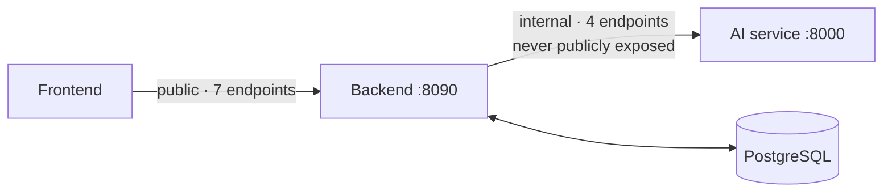
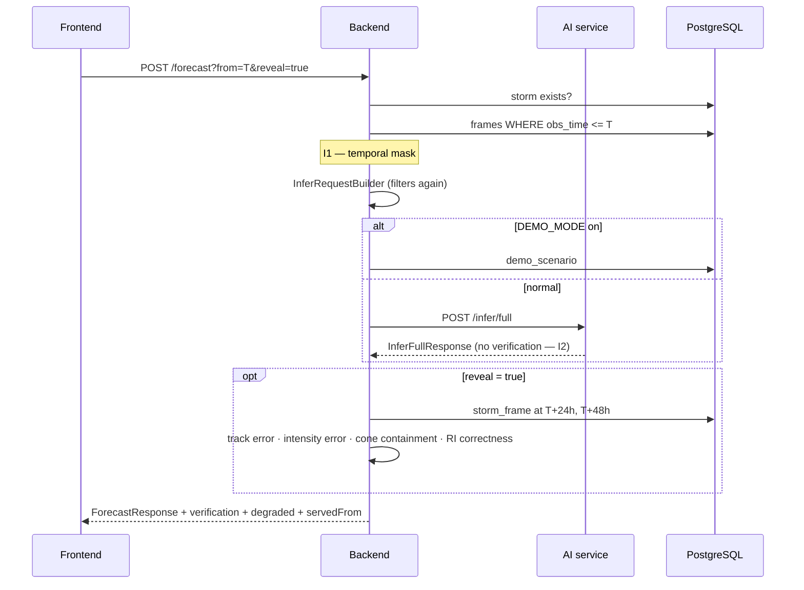

# API

Endpoint reference. **[`API_CONTRACT.md`](../API_CONTRACT.md) remains the canonical type
contract** — this document explains behaviour, callers, side effects and errors; it does
not redefine types.

Two distinct surfaces:



---

## Error envelope

Every non-2xx response from the backend is an `ApiError`:

```json
{ "code": "STORM_NOT_FOUND", "message": "No storm with sid nope", "detail": null }
```

| Code | Status | When |
|---|---|---|
| `STORM_NOT_FOUND` | 404 | No storm with that SID |
| `FRAME_NOT_FOUND` | 404 | No observation at that instant, or none at or before it |
| `AI_SERVICE_UNAVAILABLE` | 503 | AI service down **and** no cached or demo result exists |
| `INVALID_TIME` | 400 | Not a parseable ISO-8601 instant with offset |
| `MODEL_NOT_LOADED` | 404 | `DEMO_MODE` is on but no scenario exists for that storm |
| `INTERNAL_ERROR` | 500 | Unexpected — logged server-side, never leaked to the client |

`TEMPORAL_MASK_VIOLATION` (422) is reserved in the contract for a mask violation. In
practice the backend filters before sending, so this surfaces from the **AI service** as a
Pydantic 422 rather than from the backend. A backend-side 422 would mean a bug in
`InferRequestBuilder`.

Handled centrally by `GlobalExceptionHandler`. A stack trace never reaches a client.

---

# React → Spring Boot (public)

Seven endpoints. That is the entire public surface.

| # | Method | Path | DB | AI | Status |
|---|---|---|---|---|---|
| 1 | GET | `/api/health` | ✅ | ✅ | ✅ working |
| 2 | GET | `/api/storms` | ✅ | ✗ | ✅ working |
| 3 | GET | `/api/storms/{sid}` | ✅ | ✗ | ✅ working |
| 4 | GET | `/api/storms/{sid}/frames/{isoTime}` | ✅ | ✗ | ✅ working |
| 5 | POST | `/api/storms/{sid}/forecast` | ✅ | ✅ | ✅ working |
| 6 | GET | `/api/model-card` | ✅ | ✗ | ✅ working |
| 7 | POST | `/api/analyze/image` | ✗ | ✅ | ⬜ **not implemented** |

Static media is served at `/media/**` from `MEDIA_DIR` (paths only are stored in the
database).

---

## 1. `GET /api/health`

| | |
|---|---|
| **Purpose** | Report the true state of the stack, including whether anything is actually trained |
| **Caller** | Frontend header (30 s poll); `demo-check.ps1` |
| **DB** | Yes — a count, to prove connectivity |
| **AI** | Yes — proxies `GET /health` with a 3 s timeout |
| **Response** | `HealthResponse` |

```json
{
  "status": "DEGRADED",
  "aiService": { "status": "UP", "models": [ /* 9 entries */ ] },
  "database": "UP",
  "demoMode": false,
  "bundleVersion": "phase0"
}
```

**`status` is `UP` only when the AI service is reachable, the database is up, *and* at
least one model is genuinely trained.** `DEGRADED` is therefore the correct Phase 0 answer,
not a failure.

**`aiService.status` means reachability (`UP`/`DOWN`), not the AI service's own opinion of
itself.** The AI service reports `DEGRADED` about its bundle; `AiServiceClient` normalises
that to `UP`, because conflating "we cannot reach it" with "it is reachable and honest
about being untrained" would make the field useless. The bundle state stays visible in the
per-model list.

Never throws. An unreachable AI service yields `{"status": "DOWN", "models": []}`.

---

## 2. `GET /api/storms`

| | |
|---|---|
| **Purpose** | The storm rail |
| **Caller** | Frontend, once per session (`staleTime: Infinity`) |
| **DB** | Yes | **AI** | No |
| **Response** | `StormSummary[]`, ordered by season descending then name |

Each entry carries `frameCount`, `framesWithImagery`, `isDemo` and `split`. `split` is
surfaced deliberately: "held out" is the fact that makes everything the verification screen
later claims meaningful.

Returns `[]` when nothing is ingested. That is correct in Phase 0, not an error.

---

## 3. `GET /api/storms/{sid}`

| | |
|---|---|
| **Purpose** | **Metadata plus the storm's entire frame index, in one response** |
| **Caller** | Frontend on storm selection (`staleTime: Infinity`) |
| **DB** | Yes — one indexed query | **AI** | **No — invariant I5** |
| **Response** | `StormDetail` |
| **Errors** | `STORM_NOT_FOUND` |

This is the single most important design decision in the API. The timeline scrubber reads
the returned `frames[]` array **in memory**, so dragging it issues no network request and
triggers no inference. A storm of ~74 frames is roughly 15 KB.

`TrackFrame` is deliberately thin — exactly what the scrubber and sparkline need:
position, observed intensity, `cnnVmaxKt` (the dashed line), `regime`, `imageUrl`,
`hasAnalysis`. Full per-frame detail comes from endpoint 4 on demand.

`sources` carries provenance for the thin-frame fields, so the sparkline's two lines can be
labelled correctly without a second call.

---

## 4. `GET /api/storms/{sid}/frames/{isoTime}`

| | |
|---|---|
| **Purpose** | Full analysis at one instant |
| **Caller** | Frontend at the cursor, with ±5 frame prefetch |
| **DB** | Yes | **AI** | **No — reads precomputed `analysis_json`** |
| **Response** | `FrameAnalysis` |
| **Errors** | `INVALID_TIME` (400), `FRAME_NOT_FOUND` (404) |

`isoTime` must be a full ISO-8601 instant with offset, e.g. `2019-05-02T06:00:00Z`.

When `analysis_json` is absent, structure and vision return **null fields stamped
`DEMO_DATA`** — absent, never zeroed. `StormService` also re-applies the trained-flag rule
when parsing stored provenance, so a stale row claiming `TRAINED_MODEL` is downgraded
before it reaches the browser.

---

## 5. `POST /api/storms/{sid}/forecast?from={iso}&reveal={bool}`

**The only AI call in the system.**

| | |
|---|---|
| **Purpose** | Rewind & Verify — forecast from a past moment, optionally revealing truth |
| **Caller** | Frontend, on explicit user action |
| **DB** | Yes — mask, cache, persist, verify | **AI** | Yes — one call |
| **Response** | `ForecastResponse` |
| **Errors** | `STORM_NOT_FOUND`, `FRAME_NOT_FOUND`, `AI_SERVICE_UNAVAILABLE`, `INVALID_TIME` |

| Parameter | Meaning |
|---|---|
| `from` | **T** — the temporal-mask boundary. Only observations at or before it are used. |
| `reveal` | Whether ground truth is attached **afterwards**. Never changes what the models were given. |

### Sequence



### Degradation

| Situation | Result |
|---|---|
| AI responds | `degraded: false`, `servedFrom: "live"` |
| AI times out (8 s) or errors | cached run → demo scenario, `degraded: true`, `servedFrom: "cache"` / `"demo"` |
| Neither available | `503 AI_SERVICE_UNAVAILABLE` |
| `DEMO_MODE=true` | Never calls the AI service; `servedFrom: "demo"` |

**No retry.** A demo that hangs for thirty seconds is worse than one that falls back in
eight. It never fabricates a forecast.

### What comes back

One response carries everything the Command Center needs — current state, structure, vision
estimate, intensity and track forecasts, analogue ensemble, risk, narrative report, and
(when revealed) verification. There is deliberately no follow-up call for any of it.

Full shape: [`API_CONTRACT.md`](../API_CONTRACT.md).

---

## 6. `GET /api/model-card`

| | |
|---|---|
| **Purpose** | The credibility screen |
| **Caller** | Frontend `/model` route |
| **DB** | Yes — `model_registry` | **AI** | No |
| **Response** | `ModelCard` |

Assembled from two sources: `model_registry` rows (what is loaded and whether it is
trained) and `models/metrics.json` (held-out numbers written by `ml/eval/`).

**Renders correctly when `metrics.json` is absent** — every model reads "not trained",
datasets are empty, the ablation is "not measured". That is the honest report, and it is
why the page is built before there is anything flattering on it.

A registry row that is not trained is reported as `DEMO_DATA` regardless of what its
`provenance` column says — the same defensive rule applied throughout.

`notBuilt` is hardcoded in `ModelCardService` and lists five deliberate omissions. It is
not decoration: it pre-empts the hardest questions a technical judge can ask.

---

## 7. `POST /api/analyze/image` ⬜ not implemented

| | |
|---|---|
| **Purpose** | Upload an arbitrary IR image → classification + Grad-CAM ("unseen data" demo) |
| **Status** | Specified in the contract; **no controller exists** |
| **Phase** | Deferred — [`future-work.md`](future-work.md) |

Listed here because it appears in `API_CONTRACT.md`. Calling it today returns 404 from
Spring's default handler, not an `ApiError`.

---

# Spring Boot → FastAPI (internal)

Never publicly exposed. No authentication, because it is not reachable from outside the
host.

| # | Method | Path | Purpose | Status |
|---|---|---|---|---|
| 1 | GET | `/health` | Loaded components, versions, provenance, `isTrained` | ✅ |
| 2 | POST | `/infer/full` | The only call in normal operation | ✅ |
| 3 | POST | `/infer/frame` | One frame; used by the offline precompute job | ✅ |
| 4 | POST | `/infer/analogues` | Standalone analogue query | ✅ |

## `POST /infer/full`

**Request:** `InferFullRequest` — exactly five fields: `sid`, `asOf`, `history[]`,
`frameRef`, `options`.

> **Invariant I1.** None of those fields can carry a future observation, and a
> `model_validator` rejects any `history[].t > asOf` with **422**, naming the earliest
> offender. It rejects rather than silently dropping, because a caller that sends the future
> has a bug worth surfacing.

**Response:** `InferFullResponse` — `ForecastResponse` **minus** `verification`, `degraded`
and `servedFrom`.

> **Invariant I2.** There is no verification field in either direction. Ground truth is the
> backend's to attach, from the database, after this response has already been produced.
> Tests assert the absence of the field in both languages.

**Pipeline order:** structure → vision → fusion → intensity change → track → analogues →
risk → report → stamp. Detail: [`ai-service.md`](ai-service.md).

## `POST /infer/frame`

Single-frame analysis. Used by `ml/precompute/precompute_frames.py` to fill
`storm_frame.analysis_json`, and by the deferred image-upload feature.

⚠️ Currently returns `ObservedBlock(lat=0, lon=0)` because the request carries no position.
Harmless for precomputation (the caller already knows the position) but the field is
meaningless; Phase 4 should either accept a position or drop the block.

## `POST /infer/analogues`

Standalone query, split out so the analogue drawer can refresh independently and the index
can be exercised alone during Phase 3. Returns an empty, correctly-stamped block until the
index is built.

## `GET /health`

Reports every registered component with its **effective** provenance — what it is actually
allowed to claim, after the registry's downgrade rules. `status` is `UP` only if at least
one component is trained.

---

# Known discrepancies

Flagged rather than silently resolved, per the documentation brief. **None of these are
resolved in code by this documentation pass.**

### D1 — `report_template` is missing from `model_registry`

The AI service registers **nine** components; `V3__seed_registry.sql` seeds **eight**.
`report_template` has no database row.

**Effect:** the Model Card omits it. `/api/health` shows nine, `/api/model-card` shows
eight. Two existing tests encode both numbers (`test_health.py` expects 9,
`SchemaMigrationTest` expects 8), so both currently pass and neither catches the mismatch.

**Fix (Phase 5):** add a ninth seed row in a new migration, or explicitly document
`report_template` as service-internal. **Decision required.**

### D2 — The risk score can never be computed, for two independent reasons

`RiskResult` requires all four terms — `vmaxNorm`, `riProbability`, `coastDistNorm`,
`categoryNorm`.

1. `riProbability` needs a trained model (expected, resolves in Phase 3).
2. **`categoryNorm` is structurally unreachable.** `HistoryPoint` has no `category` field,
   so `full_analysis.py` passes `category=None` to both `_score_risk` and the report
   builder. Even with every model trained, the score stays `null`.

**Fix requires a decision:** add `category` to `HistoryPoint`, or move risk scoring into the
backend where `storm_frame.category` is available. Both are defensible; the second keeps the
AI service purer.

Compounding this, **the category vocabulary itself is undefined** — `CATEGORY_SCALE` names
seven IMD-style strings that nothing in the repository derives from IBTrACS wind speed. See
[`data-sources.md`](data-sources.md) §"Open questions".

### D3 — `nearestCoast` and `landfallWindowHours` are never populated

Both are in the contract and rendered by the frontend. No coastline query exists; the
`coastline_segment` table is unread. Phase 5 work.

### D4 — `predictedVmaxKt` on `TrackPoint` is never populated

In the contract and stored in `forecast_point`. The Phase 0 persistence baseline correctly
returns `null`; Phase 3 must decide whether the track model or the intensity model supplies
it.

### D5 — Forecast runs are not persisted, so the cache never hits

`ForecastService` looks up a cached run, but nothing writes `forecast_run`,
`forecast_point` or `analogue_match`. `fallback()` goes straight to demo scenarios.

**Effect:** the `servedFrom: "cache"` branch is unreachable today. Phase 5 work; the schema
and repositories already exist.

### D6 — `/api/analyze/image` is in the contract but has no implementation

See endpoint 7 above.

### D7 — `ObservedBlock` from `/infer/frame` carries placeholder coordinates

See `/infer/frame` above.

---

# Conventions

| | |
|---|---|
| Timestamps | ISO-8601 with offset, UTC. `write-dates-as-timestamps: false`. |
| Nulls | Omitted from JSON (`NON_NULL`). A missing field means "not available", never zero. |
| Coordinates | API and database use `lat`/`lon` named fields. `onwardTrack` is `[lat, lon]` pairs; MapLibre needs `[lon, lat]` and the map layer swaps them. |
| Provenance | Every analysis block has a mandatory `source`. `StructureBlock` has two; `TrackForecast` has two. |
| Idempotency | `POST /forecast` is idempotent for a given `(sid, from, bundle)`. |
| CORS | `/api/**` and `/media/**` allow the Vite origin only. |
| Versioning | None. The contract is locked; changes are coordinated across all three services. |
