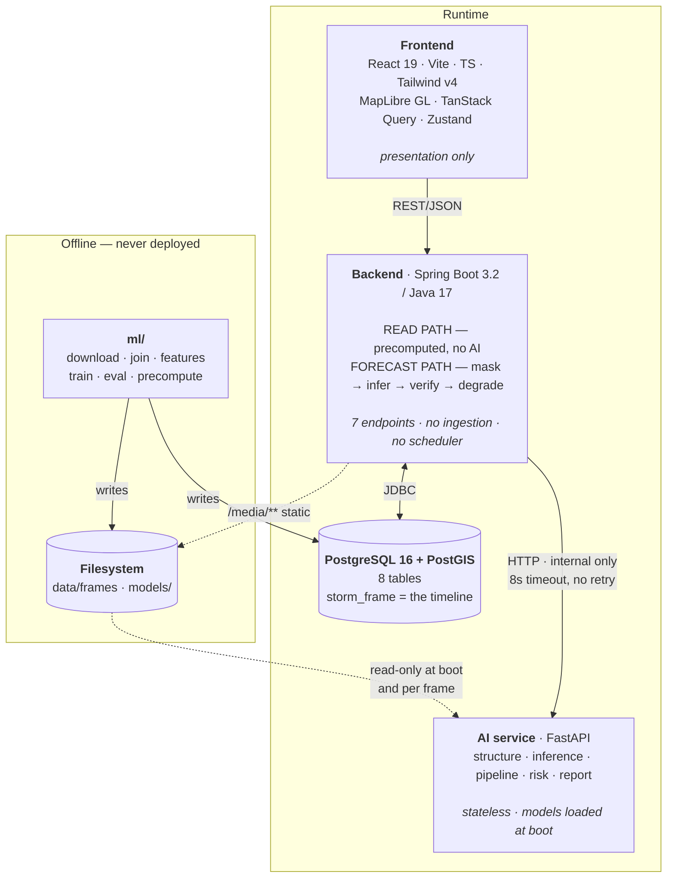
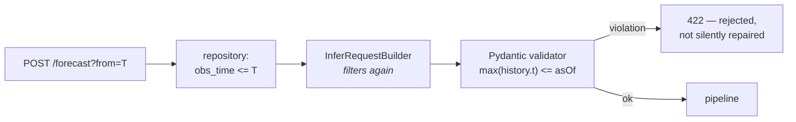
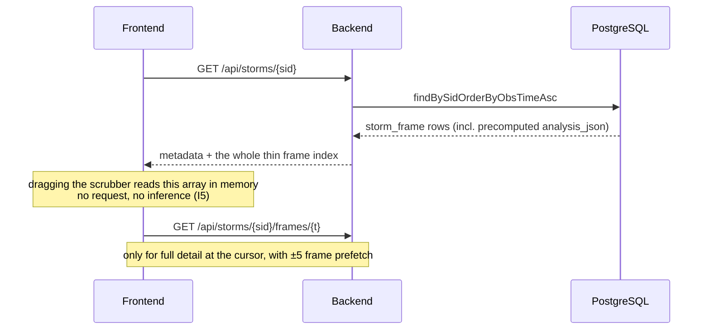
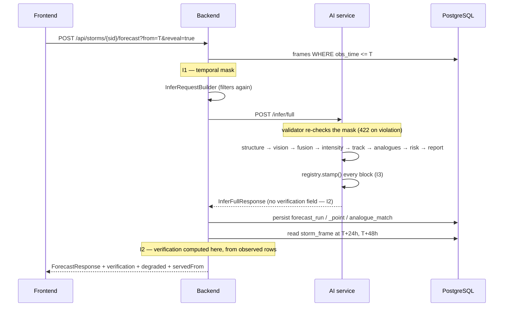
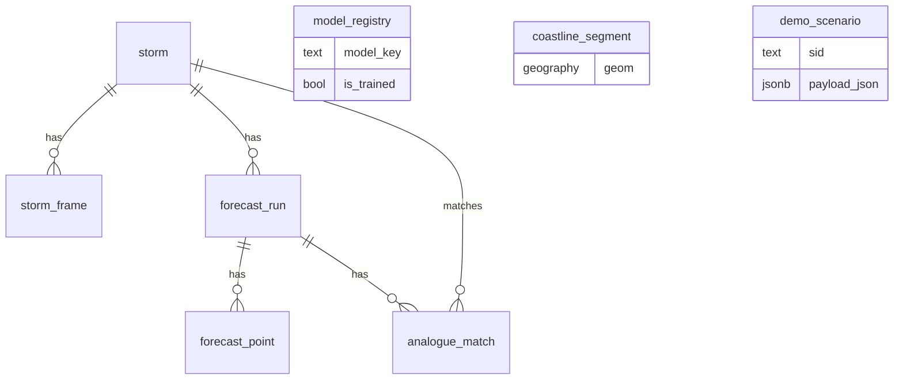

# Architecture

The complete system architecture, the rules each layer lives by, and the five invariants
that hold the design together.

---

## 1. The shape



## 2. Layer contracts

Each layer has an explicit list of what it may and may not do. These are not stylistic —
they are the reason the system stays debuggable and the invariants stay provable.

### Frontend — `frontend/`

| May | May not |
|---|---|
| Render, hold UI state, cache server responses | Call the AI service directly |
| Read `/api/**` and `/media/**` | Compute forecasts, errors, or metrics |
| Own the timeline cursor and selected storm | Contain business logic or thresholds |

The frontend never computes a number that appears as a result. Formatting is presentation;
arithmetic is not.

### Backend — `backend/`

| May | May not |
|---|---|
| Read the database (the read path) | Parse IBTrACS or HURSAT |
| Orchestrate exactly one AI call per forecast | Run models or load weights |
| Persist forecast runs, points, analogue matches | Run scheduled jobs or ingestion |
| **Own verification** — read ground truth from the DB | Send ground truth to the AI service |
| Serve `/media/**` static files | Expose the AI service publicly |
| Degrade gracefully to cache or demo scenarios | Fabricate a forecast |

The backend is the only component that may look at the future, and only after inference has
already returned.

### AI service — `ai-service/`

| May | May not |
|---|---|
| Load model weights once at startup | Connect to the database |
| Read BT arrays under `FRAMES_DIR` (read-only) | Download anything |
| Compute structure, inference, risk, report | Contain training code |
| Stamp provenance via the registry | See data later than `asOf` |
| | Produce a verification block |

Stateless by construction: restartable at any moment, testable in isolation, and incapable
of leaking the future because it is never given it.

### Offline ML — `ml/`

| May | May not |
|---|---|
| Download IBTrACS, HURSAT, Natural Earth | Be imported by `ai-service` at request time |
| Join, engineer features, train, evaluate | Be deployed anywhere |
| Write `storm`, `storm_frame`, `model_registry` | Serve HTTP |
| Write `data/` and `models/` | Read from the running services |

**One shared-code exception.** `ml/features/structural.py` and
`ai-service/app/structure/metrics.py` must produce identical numbers, so there is exactly
one implementation. It lives in `ai-service/app/structure/`, and `ml/` imports it via the
path in `ml/config.yaml`. Two copies would drift, and a drift there would mean the metrics
a model trained on are not the metrics it is served.

---

## 3. Why each layer is where it is

**Spring Boot is kept, on two conditions.** Three services let several people work without
colliding, Java was already scaffolded, and a conventional backend is often rewarded in
this kind of judging. In exchange: its surface stays at seven endpoints with no ingestion,
scheduler or alerts module, and it is never on the critical path for an AI feature.

*If the team shrank to two people, the right call would be to drop it and have React talk
to FastAPI directly. That is a live off-ramp, not a hidden assumption.*

**Python owns all data engineering.** The alternative — Spring parsing IBTrACS and
HURSAT — would mean writing the same join twice, in two languages, with two chances to
disagree about what a match is. Java also has no good tooling for netCDF, nearest-time
joins, or feature matrices.

**`ml/` is separate from `ai-service/`.** The deployed service loads weights and runs
forward passes; it has no reason to carry the training stack, netCDF readers or plotting
libraries. Keeping them apart means faster boot and lets model iteration happen without
restarting an API.

**One FastAPI service, not several.** The modules inside it are separate; the deployment is
not. Multiple AI microservices would add integration work and failure modes with no benefit
at this size.

**PostGIS is used, but nothing depends on it.** Its only genuine job is landfall proximity
against `coastline_segment`. `dist_to_coast_km` is precomputed offline in Python, and the
generated `geom` column on `storm_frame` is a convenience. If PostGIS were unavailable, no
MVP feature would break.

---

## 4. The five invariants

Each is enforced in code and covered by a test. They exist because these are the failures
that would be either expensive or — worse — **invisible**.

| | Invariant | Primary enforcement | Test |
|---|---|---|---|
| **I1** | The AI service never receives an observation later than `asOf` | `InferRequestBuilder` filters; Pydantic validator rejects with 422 | `TemporalMaskTest`, `test_temporal_mask.py` |
| **I2** | The AI service never produces the verification block | No such field on `InferFullResponse`; `VerificationService` reads the DB | `VerificationServiceTest`, `test_contract_shapes.py` |
| **I3** | An untrained model can never emit `TRAINED_MODEL` | `ModelRegistry.stamp()` downgrades to `DEMO_DATA` | `test_provenance.py`, `ProvenanceTest` |
| **I4** | Demo storms are never in the training split | `CHECK (NOT is_demo OR split = 'test')` | `SchemaMigrationTest` |
| **I5** | The timeline scrubber never triggers inference | Read path serves precomputed `analysis_json` only | verified at runtime; `StormControllerTest` |

### I1 — temporal masking



Three gates: the query, the builder, the validator. The builder's filter is **deliberately
redundant** with the query.

The reason for the redundancy is the failure mode. A leak would not present as a crash — it
would present as an unusually accurate hindcast, which is the hardest kind of bug to notice
while demonstrating a product, and it would silently invalidate every number Rewind &
Verify reports. Two independent mistakes are required to produce one.

The validator **rejects** rather than dropping the offending points, because a caller that
sends the future has a bug worth surfacing.

Structurally, `InferFullRequest` has exactly five fields — `sid`, `asOf`, `history`,
`frameRef`, `options` — and none of them can carry a future observation or a ground-truth
outcome. A test asserts that field list, so adding such a field fails the build.

### I2 — verification ownership

Ground truth belongs to the backend. `InferFullResponse` has no `verification`, `degraded`
or `servedFrom` field; `VerificationService` reads `storm_frame` at T+24h and T+48h *after*
inference has returned, and computes the errors itself.

A test asserts the absence of those fields on the response record in both languages. Even a
mocked AI response containing a verification field is ignored.

### I3 — provenance enforcement

`ai-service/app/registry.py` is the **only** place a `Source` is constructed in the
inference service. A component declares what it *would* claim; the registry decides what it
gets to claim. Details in [`provenance.md`](provenance.md).

### I4 — demo/training split

Enforced by the database itself:

```sql
CONSTRAINT demo_storms_must_be_held_out CHECK (NOT is_demo OR split = 'test')
```

Verified during Phase 0 against real PostgreSQL: the constraint genuinely rejects the
insert. Rewind & Verify is meaningless on a storm the model trained on, so this is not left
to discipline.

### I5 — the timeline never triggers inference

The scrubber is the most-used control in the demo. Making it read finished rows keeps it at
60 fps, and means a dead AI service degrades the forecast without touching the primary
interaction. Confirmed at runtime in Phase 0: with the AI service killed,
`GET /api/storms/{sid}` still served all frames.

---

## 5. Data flow

### Reading the timeline (the common case)



A storm of ~74 frames is roughly 15 KB — small enough to send whole, which is what makes
scrubbing instant.

### Running a forecast



On AI service failure the backend substitutes a cached run or a stored demo scenario with
`degraded: true`, and returns `AI_SERVICE_UNAVAILABLE` if neither exists. It never
fabricates.

### The offline path

```mermaid
flowchart LR
    S1[download] --> S2[parse] --> S3["join<br/>(SID, ±90 min)"] --> S4[validate]
    S4 --> S5[coastline] --> S6[render] --> S7[structural features]
    S7 --> S8[track features] --> S9[analogue features] --> S10[fusion]
    S10 --> S11["split<br/>storm-wise"] --> S12[train] --> S13[evaluate]
    S13 --> S14[precompute] --> S15[(database)]
```



Full stage-by-stage specification: [`data-pipeline.md`](data-pipeline.md).

---

## 6. The database, in one picture



`storm_frame` is the centre: one row per (storm, observation time), carrying observed
truth, the satellite frame reference, and the precomputed analysis the scrubber reads.

Images are files; the database stores paths only. Both a display PNG and a raw Kelvin
`.npy` are kept per frame — quantising to 8 bits costs roughly half a Kelvin per level,
enough to move the eye-contrast and CDO-fraction thresholds — so the metrics read the array
and only the browser reads the picture.

Full detail: [`database.md`](database.md).

---

## 7. Failure modes and responses

| Failure | Response | Feature affected |
|---|---|---|
| AI service down or slow | 8 s timeout, no retry → cache → demo scenario → 503 | Forecast only; timeline unaffected (I5) |
| Database down | `/api/health` reports `database: DOWN`; read path fails | Everything |
| No imagery for a frame | Structure and vision report `null`, stamped `DEMO_DATA`; IR overlay removed | Evidence drawer degrades gracefully |
| Model not trained | Values absent, `DEMO_DATA` chips, global banner | All forecast blocks |
| No ground truth past T | `verification.available: false` | Verify reveal only |
| Malformed timestamp | 400 `INVALID_TIME` | The requested call |
| Storm not found | 404 `STORM_NOT_FOUND` | The requested call |

The consistent principle: **degrade to absence with an explanation, never to a plausible
value.**

---

## 8. Deployment topology

Local development, and the recommended demo posture, is four processes on one machine:

| Process | Port | Notes |
|---|---|---|
| PostgreSQL + PostGIS | 5433 | Docker; 5432 is commonly taken |
| Spring Boot | 8090 | 8080 is commonly taken (Jenkins, Tomcat) |
| FastAPI | 8000 | |
| Vite dev server | 5173 | Proxies `/api` and `/media` to 8090 |

Docker is used **only** for PostGIS. Standing up PostGIS natively is the most error-prone
setup step; Node, Java and Python are faster to run natively and much easier to hot-reload
and debug without a container layer.

Cloud deployment is a bonus, never a dependency. The demo runs on localhost.

---

## 9. Deviations from spec-1.0

Recorded here rather than silently absorbed.

| Deviation | Reason |
|---|---|
| Backend on 8090, not 8080 | Port collision with a local Jenkins on the development machine |
| PostgreSQL on 5433, not 5432 | Port collision with another project's container |
| Root `db/` and `tests/` folders not created | Migrations live with the backend (Flyway's convention); tests live with their service |
| `docs/decisions/ADR-*.md` replaced by a single `docs/decisions.md` | Requested during the documentation phase; equivalent content, less sprawl |
| Some spec-1.0 module files not created | Deliberate — see [`project-structure.md`](project-structure.md) §"Files in spec-1.0 that do not exist yet" |

None of these change the architecture. Open behavioural gaps are listed in
[`api.md`](api.md) §"Known discrepancies".

---

## 10. What is deliberately absent

Kubernetes · multiple AI microservices · WebSockets · authentication · a chatbot · agent
frameworks · CRUD pages · Redux · an alerts module · scheduled ingestion · live satellite
streaming · pixel segmentation · deep sequence track models · a light theme · MapStruct or
a mapper layer · a service mesh · message queues.

Each with its reason: [`decisions.md`](decisions.md). The model-level omissions also appear
on the Model Card page itself, where they pre-empt the hardest questions a technical judge
can ask.
