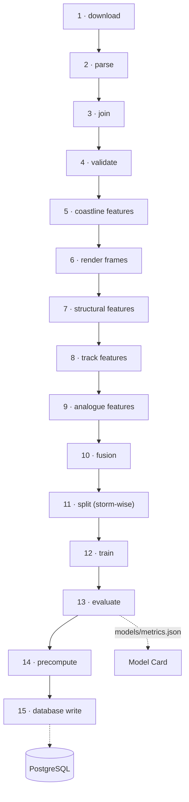

# Data pipeline

The complete offline pipeline, stage by stage. Everything here lives in `ml/` and runs on a
laptop; none of it is deployed.

> **Status: not implemented.** Phase 0 built the package structure and `ml/config.yaml`.
> Phases 1–4 implement these stages. This document is the specification to build from.

---

## The whole pipeline



Phase mapping: stages 1–6 are **Phase 1**, stage 7 is **Phase 2**, stages 8–13 are
**Phase 3**, stages 14–15 are **Phase 4**.

---

## Stage 1 — Download

| | |
|---|---|
| **Script** | `ml/ingest/download_ibtracs.py`, `ml/ingest/download_hursat.py` |
| **Input** | `config.yaml` → `ingest.ibtracs_basins`, storm list |
| **Output** | `data/raw/ibtracs/*.csv`, `data/raw/hursat/**/*.nc` |
| **Format** | CSV; gzipped netCDF |
| **Validation** | File exists, non-zero size, checksum recorded in `MANIFEST.md` |
| **Failure** | Network unavailable; NCEI path structure changed; disk full |

Download **basin subsets only**. `ibtracs.NI.list.v04r00.csv` is a few megabytes; the global
archive is over a hundred and is not needed.

Downloads are **resumable and idempotent** — a partially completed HURSAT fetch must not
force a restart. Record every URL and retrieval date in `data/MANIFEST.md`.

**This is the critical path.** Start it at hour 0 of Phase 1; nothing downstream can begin
without it, and no amount of working faster later recovers a late start.

---

## Stage 2 — Parse

| | |
|---|---|
| **Script** | `ml/ingest/parse_hursat.py` |
| **Input** | `data/raw/hursat/**/*.nc` |
| **Output** | In-memory records: `(sid, obs_time, satellite, bt_array, km_per_pixel)` |
| **Format** | netCDF → NumPy float array in **Kelvin** |
| **Validation** | 2-D array; finite values present; plausible BT range (roughly 150–330 K); shape consistent within a storm |
| **Failure** | Unexpected variable name; unexpected units; corrupt archive member |

> **Gate: parse ONE file first.** Confirm grid shape, resolution, BT units, and the SID and
> time attribute names before writing the bulk parser. Every downstream artefact depends on
> these, and assuming them is the most expensive mistake available in Phase 1.

If brightness temperature arrives scaled or offset, convert to Kelvin **here**. Nothing
downstream should have to know about a storage encoding.

Also parse IBTrACS here: filter to tropical `NATURE` values, drop rows without position,
and **pick one wind column and use it consistently** (see the open question in
[`data-sources.md`](data-sources.md)).

---

## Stage 3 — Join

| | |
|---|---|
| **Script** | `ml/ingest/join_ibtracs_hursat.py` |
| **Input** | Parsed IBTrACS rows + parsed HURSAT records |
| **Output** | `data/interim/joined.parquet` |
| **Rule** | `(SID, nearest best-track observation within ±90 minutes)` |
| **Validation** | At most one frame per `(sid, obs_time)`; every frame's SID exists in IBTrACS; match rate computed |
| **Failure** | Zero matches (SID formats disagree — the most likely real failure); timezone mismatch |

**This stage is the product.** Once the join exists, the timeline exists.

Rules:

1. One frame per `(sid, obs_time)`. Where several satellites cover one time, prefer the
   most complete grid.
2. **Keep unmatched best-track rows**, with a null image path. The timeline must have no
   holes; the UI shows no imagery there and the structural block reports absence rather
   than zeros.
3. Write the match rate into `data/MANIFEST.md` — it appears on the Model Card.

If the match rate is implausibly low, suspect a timezone or SID-format mismatch before
suspecting the data.

---

## Stage 4 — Validate

| | |
|---|---|
| **Script** | part of `join_ibtracs_hursat.py`; assertions and a report |
| **Input** | `joined.parquet` |
| **Output** | The same file, plus a validation report appended to `MANIFEST.md` |
| **Failure** | Any hard check below fails → **stop the pipeline** |

| Check | Type | On failure |
|---|---|---|
| Latitude in [−90, 90], longitude in [−180, 180] | hard | stop |
| Vmax in [0, 200] kt | hard | stop |
| Pressure in [850, 1030] hPa where present | hard | stop |
| `obs_time` strictly increasing per storm | hard | stop |
| No duplicate `(sid, obs_time)` | hard | stop |
| BT array finite fraction > 50% | soft | drop the frame, log |
| Storm has ≥ 8 observations | soft | exclude the storm, log |
| Time gaps ≤ 12 h | soft | log; the timeline will show a gap |

Hard checks stop the run because a bad row that reaches training is far more expensive to
find later than a failed pipeline is now.

---

## Stage 5 — Coastline features

| | |
|---|---|
| **Script** | `ml/ingest/coastline_distance.py` |
| **Input** | `joined.parquet` + Natural Earth coastlines |
| **Output** | `dist_to_coast_km` per observation, merged into `joined.parquet` |
| **Format** | Float kilometres |
| **Validation** | Non-negative; finite; land-side observations near zero |
| **Failure** | Shapefile missing; projection mismatch |

Computed offline with shapely so that nothing at runtime depends on PostGIS. Also loads
`coastline_segment` for the landfall-proximity query.

---

## Stage 6 — Render frames

| | |
|---|---|
| **Script** | `ml/ingest/render_frames.py` |
| **Input** | BT arrays |
| **Output** | `data/frames/{sid}/{ts}.npy` and `data/frames/{sid}/{ts}.png` |
| **Format** | float Kelvin; 8-bit greyscale on a **fixed 180–300 K scale** |
| **Validation** | Both files exist and are readable; PNG dimensions match the array |
| **Failure** | Disk full; unwritable path |

**Two artefacts per frame, deliberately.** The `.npy` is what the structural metrics
measure; the `.png` is what the browser and the CNN see. Quantising to 8 bits over a 120 K
range costs about 0.47 K per level — enough to move the eye-contrast and CDO-fraction
thresholds.

**The scale is fixed, never per-image auto-scaled.** Auto-scaling would make identical
storms look different depending on their background and would destroy comparability across
the training set.

---

## Stage 7 — Structural features

| | |
|---|---|
| **Script** | `ml/features/structural.py` — a thin wrapper |
| **Input** | `.npy` Kelvin arrays + `km_per_pixel` |
| **Output** | Seven metrics per frame → `data/processed/features.parquet` |
| **Validation** | Metrics within their documented ranges; `axisymmetry` ∈ [0,1] |
| **Failure** | All-NaN field; non-2-D array (both raise `ValueError`) |

**The implementation lives in `ai-service/app/structure/`, not here.** `ml/` imports it via
`config.yaml` → `paths.structure_module`.

One implementation, one set of tests. Two copies would drift, and a drift there would mean
the metrics a model trained on are not the metrics it is served.

Methodology: [`structural-signature.md`](structural-signature.md).

---

## Stage 8 — Track features

| | |
|---|---|
| **Script** | `ml/features/track_features.py` |
| **Input** | `joined.parquet` |
| **Output** | Kinematic features per observation |
| **Validation** | No feature computed from a future observation |
| **Failure** | Insufficient history at a storm's start — emit nulls, do not extrapolate backwards |

Nine features: current Vmax; ΔVmax over 12 h and 24 h; pressure; latitude; translation
speed; heading; day-of-year; and a persistence term.

> **Causality rule.** Every feature at time *t* must be computable from observations at or
> before *t*. A centred rolling mean, a "next observation" difference, or any
> forward-looking window silently destroys Rewind & Verify — the model would appear
> accurate for reasons that do not exist at forecast time. This is invariant **I1** applied
> at the feature level, and it is the easiest place in the whole project to break it by
> accident.

---

## Stage 9 — Analogue features

| | |
|---|---|
| **Script** | `ml/features/analogue_matrix.py` |
| **Input** | Structural + track features |
| **Output** | `data/processed/analogue_matrix.npz` — a z-scored matrix plus its index |
| **Format** | NumPy array + `(sid, obs_time)` index + the scaler |
| **Validation** | No NaN rows; scaler persisted alongside |
| **Failure** | Too few complete 24 h windows |

Each row is a 24-hour evolution window. The scaler **must** be saved: querying with a
differently-scaled vector would silently return nonsense neighbours.

Details: [`analogue-ensemble.md`](analogue-ensemble.md).

---

## Stage 10 — Fusion

| | |
|---|---|
| **Script** | `ml/features/fusion.py` |
| **Input** | CNN embeddings + structural + track + geographic features |
| **Output** | The 33-d vector per observation, in `features.parquet` |
| **Validation** | Exactly 33 dimensions; PCA fitted on train only |
| **Failure** | Missing embeddings for frames without imagery |

```
33-d = CNN embedding (PCA → 16)  ⊕  structural (7)  ⊕  track (9)  ⊕  geographic (1)
```

**The PCA is fitted on the training split only** and then applied to val and test. Fitting
it on everything is a subtle, easy leak.

Frames without imagery have no embedding. Phase 3 must choose one policy — impute, or
restrict the fused model to frames with imagery — and record it in `metrics.json`, because
it changes what the ablation means.

---

## Stage 11 — Split

| | |
|---|---|
| **Script** | `ml/train/splits.py` |
| **Input** | The storm list |
| **Output** | A `split` column: `train` / `val` / `test` |
| **Rule** | **Storm-wise**, seeded, 70/15/15 |
| **Validation** | **Assert every demo storm is in `test`** |
| **Failure** | Assertion failure → **stop** |

**Storm-wise, never frame-wise.** Frames within one storm are heavily autocorrelated; a
random frame-level split would leak and inflate every metric.

This is invariant **I4** and it is checked three times: here, by the database
(`CHECK (NOT is_demo OR split = 'test')`), and on the Model Card via `demoStormsInTest`.

---

## Stage 12 — Train

| | |
|---|---|
| **Scripts** | `train_ir_intensity.py`, `train_dvmax_ri.py`, `train_track_cliper.py`, `build_analogue_index.py` |
| **Input** | `features.parquet` + rendered frames, **train split only** |
| **Output** | `models/*.pt`, `*.json`, `*.npz`, `scalers.pkl` |
| **Validation** | No training row belongs to a `test` storm |
| **Failure** | Insufficient data; non-convergence; out of memory |

**Recommended order — cheapest and most certain first:**


The CNN is last because it takes longest and is the one component that can be downgraded
(EfficientNet-B0 → ResNet-18, or a frozen backbone with only the head trained) without
changing any interface.

Per-model specifications: [`models.md`](models.md).

---

## Stage 13 — Evaluate

| | |
|---|---|
| **Scripts** | `eval/evaluate_all.py`, `eval/ablation.py`, `eval/cone_calibration.py` |
| **Input** | Trained models + the **test split** |
| **Output** | `models/metrics.json` and `models/model_card.md` |
| **Validation** | Every metric has a named baseline and an `n` |
| **Failure** | A model claims to be trained without a metric → the registry refuses it |

Three outputs that matter:

1. **Per-model metrics, each against a stated baseline.** An MAE with no baseline says
   nothing about whether the model beats guessing the mean.
2. **The ablation** — track-only, image-only, fused, on identical held-out storms. This is
   the multi-source claim, tested rather than asserted.
3. **Cone calibration** — the p67 and p90 percentiles of held-out track error per lead
   time, plus the *observed* containment those radii actually achieve.

RI is reported as **PR-AUC and lift over the base rate**, never accuracy: at a ~5% base
rate, always predicting "no" scores 95% and is useless.

`metrics.json` is generated here and **never hand-edited**. The Model Card is only as
honest as this file.

---

## Stage 14 — Precompute

| | |
|---|---|
| **Script** | `ml/precompute/precompute_frames.py` |
| **Input** | Every frame of every demo storm + trained models |
| **Output** | `analysis_json` per frame; Grad-CAM PNGs |
| **Validation** | Every demo frame with imagery has non-null analysis |
| **Failure** | Model load failure; disk full |

This is what makes invariant **I5** possible: the scrubber reads finished rows instead of
triggering inference, which keeps it instant and keeps a dead AI service from breaking the
primary interaction.

Embarrassingly parallel across storms. Cache per `(frame, model_version)` so that
re-running after improving one model does not redo everything.

The written JSON must match the `FrameAnalysis` contract exactly — `StormService` parses it
with the same field names the API returns.

---

## Stage 15 — Database write

| | |
|---|---|
| **Scripts** | `ml/db/write_to_postgres.py`, `ml/db/seed_demo_scenarios.py` |
| **Input** | `joined.parquet` + analysis JSON + `metrics.json` |
| **Output** | Populated `storm`, `storm_frame`, `model_registry`, `demo_scenario` |
| **Validation** | Row counts match the source; constraints accept every row |
| **Failure** | `demo_storms_must_be_held_out` violation → a leakage bug, **stop and investigate** |

**`ml/` is the only writer** to `storm`, `storm_frame` and `model_registry`. The backend
reads them; it never populates them.

Writes are idempotent — `ON CONFLICT` upserts — so a re-run after improving the models does
not require a wipe.

If the leakage constraint fires, that is the database catching a real mistake. Do not work
around it.

---

## Configuration

Everything is driven by `ml/config.yaml` so a run is reproducible from one reviewable
artefact: paths, basin selection, join tolerance, split seed and fractions, demo storms,
and model hyperparameters.

## Reproducibility

| Requirement | How |
|---|---|
| Fixed randomness | `split.seed` in `config.yaml`; seed every library |
| Recorded provenance | `data/MANIFEST.md` — URLs, retrieval dates, counts, match rate |
| Regenerable artefacts | Everything under `data/` and `models/*.pt` is gitignored |
| Auditable results | `metrics.json` and `model_card.md` are committed |

## Runtime expectations

Rough, for planning only — these are estimates, not measurements.

| Stage | Order of magnitude | Notes |
|---|---|---|
| Download | hours | The critical path; start first |
| Parse + join | minutes | |
| Render | minutes to tens of minutes | I/O bound |
| Structural features | minutes | ~10 ms per frame |
| CNN training | hours on CPU | The reason it is trained last |
| Other models | minutes | |
| Precompute | tens of minutes | Parallel across storms |
