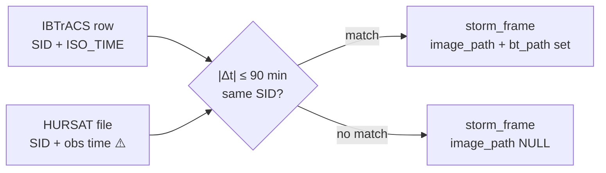

# Data sources

What each source contributes, what it looks like, and what we do not yet know about it.

> **Validation status: nothing has been downloaded or validated.**
> No dataset has been acquired, parsed, joined or inspected. Every field name, grid shape
> and resolution below is **stated from published documentation, not verified against a
> file in this repository.** Items marked ⚠️ must be confirmed against a real file in
> Phase 1 before any bulk code is written.

---

## What "multi-source" has to mean

The problem statement emphasises multi-source satellite data, and the easy failure is to
display two datasets side by side and call it fusion.

Ours has to be testable, so it is: image-derived features and track features enter the
**same** feature vector for the **same** model, and `ml/eval/ablation.py` reports
track-only, image-only and fused error on identical held-out storms.

**We do not claim fusion until that table says so.** If the imagery adds nothing, the Model
Card will say the imagery adds nothing.

| Source | Contributes | Where it fuses |
|---|---|---|
| HURSAT-B1 IR | cloud-top structure the best track cannot express — eye geometry, symmetry, convective vigour | CNN embedding (PCA→16) + 7 structural metrics |
| IBTrACS best track | ground-truth labels, kinematics, persistence terms, the whole track model | the same 33-d vector; also the CNN's supervision signal |
| Natural Earth | distance to coast, landfall proximity | the same vector (`distToCoastKm`) and the risk engine |
| *(deferred)* SST / shear reanalysis | environmental favourability | the same vector, additive |

---

## 1. NOAA IBTrACS v4 — the numerical backbone

International Best Track Archive for Climate Stewardship.

| | |
|---|---|
| **Provider** | NOAA NCEI |
| **Licence** | US Government work — public domain |
| **Attribution** | Cite the IBTrACS dataset and its version (`v04r00`) in any published use |
| **Format** | CSV, one row per storm observation |
| **Temporal resolution** | 6-hourly, with 3-hourly interpolated values in some columns ⚠️ |
| **Coverage** | 1842–present, global |

### Why this one

It is the consolidated, quality-controlled merge of the world's official agency best
tracks. Using anything else would mean reconciling agencies ourselves.

### What to download

**Basin subsets, not the global file.** `ibtracs.NI.list.v04r00.csv` for the North Indian
Ocean is a few megabytes; the global archive is over a hundred. The North Indian basin is
what the problem statement is framed around, and it keeps every later step fast.

Configured in `ml/config.yaml` → `ingest.ibtracs_basins: [NI]`.

### Fields we rely on

| Field | Role in CycloVision | Maps to |
|---|---|---|
| `SID` | **The join key.** Unique storm id, e.g. `2019114N06084` | `storm.sid` |
| `NAME` | Storm name | `storm.name` |
| `BASIN` | NI / SI / WP / EP / NA / SP | `storm.basin` |
| `SEASON` | Year | `storm.season_year` |
| `ISO_TIME` | Observation timestamp (UTC) | `storm_frame.obs_time` |
| `LAT`, `LON` | Position | `storm_frame.lat`, `.lon` |
| `WMO_WIND` / agency wind ⚠️ | Maximum sustained wind — **the supervision label** | `storm_frame.vmax_kt` |
| `WMO_PRES` / agency pressure ⚠️ | Central pressure | `storm_frame.pressure_hpa` |
| `STORM_SPEED`, `STORM_DIR` ⚠️ | Translation speed and heading | `storm_frame.translation_speed_kt`, `.heading_deg` |
| `NATURE` | TS / ET / DS etc. — used to filter to tropical stages | filter only |

⚠️ **Which wind column to use is an open decision.** IBTrACS carries several agency wind
columns with different averaging periods (1-minute vs 10-minute sustained), and they are
not interchangeable. Phase 1 must pick one, document the choice, and apply it consistently
— mixing them would corrupt both the labels and the RI threshold. See "Open questions".

### Known limitations

- Best-track intensities are **post-analysis estimates**, not direct measurements. They are
  the accepted ground truth in the field, and we treat them as such, but they carry their
  own uncertainty.
- Reporting practice varies by agency and era; older storms are less reliable.
- Position is the storm centre, with resolution typically to 0.1°.

---

## 2. NOAA HURSAT-B1 — storm-centred infrared imagery

Hurricane Satellite data, B1 product.

| | |
|---|---|
| **Provider** | NOAA NCEI |
| **Licence** | US Government work — public domain |
| **Format** | netCDF, gzipped, one file per storm/time/satellite ⚠️ |
| **Channel used** | `IRWIN` — infrared window brightness temperature ⚠️ |
| **Units** | **Kelvin** ⚠️ |
| **Resolution** | ~8 km ⚠️ |
| **Grid** | ~301 × 301, storm-centred ⚠️ |
| **Cadence** | 3-hourly ⚠️ |
| **Coverage** | 1978–2015 |

### Why this one

Because the tiles are **already storm-centred**. Collecting and labelling raw global
satellite imagery is a project in itself; HURSAT removes that entirely and lets the effort
go into analysis. It is also directly joinable to IBTrACS, which is what makes the timeline
possible.

### Why Kelvin matters

The structural metrics are physical measurements of the brightness-temperature field — eye
warmth against eyewall cold, the fraction of the core below the deep-convection threshold,
azimuthal symmetry of the perturbation. Those are meaningless on a rendered 8-bit picture.

The pipeline therefore keeps **two artefacts per frame**:

| Artefact | Purpose | Consumer |
|---|---|---|
| `{ts}.npy` | Raw Kelvin, float | `ai-service/app/structure/` |
| `{ts}.png` | 8-bit render, **fixed 180–300 K scale** | Browser, CNN training input |

Quantising to 8 bits over a 120 K range costs roughly 0.47 K per level, which is enough to
move the eye-contrast and CDO-fraction thresholds. Hence both.

The render scale is **fixed, not per-image auto-scaled**. Auto-scaling would make identical
storms look different depending on their background and would destroy comparability across
the training set.

### The ⚠️ that matters most

> **Parse ONE file and confirm grid shape, resolution, BT units, and the SID and time
> attribute names before writing the bulk parser.**

The whole pipeline shape depends on these. Assuming them is the single most expensive
mistake available in Phase 1, because every downstream artefact would need regenerating.
This is Phase 1's first task and its gate.

### Fallback if HURSAT proves impractical

The pre-agreed substitute, for **CNN training only**, is the DrivenData / NASA-IMPACT
tropical storm wind-speed dataset: curated single-band IR imagery with wind labels and
storm identifiers, ready to train on.

HURSAT would still be required for the demo storms, because that dataset carries no
latitude/longitude and cannot be placed on a map.

**If both are used, there is a domain shift** — different sensors, different rendering,
different normalisation. That must be stated on the Model Card, not glossed over.

**Decision point: hour 8 of Phase 1. Not later.**

### Known limitations

- Coverage ends in **2015**, so recent storms (Amphan 2020, Biparjoy 2023) have best-track
  data but no HURSAT imagery. Demo storm selection must account for this.
- Not every best-track observation has a matching satellite pass. The match rate must be
  measured and reported.
- Geostationary coverage varies by era and satellite; older storms may have coarser or
  partial tiles.
- Single infrared channel only — no visible, no water vapour, no microwave.

---

## 3. Natural Earth — coastlines

| | |
|---|---|
| **Provider** | Natural Earth |
| **Licence** | Public domain |
| **Format** | Shapefile / GeoJSON |
| **Resolution** | 1:10m recommended ⚠️ |

**Role:** compute `dist_to_coast_km` per observation offline with shapely, and populate
`coastline_segment` for the landfall-proximity term of the risk score.

This is why PostGIS is present — and it is PostGIS's *only* genuine job. The per-observation
distance is precomputed in Python, so nothing at runtime depends on the extension.

### Known limitations

- Coastline simplification at 1:10m introduces error of order a kilometre — irrelevant at
  the scale the risk engine works on.
- Distance is to *any* coast, not to a populated one. It is a proximity proxy, not an
  exposure model.

---

## 4. INSAT-3D — an adapter, not a dependency

The canonical sensor for this problem statement is ISRO's INSAT-3D/3DR, distributed by
MOSDAC. It requires registration and is slow to obtain, so it is **not** a dependency for
any phase.

The architecture already accommodates it: `storm_frame.image_source` distinguishes sources,
and `compute_metrics()` takes `km_per_pixel` as a parameter precisely because INSAT-3D's
resolution differs from HURSAT's. Adding it is an ingest-side adapter, not a redesign.

Details: [`future-work.md`](future-work.md).

---

## 5. The join

```
(IBTrACS SID, nearest best-track observation within ±90 minutes)
```

Configured as `ingest.join_tolerance_minutes: 90` in `ml/config.yaml`.



**Rules:**

1. One satellite frame per `(sid, obs_time)`. Where several satellites cover one time,
   prefer the most complete grid.
2. **Rows with no matching frame are kept**, with `image_path` null. The timeline must have
   no holes; the UI shows no imagery there and the structural block reports absence rather
   than zeros.
3. The match rate is recorded in `data/MANIFEST.md` and surfaced on the Model Card.

Reporting "8,412 of 11,033 track points had a matched IR frame (76%)" is the kind of
accounting that makes the rest of the numbers credible. The figure is illustrative — the
real one will be measured in Phase 1.

---

## 6. Splitting

**Storm-wise, never frame-wise.** Frames within one storm are heavily autocorrelated; a
random frame-level split would leak and inflate every metric we report.

Demo storms are always in the `test` split. Rewind & Verify is meaningless on a storm the
model trained on, so this is enforced three times:

1. An assertion in `ml/train/splits.py`
2. A database constraint: `CHECK (NOT is_demo OR split = 'test')`
3. A `demoStormsInTest` flag reported on the Model Card

If verification results ever look suspiciously good, assume leakage and check before
believing them.

---

## 7. Demo storms

`ml/config.yaml` currently lists **four**: FANI (2019), AMPHAN (2020), PHAILIN (2013),
HUDHUD (2014).

> ⚠️ **Two open issues with this list.**
> **(a)** spec-1.0 called for 6–8 demo storms and named the 1999 Odisha super cyclone and
> Biparjoy (2023) among them; the config has four and omits both.
> **(b)** HURSAT-B1 coverage ends in 2015, so **AMPHAN (2020) can have no HURSAT imagery**.
> It would be track-only, which is usable for the track and analogue features but not for
> the structural signature, the CNN, or the IR overlay — i.e. not for the demo's strongest
> moments.
>
> Phase 1 must reconcile this list against actual coverage before curation.

---

## 8. Open questions blocking implementation

| # | Question | Blocks | Resolve by |
|---|---|---|---|
| 1 | Which IBTrACS wind column, and what averaging period? | labels, RI threshold, everything downstream | Phase 1, before feature engineering |
| 2 | Exact HURSAT grid shape, resolution, units and attribute names | the bulk parser and every artefact | Phase 1, first task |
| 3 | The canonical intensity category vocabulary | `storm.peak_category`, `storm_frame.category`, the risk engine's `CATEGORY_SCALE`, and the CNN's classification head | Phase 1 — see below |
| 4 | Final demo storm list, reconciled against coverage | curation and precomputation | Phase 1 |
| 5 | Whether the HURSAT fallback dataset is needed | training data and the domain-shift disclosure | Phase 1, hour 8 |

### On question 3

`ai-service/app/risk/rules.py` defines `CATEGORY_SCALE` over the keys `DEPRESSION`,
`DEEP_DEPRESSION`, `CYCLONIC_STORM`, `SEVERE`, `VERY_SEVERE`, `EXTREMELY_SEVERE`,
`SUPER_CYCLONIC_STORM` — an IMD-style vocabulary. Nothing else in the repository defines or
derives these strings, and no mapping from IBTrACS wind speed to them exists.

Until that mapping is written and agreed, `storm_frame.category` has no defined source and
the risk engine's `categoryNorm` term cannot be computed. This is a genuine blocker, not a
detail; it is recorded again in [`decisions.md`](decisions.md).

---

## 9. Claims we do not make

- **No trained Dvorak-pattern classifier.** No free labelled Dvorak dataset exists at
  scale. We measure the underlying physical quantities and classify the regime with a
  transparent rule engine, labelled as such. See
  [`structural-signature.md`](structural-signature.md).
- **No wide-field cyclone detection.** No labelled detection data in the time budget. Our
  imagery is storm-centred, so detection is not required for what we do.
- **No observed SST or shear.** Reanalysis downloads are too heavy for the window. A
  feature-vector slot is reserved. Anything used before then would be *climatology*, and
  would be labelled that way.
- **No claim of validated data.** As of this writing, nothing has been downloaded. Every
  specification above is from documentation, not from inspection.
