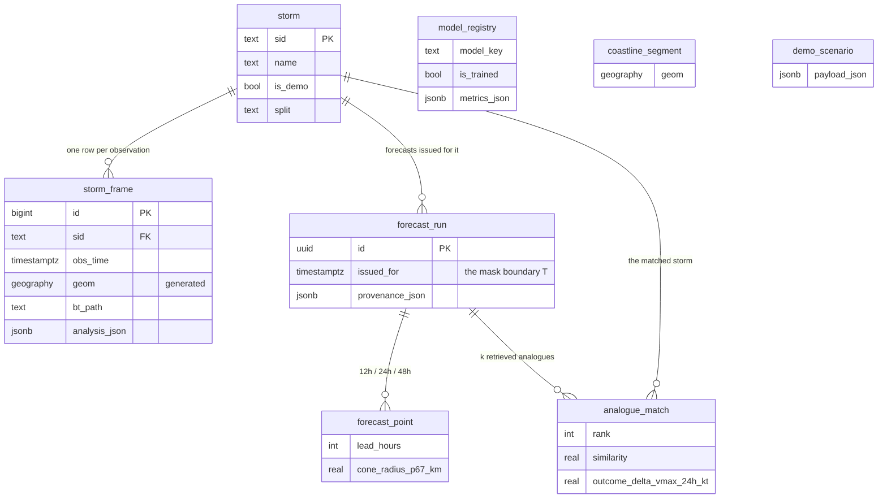

# Database

PostgreSQL 16 with PostGIS 3.4. Eight tables. The schema is owned by Flyway and is the
single source of truth; Hibernate runs `ddl-auto: validate` and must never alter it.

Migrations: `backend/src/main/resources/db/migration/`
— `V1__schema.sql`, `V2__indexes.sql`, `V3__seed_registry.sql`.

---

## Relationships



`model_registry`, `coastline_segment` and `demo_scenario` are standalone — no foreign keys
by design. `demo_scenario.sid` is deliberately **not** a foreign key so a fallback scenario
survives a storm being re-imported.

---

## 1. `storm`

One tropical cyclone, keyed by its IBTrACS SID.

| Column | Type | Notes |
|---|---|---|
| `sid` | `TEXT` PK | IBTrACS SID, e.g. `2019114N06084` — **the join key across the whole system** |
| `name` | `TEXT` NOT NULL | |
| `basin` | `TEXT` NOT NULL | NI / SI / WP / EP / NA / SP |
| `season_year` | `INT` NOT NULL | |
| `start_time`, `end_time` | `TIMESTAMPTZ` NOT NULL | |
| `peak_vmax_kt`, `peak_category` | `REAL`, `TEXT` | |
| `landfall_time`, `landfall_lat`, `landfall_lon`, `landfall_place` | | Nullable — many storms never make landfall |
| `is_demo` | `BOOLEAN` NOT NULL | Curated for demonstration |
| `split` | `TEXT` NOT NULL | `train` / `val` / `test`, CHECK-constrained |
| `created_at` | `TIMESTAMPTZ` | |

### The constraint that matters

```sql
CONSTRAINT demo_storms_must_be_held_out CHECK (NOT is_demo OR split = 'test')
```

**This is invariant I4, enforced by the database rather than by discipline.** Rewind &
Verify is meaningless on a storm the model trained on, so a demo storm can never be in the
training split. Verified in Phase 0 against real PostgreSQL: the constraint genuinely
rejects the insert.

| | |
|---|---|
| **Written by** | `ml/db/write_to_postgres.py` **only** |
| **Read by** | `StormService` (list, detail), `ForecastService` (existence check) |

---

## 2. `storm_frame` — the central timeline table

One row per (storm, observation time). Everything the scrubber needs lives here, already
computed.

| Column | Type | Notes |
|---|---|---|
| `id` | `BIGINT` identity PK | |
| `sid` | `TEXT` FK → `storm` ON DELETE CASCADE | |
| `obs_time` | `TIMESTAMPTZ` NOT NULL | |
| **Observed (IBTrACS)** | | |
| `lat`, `lon` | `DOUBLE PRECISION` NOT NULL | |
| `geom` | `GEOGRAPHY(POINT,4326)` | **Generated** from lat/lon, stored |
| `vmax_kt`, `pressure_hpa` | `REAL` | The supervision labels |
| `category` | `TEXT` | ⚠️ vocabulary undefined — see below |
| `translation_speed_kt`, `heading_deg` | `REAL` | |
| `dist_to_coast_km` | `REAL` | Precomputed offline with shapely |
| **Satellite (nullable)** | | |
| `image_path` | `TEXT` | 8-bit PNG for display |
| `bt_path` | `TEXT` | **Raw Kelvin `.npy`** — what the metrics measure |
| `image_time` | `TIMESTAMPTZ` | The actual satellite pass time (\|Δt\| ≤ 90 min) |
| `image_source` | `TEXT` | `HURSAT-B1` / `INSAT-3D` |
| `gradcam_path` | `TEXT` | |
| **Precomputed analysis** | | |
| `analysis_json` | `JSONB` | Structure, vision estimate, regime, provenance |
| `analysis_version` | `TEXT` | The bundle that produced it |

`UNIQUE (sid, obs_time)`.

### Why the satellite columns are nullable

Not every best-track observation has a matching satellite pass. **The timeline must have no
holes**, so unmatched rows are kept with a null `image_path`; the UI shows no imagery there
and the structural block reports absence rather than zeros.

### Why `analysis_json` exists

**Invariant I5.** The scrubber reads this column instead of triggering inference. That is
what keeps it at 60 fps and what lets the primary interaction survive a dead AI service —
confirmed at runtime in Phase 0.

It is JSONB rather than columns because its shape follows the `FrameAnalysis` contract,
which will grow as models are added. Normalising it would mean a migration every time.

### The generated geometry column

```sql
geom GEOGRAPHY(POINT,4326)
  GENERATED ALWAYS AS (ST_SetSRID(ST_MakePoint(lon, lat),4326)::geography) STORED
```

Always consistent with lat/lon, because it cannot be written independently. **Deliberately
not mapped in JPA** — nothing in the application reads it, and mapping it would drag in
hibernate-spatial for no benefit.

| | |
|---|---|
| **Written by** | `ml/db/write_to_postgres.py` (rows), `ml/precompute/` (`analysis_json`) |
| **Read by** | `StormService` (timeline + frame detail), `ForecastService` (the temporal mask), `VerificationService` (ground truth) |

---

## 3. `forecast_run`

One live forecast invocation.

| Column | Type | Notes |
|---|---|---|
| `id` | `UUID` PK | |
| `sid` | `TEXT` FK → `storm` | |
| `issued_for` | `TIMESTAMPTZ` NOT NULL | **T — the temporal-mask boundary** |
| `created_at` | `TIMESTAMPTZ` | |
| `model_bundle_version` | `TEXT` NOT NULL | |
| `delta_vmax_24h_kt`, `predicted_vmax_24h_kt`, `intensity_trend`, `intensity_confidence` | | CHECK on trend |
| `ri_probability`, `ri_base_rate` | `REAL` | Always stored together |
| `structure_json`, `vision_json`, `shap_json`, `analogue_summary_json` | `JSONB` | |
| `risk_score`, `risk_level`, `risk_terms_json` | | CHECK on level |
| `report_text` | `TEXT` | |
| `provenance_json` | `JSONB` NOT NULL | |
| `degraded` | `BOOLEAN` NOT NULL | |

```sql
CONSTRAINT uq_forecast_run UNIQUE (sid, issued_for, model_bundle_version)
```

**Idempotency is the point.** The same forecast for the same storm, moment and bundle is
the same row — which is what allows a dead AI service to degrade to a cached answer instead
of an error page.

`ri_base_rate` is stored alongside `ri_probability` because a probability without its base
rate is uninterpretable, and the base rate may change as more data is ingested.

| | |
|---|---|
| **Written by** | `ForecastService` — ⚠️ **not yet implemented**, see [`api.md`](api.md) |
| **Read by** | `ForecastService` (cache lookup) |

---

## 4. `forecast_point`

| Column | Type | Notes |
|---|---|---|
| `id` | `BIGINT` identity PK | |
| `run_id` | `UUID` FK → `forecast_run` CASCADE | |
| `lead_hours` | `INT` | CHECK IN (12, 24, 48) |
| `lat`, `lon` | `DOUBLE PRECISION` NOT NULL | |
| `cone_radius_p67_km`, `cone_radius_p90_km` | `REAL` | **Nullable — and null means "not calibrated"** |
| `predicted_vmax_kt` | `REAL` | |

`UNIQUE (run_id, lead_hours)`.

The cone radii are **empirical percentiles of the track model's own held-out error**, not
model outputs — which is why they carry `STATISTICAL_BASELINE` provenance separately from
the track. When they are null the map draws no cone: an invented radius would be the single
most misleading number on screen, because the cone's width *is* the product's visual
statement about uncertainty.

---

## 5. `analogue_match`

| Column | Type | Notes |
|---|---|---|
| `id` | `BIGINT` identity PK | |
| `run_id` | `UUID` FK → `forecast_run` CASCADE | |
| `rank` | `INT` | 1 = closest |
| `match_sid` | `TEXT` FK → `storm` | |
| `match_time` | `TIMESTAMPTZ` | The matched moment in that storm's life |
| `similarity` | `REAL` NOT NULL | |
| `outcome_delta_vmax_24h_kt` | `REAL` | **What happened next** |
| `outcome_was_ri` | `BOOLEAN` | |
| `onward_track_json` | `JSONB` | `[[lat, lon], …]` |

**The outcome columns are the reason this table exists.** The analogue ensemble is a second
forecast, not a "similar storms" card, and the outcome is the forecast.

`match_time` matters as much as `match_sid`: an analogue is a *moment* in a storm's life,
not a whole storm.

> ⚠️ **Coordinate order.** `onward_track_json` stores `[lat, lon]`; MapLibre requires
> `[lon, lat]` and `layers/track.ts` swaps them. Easy to get wrong — the contract example in
> `API_CONTRACT.md` is authoritative.

---

## 6. `model_registry`

What produced what. Drives the Model Card and the provenance system.

| Column | Type | Notes |
|---|---|---|
| `id` | `INT` identity PK | |
| `model_key` | `TEXT` NOT NULL | `ir_intensity`, `dvmax_ri`, `track_cliper`, … |
| `version` | `TEXT` NOT NULL | |
| `provenance` | `TEXT` NOT NULL | CHECK against the eight tags |
| `is_trained` | `BOOLEAN` NOT NULL | |
| `trained_at` | `TIMESTAMPTZ` | |
| `metrics_json` | `JSONB` | `{metric, value, baseline, baselineValue, n}` |
| `notes` | `TEXT` | |

```sql
CONSTRAINT trained_models_need_evidence
    CHECK (NOT is_trained OR (trained_at IS NOT NULL AND metrics_json IS NOT NULL))
```

**A trained-model claim must be auditable.** Without a training time and a metric it is not,
so the database refuses the row. This mirrors the same rule in
`ai-service/app/registry.py`; both are checked by tests.

`V3__seed_registry.sql` seeds **eight** components, all `DEMO_DATA` / `is_trained = false`.
Phase 3 updates these rows in place as each model is trained, and the `DEMO_DATA` chips
disappear from the UI one at a time.

> ⚠️ **Known discrepancy.** The AI service registers **nine** components; `report_template`
> has no row here, so the Model Card omits it. See [`api.md`](api.md) §"Known
> discrepancies".

---

## 7. `coastline_segment`

| Column | Type |
|---|---|
| `id` | `INT` identity PK |
| `country` | `TEXT` |
| `geom` | `GEOGRAPHY(LINESTRING,4326)` NOT NULL |

**The only genuine PostGIS dependency in the system.** Per-observation
`dist_to_coast_km` is precomputed offline in Python; this table exists for the
landfall-proximity query. If PostGIS were unavailable, no MVP feature would break.

⚠️ Not yet used by any query — `nearestCoast` and `landfallWindowHours` are unpopulated
(see [`api.md`](api.md)).

---

## 8. `demo_scenario`

The offline safety net.

| Column | Type | Notes |
|---|---|---|
| `id` | `INT` identity PK | |
| `sid`, `issued_for` | | `UNIQUE (sid, issued_for)` |
| `label` | `TEXT` NOT NULL | |
| `payload_json` | `JSONB` NOT NULL | A complete, shape-identical `ForecastResponse` |

Used only when the AI service is unreachable and no cached run exists. Anything served from
here comes back with `servedFrom: "demo"`, `degraded: true` and `DEMO_DATA` provenance —
**that labelling is the entire reason this fallback is acceptable.**

---

## Indexes

```sql
CREATE INDEX idx_frame_sid_time    ON storm_frame (sid, obs_time);          -- the scrubber
CREATE INDEX idx_frame_with_image  ON storm_frame (sid, obs_time)
                                      WHERE image_path IS NOT NULL;         -- training set
CREATE INDEX idx_frame_geom        ON storm_frame USING GIST (geom);
CREATE INDEX idx_coastline_geom    ON coastline_segment USING GIST (geom);
CREATE INDEX idx_storm_demo        ON storm (is_demo) WHERE is_demo;
CREATE INDEX idx_run_sid_issued    ON forecast_run (sid, issued_for DESC);  -- cache lookup
CREATE INDEX idx_point_run         ON forecast_point (run_id);
CREATE INDEX idx_analogue_run      ON analogue_match (run_id);
```

Chosen for the two hot paths: `idx_frame_sid_time` serves both the whole-timeline query and
the temporal mask; `idx_run_sid_issued` serves the cache lookup. GiST indexes are required
for any performant PostGIS query.

---

## Why images are files, not blobs

The database stores **paths only**. Every frame is a PNG plus an `.npy` on disk, served by
Spring's static handler at `/media/**`.

| Reason | |
|---|---|
| **Query performance** | The timeline query returns every row for a storm. Multi-megabyte rasters in those rows would make the product's most-used query slow. |
| **Browser caching** | Static files get HTTP caching and range requests for free. |
| **Backup size** | Regenerable artefacts do not belong in backups. |
| **Two formats per frame** | The metrics need Kelvin floats; the browser needs 8-bit pixels. Storing both as blobs doubles the problem. |

The cost is that the database and filesystem can disagree — a path can point at a missing
file. Handled by returning null rather than erroring: `bt_loader` returns `None` for a
missing file, and the structural block reports absence.

---

## Ownership summary

| Table | Written by | Read by |
|---|---|---|
| `storm` | `ml/db/` | `StormService`, `ForecastService` |
| `storm_frame` | `ml/db/`, `ml/precompute/` | `StormService`, `ForecastService`, `VerificationService` |
| `forecast_run` | `ForecastService` ⚠️ pending | `ForecastService` |
| `forecast_point` | `ForecastService` ⚠️ pending | `ForecastService` |
| `analogue_match` | `ForecastService` ⚠️ pending | `ForecastService` |
| `model_registry` | `ml/db/` | `ModelCardService`, `HealthController` |
| `coastline_segment` | `ml/ingest/` | ⚠️ nothing yet |
| `demo_scenario` | `ml/db/seed_demo_scenarios.py` | `DemoFallbackService` |

**The AI service reads and writes nothing.** It has no database connection at all.

---

## Conventions

| | |
|---|---|
| Timestamps | `TIMESTAMPTZ`, always UTC. Hibernate is pinned to UTC. |
| Identity | `GENERATED ALWAYS AS IDENTITY`, except `forecast_run` (application-generated UUID) and `storm` (natural key) |
| JSONB | For contract-shaped payloads that will evolve; mapped as `String` with `@JdbcTypeCode(SqlTypes.JSON)` |
| Deletes | `ON DELETE CASCADE` from `storm` — re-importing a storm cleanly replaces its frames |
| Migrations | Never edit an applied migration; always add `V{n+1}__*.sql` |
