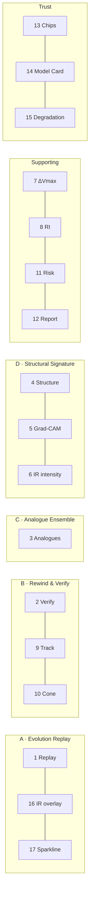

# Features

Every feature in CycloVision, in full. **This list is closed** — the four differentiators
are locked and nothing is added unless it clearly strengthens one of them.

Each entry states its provenance tag and its **Phase 0 status**, because the difference
between "specified" and "working" is exactly the thing this project refuses to blur.

**Status key:** ✅ working · 🟡 partially built · ⬜ specified, not yet built

---

## 1. Cyclone Evolution Replay ✅ (mechanism) / ⬜ (data)

**Differentiator A — the spine of the product.**

| | |
|---|---|
| **Purpose** | Make time the primary axis. Let a user move through a storm's entire life and watch every signal change together. |
| **User interaction** | Drag the timeline scrubber. Arrow keys step one frame; space toggles playback. |
| **Input** | `StormDetail.frames[]` — the whole lifetime, fetched once per storm. |
| **Processing** | None at interaction time. All per-frame analysis was precomputed offline into `storm_frame.analysis_json`. |
| **Output** | Synchronised update of: IR overlay position and image, storm marker, observed track cursor, structural readouts, model intensity estimate, sparkline cursor, intelligence panel. |
| **Provenance** | Mixed — each element carries its own tag. Track is `OBSERVED`; estimates are `TRAINED_MODEL`; regime is `RULE_ENGINE`. |
| **Dependencies** | The IBTrACS↔HURSAT join (Phase 1); precomputation (Phase 4). |
| **Demo value** | **Very high.** It is the first thing that moves and takes one second to understand. |

**Why it is nearly free:** HURSAT gives a storm-centred IR frame roughly every 3 hours and
IBTrACS gives a synchronised best track over the same period. Every storm is *natively* a
time-aligned multi-source sequence. Once the join exists — which is required to train
anything at all — the timeline exists. **The join is the product.**

**Limitations**
- Frames without a matched satellite pass show no imagery. The gap is shown as a gap.
- The IR footprint is an approximate placement of a storm-centred tile, not a
  reprojection. Adequate at basin zoom; stated rather than hidden.
- Playback is fixed at ~220 ms per frame; there is no variable speed control.

**Phase 0 status:** the scrubber, sparkline, map sync and prefetching are all implemented
and building. There is no storm data, so it renders an empty-state message instead.

---

## 2. Rewind & Verify ⬜ (backend path ✅, UI trigger 🟡)

**Differentiator B — the most important idea in the product.**

| | |
|---|---|
| **Purpose** | Convert an unfalsifiable claim into a demonstrated, measured result. |
| **User interaction** | Switch to Verify → park the scrubber at any past moment → "Forecast from this moment" → pause → "Reveal what happened". |
| **Input** | `sid`, `from=T`, `reveal`. Backend loads `storm_frame` rows `WHERE obs_time <= T` only. |
| **Processing** | Temporal mask → build request → AI service inference → persist → attach ground truth from the database → compute errors. |
| **Output** | Predicted track + cone + intensity outlook; on reveal, observed truth drawn over it plus track error (km), intensity error (kt), cone containment, RI warning correctness. |
| **Provenance** | Forecast blocks per model. The entire `verification` block is `OBSERVED`. |
| **Dependencies** | Trained track and intensity models (Phase 3); a calibrated cone (Phase 3). |
| **Demo value** | **Highest.** This is the moment the room goes quiet. |

**Why it is credible:** the user picks T, so it cannot be cherry-picked; the demo storms
are in the held-out test split, enforced by a database constraint; and the future is
withheld by two independent filters in two different services.

Full mechanism: [`rewind-and-verify.md`](rewind-and-verify.md).

**Limitations**
- Requires ground truth past T. When the storm record ends first, verification reports
  `available: false` rather than a partial result.
- RI correctness is a binary hit/miss against a fixed 0.25 probability threshold, not a
  calibration curve.
- Errors are computed at the nearest observation to T+24h and T+48h, not interpolated.

**Phase 0 status:** the full backend path is implemented and was verified end to end —
mask, request build, inference, verification attach, error arithmetic. The forecast returns
absent values because no model is trained.

---

## 3. Analogue Ensemble ⬜

**Differentiator C.**

| | |
|---|---|
| **Purpose** | Provide a second, statistically independent forecast from history, so agreement between methods becomes evidence. |
| **User interaction** | Summary line in the intelligence panel; full detail in the Analogues drawer; onward tracks toggle onto the map. |
| **Input** | The storm's last 24 hours of evolution as a standardised feature vector. |
| **Processing** | k-nearest-neighbour search over a precomputed historical matrix, excluding same-storm and same-season neighbours, then aggregation of what those storms did over their *following* 24 hours. |
| **Output** | Counts intensified/weakened, mean ΔVmax, RI count and fraction against the climatological base rate, ranked matches with similarity, onward tracks. |
| **Provenance** | `ANALOGUE_ENSEMBLE`. |
| **Dependencies** | Fused feature matrix and the analogue index (Phase 3). |
| **Demo value** | **Very high** — "this storm is behaving like the 1999 Odisha super cyclone did 36 hours before landfall" lands with any audience. |

Full mechanism, including what an analogue result does **not** mean:
[`analogue-ensemble.md`](analogue-ensemble.md).

**Limitations**
- Analog Ensemble is a retrieval method, not a causal one. Similar antecedents do not
  guarantee similar outcomes.
- Coverage is limited by the historical record; unusual storms will have poor matches, and
  a low similarity score must be read as such.
- Exclusions prevent same-storm and same-season leakage but not basin-level correlation.

**Phase 0 status:** the schema, endpoint, drawer and exclusion contract exist. The index is
empty, so it returns `k: 0` with no matches, stamped `DEMO_DATA`.

---

## 4. Structural Signature ✅ (computation) / 🟡 (calibration)

**Differentiator D, first half. The scientific core.**

| | |
|---|---|
| **Purpose** | Identify and classify cyclone *patterns* — the literal wording of the problem statement — from measurable physics rather than from a label we cannot source. |
| **User interaction** | Regime summary in the panel; the seven metrics with thresholds in the Evidence drawer. |
| **Input** | The raw brightness-temperature field in **Kelvin** (`.npy`), plus the tile's `km_per_pixel`. |
| **Processing** | Polar regrid → seven deterministic metrics → transparent threshold rules → regime + the list of rules that fired. |
| **Output** | `eyePresent`, `eyeRadiusKm`, `eyeRingBtContrastK`, `minBtK`, `cdoFraction100km`, `axisymmetry`, `convectiveRingRadiusKm`, `coldCloudOffsetKm`; regime ∈ {EYE, CENTRAL_DENSE_OVERCAST, BANDING, SHEARED, DISORGANISED}; `rulesApplied[]`. |
| **Provenance** | Metrics `DERIVED_MEASUREMENT`; regime `RULE_ENGINE`. **Two separate stamps, deliberately.** |
| **Dependencies** | Real BT arrays (Phase 1). Nothing else — no training. |
| **Demo value** | **High**, and it is the strongest answer under technical questioning. |

**Why two provenance stamps:** the measurements are deterministic physics; the regime label
is an interpretation layered on top. Merging the stamps would let a hand-written threshold
borrow a measurement's credibility.

Full methodology, including why this is **not** presented as a Dvorak classifier:
[`structural-signature.md`](structural-signature.md).

**Limitations**
- Thresholds are documented starting points, not tuned results, until Phase 3.
- Requires Kelvin values. An 8-bit display PNG is not sufficient input.
- Assumes the tile is storm-centred (true for HURSAT-B1).

**Phase 0 status:** fully implemented and unit-tested against synthetic fields. A genuine
physics bug was found and fixed during Phase 0 — see the eye-enclosure requirement in
[`structural-signature.md`](structural-signature.md). Registered as *available*, so it
claims `DERIVED_MEASUREMENT` whenever a BT array is actually present; the regime engine is
registered *uncalibrated* and therefore stamps `DEMO_DATA` until Phase 3.

---

## 5. Grad-CAM ⬜

**Differentiator D, second half.**

| | |
|---|---|
| **Purpose** | Show which regions of the satellite frame the trained network actually used. |
| **User interaction** | Toggle in the Evidence drawer, over the full-resolution frame. |
| **Input** | The IR frame and the trained CNN's activations. |
| **Processing** | Captum `LayerGradCam` on the final convolutional block; heatmap rendered to PNG offline during precomputation. |
| **Output** | `gradcamUrl` on the vision block; an overlay image. |
| **Provenance** | `TRAINED_MODEL` (it is a property of the trained network). |
| **Dependencies** | The trained IR intensity model (Phase 3). |
| **Demo value** | **High**, but only because of what it sits next to. |

**The pairing is the point.** Grad-CAM alone is easy to show and hard to interpret — every
project has one. It earns its place here because the structural metrics independently
located the eyewall ring: when the network's attention coincides with a feature we measured
without it, that agreement is a real validation signal.

**Limitations**
- Grad-CAM shows correlation with the output, not causation.
- It is coarse — the resolution of the final conv layer, upsampled.
- It says nothing about the tabular half of the fused model; SHAP covers that.

**Phase 0 status:** the field, the UI toggle and the storage path exist. No overlay is
produced, and the UI says "the vision model is not trained yet" rather than showing a blank
image.

---

## 6. Satellite intensity estimation ⬜

| | |
|---|---|
| **Purpose** | Estimate maximum sustained wind from the infrared image alone — the "real AI" signal a judge can see working. |
| **User interaction** | Passive. Appears as the dashed line on the sparkline and as the vision block in the panel and Evidence drawer. |
| **Input** | A 224×224 normalised render of the storm-centred IR field. |
| **Processing** | EfficientNet-B0 (ImageNet-initialised via `timm`), two heads: Vmax regression and category classification. |
| **Output** | `vmaxKt`, `category`, `confidence`, and a 1280-d embedding consumed by the fusion vector. |
| **Provenance** | `TRAINED_MODEL`, carrying MAE and the mean-predictor baseline. |
| **Dependencies** | Joined imagery and labels (Phase 1). |
| **Demo value** | **Very high** — via the sparkline, at 40 seconds into the demo. |

Single-channel IR is replicated to three channels so the ImageNet weights stay usable
rather than discarding the pretrained first layer.

**Limitations**
- Trained on a subset; expect MAE worse than published literature values, and report it.
- The relationship between cloud-top structure and surface wind is indirect.
- A sensor domain shift is possible if training data is substituted (see
  [`data-sources.md`](data-sources.md)).

**Phase 0 status:** protocol defined; placeholder returns `None` for every field rather
than a fabricated estimate.

---

## 7. Intensity-change prediction (ΔVmax 24 h) ⬜

| | |
|---|---|
| **Purpose** | Predict whether the storm strengthens or weakens over the next 24 hours — and, via the ablation, demonstrate that the imagery adds real information. |
| **User interaction** | Headline figure in the intelligence panel; drivers in the Evidence drawer. |
| **Input** | The **fused 33-d vector**: CNN embedding (PCA→16) ⊕ 7 structural metrics ⊕ 9 track features ⊕ 1 geographic feature. |
| **Processing** | XGBoost regressor. |
| **Output** | `deltaVmax24hKt`, `predictedVmax24hKt`, `trend`, `confidence`. |
| **Provenance** | `TRAINED_MODEL`, with MAE against a persistence baseline. |
| **Dependencies** | Features and the vision embedding (Phase 3). |
| **Demo value** | **High** — this is where "multi-source fusion" stops being a claim. |

**This is where fusion actually happens.** Image-derived features and track features enter
the *same* vector for the *same* model, and `ml/eval/ablation.py` reports track-only,
image-only and fused error on identical held-out storms. **We do not claim fusion until
that table says so.**

**Limitations**
- Trend thresholds (±5 kt) are a presentation choice, not a model output.
- Confidence is a model-reported quantity and is not yet calibration-checked.

**Phase 0 status:** protocol defined; placeholder returns `None`.

---

## 8. Rapid intensification (RI) prediction ⬜

| | |
|---|---|
| **Purpose** | Flag the operationally hardest and most consequential case: ≥30 kt intensification in 24 hours. |
| **User interaction** | "Rapid intensification 34% · base rate 5%" in the panel. |
| **Input** | The same fused 33-d vector. |
| **Processing** | XGBoost classifier with `scale_pos_weight` for the class imbalance. |
| **Output** | `riProbability`, always accompanied by `riBaseRate`. |
| **Provenance** | `TRAINED_MODEL`, reported as **PR-AUC and lift over the base rate**. |
| **Dependencies** | Same as ΔVmax. |
| **Demo value** | **High** — "6× the climatological rate" is a sentence anyone understands. |

**The base rate always travels with the probability.** RI occurs in roughly 5% of
over-water cases (basin-dependent); a 34% probability is meaningless until you know that.
For the same reason RI is **never** reported as accuracy: at a ~5% base rate, a model that
always predicts "no" scores 95% and is useless.

**Limitations**
- Severe class imbalance; the model may have little skill, and if lift ≈ 1 the Model Card
  will say so.
- The 0.25 warning threshold used by verification is a fixed choice, not optimised.

**Phase 0 status:** protocol defined; placeholder returns `None`. The `riBaseRate` field
and the verification threshold constant already exist.

---

## 9. Track forecast ⬜

| | |
|---|---|
| **Purpose** | Predict where the storm goes at 12, 24 and 48 hours. |
| **User interaction** | Dashed accented line on the map, drawn from the current position. |
| **Input** | Recent track history: position, Vmax, heading, translation speed, persistence terms, day-of-year. |
| **Processing** | **CLIPER-style** gradient-boosted regression (CLImatology and PERsistence) — one model per horizon and per Δlat/Δlon. |
| **Output** | `TrackPoint[]` at leads 12/24/48. |
| **Provenance** | `TRAINED_MODEL`, benchmarked against **pure persistence**. |
| **Dependencies** | IBTrACS only — no imagery. |
| **Demo value** | High. |

**Why CLIPER and not a GRU:** a deep sequence model cannot be trained and validated
reliably in the available time, and an under-trained one is worse than useless. CLIPER is a
genuinely trained model, it is the *actual operational benchmark* forecasters measure
themselves against, and it is fully explainable. A meteorologically literate judge will
recognise it as the right choice.

**Limitations**
- No environmental steering flow; it cannot anticipate a recurvature it has not seen the
  beginnings of.
- Official agency forecasts are considerably better. We do not claim otherwise.

**Phase 0 status:** protocol defined. A **pure-persistence baseline** stands in — the
straight-line extrapolation the real model must beat — registered as unavailable and
therefore stamped `DEMO_DATA`. Wiring the baseline in now means the Phase 3 comparison is
already plumbed.

---

## 10. Confidence cone ⬜

| | |
|---|---|
| **Purpose** | Communicate track uncertainty honestly, as a shape rather than a number. |
| **User interaction** | Two translucent bands around the forecast track. |
| **Input** | The distribution of the track model's own held-out errors, per lead time. |
| **Processing** | Take the 67th and 90th percentiles of measured error. Not a model output. |
| **Output** | `coneRadiusP67Km`, `coneRadiusP90Km`, plus a `coneBasis` string stating n. |
| **Provenance** | `STATISTICAL_BASELINE` — **stamped separately from the track model**. |
| **Dependencies** | A trained track model and its evaluation (Phase 3). |
| **Demo value** | High. "That radius isn't a guess — it's the 67th percentile of our model's actual held-out errors across N forecasts." |

**An uncalibrated cone draws nothing.** The cone's width *is* the product's visual
statement about uncertainty; an invented radius would be the single most misleading number
on screen. The map layer skips any point whose radii are null.

**Limitations**
- Circular bands, not a swept envelope; a real cone tapers between lead times.
- Percentiles are pooled across all storms, not conditioned on regime or basin.

**Phase 0 status:** contract, map layer and calibration table exist. Radii are `null` and
`coneBasis` reads "Not yet calibrated."

---

## 11. Risk engine 🟡

| | |
|---|---|
| **Purpose** | Turn several signals into one understandable level, transparently. |
| **User interaction** | A level and score in the panel; the formula and every term available. |
| **Input** | `vmaxKt`, `riProbability`, `distToCoastKm`, `category`. |
| **Processing** | `0.35·vmaxNorm + 0.25·riProbability + 0.25·(1 − coastDistNorm) + 0.15·categoryNorm`, clamped to [0,1]. Thresholds: >0.80 CRITICAL, >0.60 HIGH, >0.35 MODERATE, else LOW. |
| **Output** | `score`, `level`, `formula`, `terms{}`. |
| **Provenance** | `RULE_ENGINE`. |
| **Dependencies** | RI probability (Phase 3); `dist_to_coast_km` (Phase 1). |
| **Demo value** | Medium — but its transparency is a credibility asset. |

**Why rules and not a model:** a supervised risk model needs labelled outcome severity on a
discrete scale, which does not cleanly exist in IBTrACS. Fitting one on proxies would
produce a number that looks authoritative and means very little. A weighted rule is honest
about being a judgement call, and the formula is returned with the score so "why is this
High?" is answerable on screen.

**All four terms are required.** If any is missing the score is `null` and only the
available terms are returned. A partial score presented as a whole one is exactly the kind
of number this project refuses to produce.

**Limitations**
- Weights are a judgement call, not derived from outcome data.
- `nearestCoast` and `landfallWindowHours` are in the contract but are **not populated** —
  see the discrepancy note in [`api.md`](api.md).

**Phase 0 status:** the formula is implemented and returns its terms. The score is always
`null`, because `riProbability` needs an untrained model **and** because `category` is not
currently reachable by the AI service — a genuine gap flagged in
[`decisions.md`](decisions.md) and [`api.md`](api.md).

---

## 12. Situation report ✅ (template) / ⬜ (LLM)

| | |
|---|---|
| **Purpose** | State the current situation in plain language, for a non-specialist. |
| **User interaction** | A short paragraph at the bottom of the intelligence panel. |
| **Input** | Every already-computed block. |
| **Processing** | Deterministic string interpolation. Sentences are emitted only when their inputs exist. |
| **Output** | `report.text`. |
| **Provenance** | `RULE_ENGINE`. |
| **Dependencies** | None — it degrades to describing only what is known. |
| **Demo value** | Medium. |

**Deterministic first, LLM optional.** The template is instant, works offline, and cannot
invent a number — it can only restate ones that exist. An LLM pass is deferred
([`future-work.md`](future-work.md)), would be tagged `LLM_NARRATION`, and would be
permitted to rephrase but never to originate a figure.

**Limitations**
- Fixed sentence structures; it reads as generated.
- No cross-signal reasoning — it reports, it does not argue.

**Phase 0 status:** fully implemented and working. With nothing trained it correctly
produces: *"…No trained model has contributed to this summary: the model bundle is not yet
trained, so forecast fields are unavailable rather than estimated."*

---

## 13. Provenance chips ✅

| | |
|---|---|
| **Purpose** | Make the source of every number visible without being asked. |
| **User interaction** | Passive; hovering gives a full explanation, model key, version and metric. |
| **Input** | The `Source` object attached to every analysis block. |
| **Processing** | Label lookup; `DEMO_DATA` is styled to catch the eye, all others recede. |
| **Output** | A small uppercase tag beside each value; a global banner when anything on screen is `DEMO_DATA`. |
| **Provenance** | *(meta)* |
| **Dependencies** | None. |
| **Demo value** | **High as a credibility signal.** Deliberate intellectual honesty reads as rigour. |

**Limitations**
- Adds visual noise; mitigated by keeping the chips small, uppercase and unfilled.
- Correctness depends on upstream stamping, which is why that is enforced in four
  independent places.

**Phase 0 status:** fully implemented, including the banner.

---

## 14. Model Card ✅ (page) / ⬜ (content)

| | |
|---|---|
| **Purpose** | Answer "how do I know this is real?" with evidence rather than assurance. |
| **User interaction** | The `/model` route, reachable from the header. |
| **Input** | `model_registry` rows plus `models/metrics.json`. |
| **Processing** | Join the two; a registry row that is not trained is reported as `DEMO_DATA` regardless of what it declares. |
| **Output** | Datasets, split, models with metrics and baselines, ablation, cone calibration, and the omissions list. |
| **Provenance** | *(meta)* |
| **Dependencies** | Evaluation output (Phase 3). |
| **Demo value** | **High** — it is the answer to the hardest question in the room. |

**Limitations**
- Only as honest as `metrics.json`; that file is generated by `ml/eval/`, never hand-edited.
- `report_template` is currently missing from it — see [`api.md`](api.md).

**Phase 0 status:** the page renders fully. `metrics.json` does not exist, so datasets are
empty and every model reads "not trained" — which is the correct report.

---

## 15. Graceful degradation and cache ✅ (path) / 🟡 (cache)

| | |
|---|---|
| **Purpose** | Ensure a failed AI service degrades the answer instead of breaking the demo. |
| **User interaction** | A small `cached` or `demo` indicator; otherwise invisible. |
| **Input** | An AI service timeout or error. |
| **Processing** | 8-second timeout, **no retry** → look for a cached `forecast_run` for `(sid, T, bundle)` → fall back to a stored `demo_scenario` → otherwise return `AI_SERVICE_UNAVAILABLE`. |
| **Output** | `degraded: true` and `servedFrom: "cache" \| "demo"`. |
| **Provenance** | Demo scenarios are `DEMO_DATA`. |
| **Dependencies** | None. |
| **Demo value** | **Critical and invisible** — the single most demo-saving feature. |

**Short timeout, no retry:** a demo that hangs for thirty seconds is worse than one that
falls back in eight.

**It never fabricates.** With no cache and no scenario it returns a clean 503, not a
plausible-looking forecast.

**Crucially, the timeline is unaffected.** Explore mode reads precomputed rows and never
touches the AI service (invariant **I5**), so the primary interaction survives the AI
service being switched off entirely — verified during Phase 0.

**Limitations**
- The cached-run branch is **not yet implemented**; `ForecastService.fallback()` currently
  goes straight to demo scenarios. Phase 5 work, flagged in [`api.md`](api.md).
- No `forecast_run` rows are persisted yet, so there is nothing to cache.

---

## 16. Satellite IR overlay ✅ (mechanism) / ⬜ (data)

| | |
|---|---|
| **Purpose** | Put the actual satellite image on the map, in the right place, at the right time. |
| **User interaction** | Updates on every scrub. |
| **Input** | The 8-bit PNG render and the storm's position. |
| **Processing** | A square footprint of the tile's ground width centred on the storm; MapLibre image source updated in place. |
| **Output** | A georeferenced raster beneath the track layers. |
| **Provenance** | `OBSERVED` (it is the observation). |
| **Dependencies** | Rendered frames (Phase 1). |
| **Demo value** | **Very high.** It is what turns a track on a map into a storm. |

**A frame with no imagery removes the overlay** rather than leaving the previous image
behind — showing an old satellite picture at a new timestamp would be a quiet lie about
what was observed.

**Limitations**
- Approximate placement, not reprojection.
- Tile width is currently assumed (301 px × 8 km) and must be replaced with the value
  parsed from the file in Phase 1.
- Fixed 180–300 K render scale, so very cold tops saturate.

---

## 17. Lifecycle visualisation (the sparkline) ✅ (mechanism) / ⬜ (data)

| | |
|---|---|
| **Purpose** | Show observed intensity against the model's per-frame estimate across the entire storm — the product's strongest evidence, visible before any interaction. |
| **User interaction** | Passive; it is the track of the scrubber. Drag to move the cursor along it. |
| **Input** | `frames[].vmaxKt` and `frames[].cnnVmaxKt`. |
| **Processing** | Hand-drawn SVG, min/max scaled across both series, redrawn on every scrub. |
| **Output** | A solid truth line, a dashed estimate line, cursor and verify markers. |
| **Provenance** | Solid = `OBSERVED`; dashed = `TRAINED_MODEL`. The legend states both. |
| **Dependencies** | Precomputed per-frame estimates (Phase 4). |
| **Demo value** | **Very high** — the 40-second moment. |

Hand-drawn rather than charted: it must redraw under a 60 fps drag inside a 132 px bar, and
a general-purpose chart component would be both slower and harder to make that small.

**The line breaks across gaps.** Frames without an estimate are genuinely absent;
interpolating would draw a model output where none exists.

**Limitations**
- No y-axis labels — it is a sparkline, not a chart. Exact values are in the panel.
- Both series share one scale, which is the point.

---

## Feature-to-differentiator map

## Explicitly not features

Live cyclone tracking · alerts and notifications · user accounts · a chatbot · report
export · multi-storm comparison beyond analogues · a settings page · mobile layouts.

Reasons are recorded in [`decisions.md`](decisions.md).
