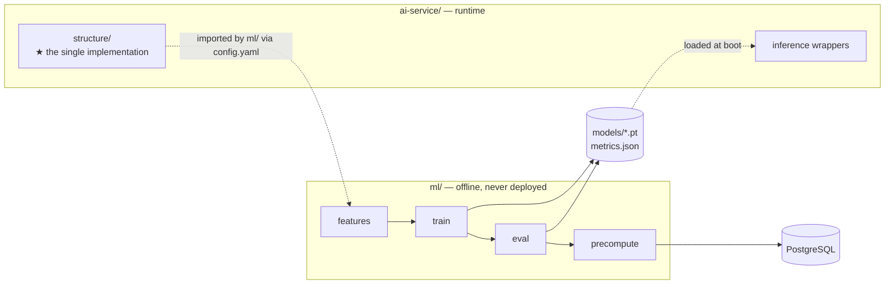
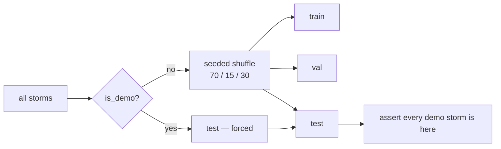
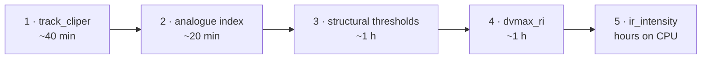
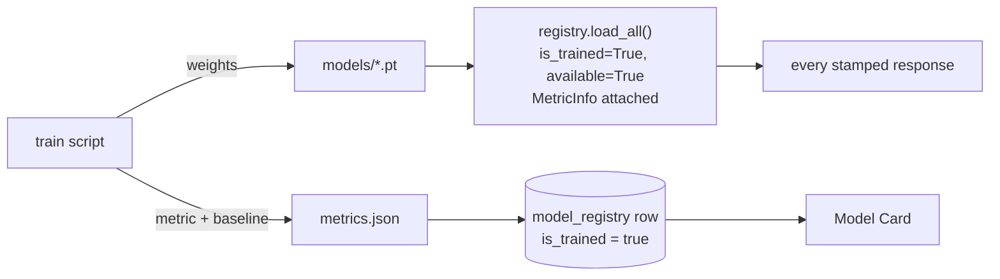

# ML pipeline

The offline machine-learning implementation: features, training, evaluation, artefacts.

This document covers *how models get made*. [`data-pipeline.md`](data-pipeline.md) covers
how data gets ready; [`models.md`](models.md) covers each model's specification.

> **Status: not implemented.** Phase 0 built the package structure and `ml/config.yaml`.
> Phases 3–4 implement this. Everything below is the specification to build from.

---

## The boundary between `ml/` and `ai-service/`

This is the most important thing in the document, because getting it wrong produces bugs
that are almost impossible to see.



| | `ml/` | `ai-service/` |
|---|---|---|
| Runs | on a laptop, on demand | as a service, continuously |
| Deployed | never | yes |
| Heavy deps | pandas, xarray, netCDF4, shapely, matplotlib | none of those |
| Writes | `data/`, `models/`, PostgreSQL | nothing |
| Reads | everything | `models/`, `FRAMES_DIR` (read-only) |

**Why separate.** The deployed service loads weights and runs forward passes; it has no
reason to carry the training stack, netCDF readers or plotting libraries. Faster boot, and
model iteration without restarting an API.

### The one shared implementation

`ml/features/structural.py` and `ai-service/app/structure/metrics.py` **must** produce
identical numbers. So there is exactly one implementation, and it lives in
`ai-service/app/structure/`. `ml/` imports it via `ml/config.yaml`:

```yaml
paths:
  structure_module: ../ai-service/app/structure
```

Two copies would drift, and a drift there would mean **the metrics a model trained on are
not the metrics it is served** — a silent accuracy loss with no error message anywhere.

Everything else is duplicated *deliberately*: `ml/` may reimplement track features for
batch efficiency, because those are recomputed from the database at inference time and any
disagreement would show up as an obvious wrong number, not a silent one.

---

## Feature generation

### The fusion vector — 33 dimensions

```
33-d  =  CNN embedding (PCA → 16)
       ⊕ structural metrics (7)
       ⊕ track features (9)
       ⊕ geographic (1)
```

| Group | Dims | Source | Provenance of origin |
|---|---|---|---|
| CNN embedding | 16 | EfficientNet-B0 penultimate layer, 1280-d → PCA | `TRAINED_MODEL` |
| Structural | 7 | `eyePresent`, `eyeRadiusKm`, `eyeRingBtContrastK`, `minBtK`, `cdoFraction100km`, `axisymmetry`, `coldCloudOffsetKm` | `DERIVED_MEASUREMENT` |
| Track | 9 | Vmax, ΔVmax 12 h, ΔVmax 24 h, pressure, latitude, translation speed, heading, day-of-year, persistence | `OBSERVED` |
| Geographic | 1 | `distToCoastKm` | `DERIVED_MEASUREMENT` |

**This is where multi-source fusion actually happens** — one vector, one model. Not two
datasets displayed side by side.

`convectiveRingRadiusKm` is measured and displayed but excluded from the vector: it is
strongly collinear with `eyeRadiusKm`. Phase 3 should confirm that empirically and record
the decision.

### Causality — the rule that protects Rewind & Verify

> **Every feature at time *t* must be computable from observations at or before *t*.**

A centred rolling mean, a "next observation" difference, or any forward-looking window
silently destroys the verification story: the model would appear accurate for reasons that
do not exist at forecast time, and nothing would report an error.

This is invariant **I1** applied at the feature level, and it is the easiest place in the
whole project to break by accident. `ΔVmax_12h` means `vmax(t) − vmax(t−12h)`. Never
`vmax(t+12h) − vmax(t)`.

### The PCA is fitted on train only

Fitting the embedding PCA on all splits is a subtle, easy leak. Fit on `train`, then
transform `val` and `test`. Persist the fitted PCA alongside the weights — a model served
with a differently-fitted PCA is silently wrong.

### Frames without imagery

Not every observation has a matched satellite pass, so not every row has an embedding or
structural metrics. Phase 3 must pick **one** policy and record it in `metrics.json`:

| Option | Consequence |
|---|---|
| Restrict the fused model to frames with imagery | Cleaner, smaller training set; the ablation compares like with like |
| Impute missing image features | Larger set; the ablation becomes harder to interpret |

**Recommended: restrict.** The ablation is the multi-source claim, and it must compare
identical rows across the three settings to mean anything.

---

## Storm-wise splits

`ml/train/splits.py`. Seeded, 70/15/15, **by storm**.



**Never frame-wise.** Frames within one storm are heavily autocorrelated — consecutive
3-hourly observations of the same cyclone are nearly identical. A random frame-level split
puts near-duplicates on both sides and inflates every metric.

Demo storms are forced into `test`, asserted here, constrained by the database
(`CHECK (NOT is_demo OR split = 'test')`), and reported on the Model Card as
`demoStormsInTest`. This is invariant **I4**, checked three times because Rewind & Verify
is meaningless without it.

> If verification results ever look suspiciously good, **assume leakage and check before
> believing them.**

---

## Training

Order matters — cheapest and most certain first, so that a failure late does not leave the
project with nothing.



The CNN is last because it takes longest **and** because it is the one component that can be
downgraded without changing any interface — EfficientNet-B0 → ResNet-18, or freezing the
backbone and training only the head.

Per-model hyperparameters, inputs and outputs: [`models.md`](models.md).

### Rules that apply to every training script

1. **Read only the `train` split.** Assert it at the top of every script.
2. **Seed everything.** `config.yaml` → `split.seed`, applied to numpy, torch and the
   model library.
3. **Persist scalers and transforms** alongside weights. A model served with a different
   scaler is silently wrong.
4. **Emit a held-out metric and a named baseline.** Without both, the registry and the
   database will refuse the claim.

---

## Evaluation

`ml/eval/`. Three outputs, all landing in `models/metrics.json`.

### 1. Per-model metrics against a baseline

| Model | Metric | Baseline |
|---|---|---|
| `ir_intensity` | MAE (kt) | mean predictor |
| `dvmax_ri` — ΔVmax | MAE (kt) | persistence (ΔVmax = 0) |
| `dvmax_ri` — RI | **PR-AUC** | climatological base rate |
| `track_cliper` | mean error (km) @ 12/24/48 h | pure persistence |

**An MAE with no baseline says nothing** about whether the model beats guessing the mean.
Both halves are required for a `TRAINED_MODEL` claim.

**RI is never reported as accuracy.** At a ~5% base rate, always predicting "no" scores 95%
and is useless. Report PR-AUC and lift over the base rate. If lift ≈ 1, say so — and lead
the demo with the analogue ensemble's empirical RI fraction instead, which needs no
classifier at all.

### 2. The ablation — the multi-source claim, tested

`ml/eval/ablation.py`. Train the ΔVmax model three times on **identical held-out storms**:

| Setting | Features |
|---|---|
| track-only | track (9) + geographic (1) |
| image-only | CNN embedding (16) + structural (7) |
| fused | all 33 |

This is the answer to *"is this genuinely multi-source, or two datasets on one screen?"*

**We do not claim fusion until this table says so.** If fused does not win, the Model Card
reports that the imagery adds nothing — which is still a real finding, honestly reported.

### 3. Cone calibration

`ml/eval/cone_calibration.py`. For each lead time, take the **67th and 90th percentiles of
the track model's own held-out error**, and then measure what containment those radii
actually achieve.

The cone is therefore not a chosen width but a measured one, which is why it carries
`STATISTICAL_BASELINE` provenance separately from the track model. A well-calibrated p67
radius should contain close to 67% of held-out truths; the observed figure goes on the
Model Card whether or not it is flattering.

### `metrics.json`

Generated here, committed, **never hand-edited**. It is consumed by `ModelCardService` and
is the only thing standing between the Model Card and marketing copy.

Shape follows the `ModelCard` type in `API_CONTRACT.md`: `datasets[]`, `split{}`,
`models{}`, `ablation{}`, `coneCalibration{}`.

---

## Precomputation

`ml/precompute/precompute_frames.py`. Runs the full pipeline **once** over every frame of
every demo storm and writes `storm_frame.analysis_json`.

This is what makes invariant **I5** possible: the scrubber reads finished rows instead of
triggering inference, which keeps it at 60 fps and lets the primary interaction survive a
dead AI service.

| Property | |
|---|---|
| Parallelism | Embarrassingly parallel across storms |
| Caching | Key on `(frame, model_version)` so improving one model does not redo everything |
| Output shape | **Must match the `FrameAnalysis` contract exactly** — `StormService` parses it with the same field names the API returns |
| Also writes | Grad-CAM PNGs to `data/gradcam/{sid}/{ts}.png` |

Re-run whenever any model changes. Stale `analysis_json` with a new `analysis_version` is
the failure mode to watch for.

---

## Artefacts

| Artefact | Path | Committed | Consumer |
|---|---|---|---|
| CNN weights | `models/ir_intensity_v1.pt` | no | `ai-service` |
| ΔVmax + RI | `models/dvmax_ri_v1.json` | no | `ai-service` |
| Track model | `models/track_cliper_v1.json` | no | `ai-service` |
| Analogue index | `models/analogue_index_v1.npz` | no | `ai-service` |
| Scalers, PCA | `models/scalers.pkl` | no | `ai-service` |
| **Metrics** | `models/metrics.json` | **yes** | `ModelCardService` |
| **Model card** | `models/model_card.md` | **yes** | humans |

Weights are regenerable and large, so they are gitignored. The two evaluation artefacts are
committed because they are the project's credibility record.

---

## The registry handshake

Training a model is not finished until the registry knows about it. Three places must agree:



1. `ml/db/write_to_postgres.py` updates the `model_registry` row — the database refuses it
   without `trained_at` **and** `metrics_json`.
2. `registry.load_all()` registers the real implementation with `is_trained=True`,
   `available=True` and a `MetricInfo` — the registry refuses it without a metric.
3. `metrics.json` carries the numbers to the Model Card.

Miss any one and the component silently keeps reporting `DEMO_DATA`. That failure mode is
deliberate: **defaulting to the honest answer** is the right direction to fail in.

---

## Adding a new model — the checklist

1. Implement the protocol in `ai-service/app/inference/base.py`.
2. Write `ml/train/train_<name>.py` — train split only, seeded, persist the scaler.
3. Add evaluation to `ml/eval/evaluate_all.py` with a **named baseline**.
4. Register in `load_all()` with truthful `is_trained` / `available` and a `MetricInfo`.
5. Update the `model_registry` row.
6. Re-run precomputation if it affects per-frame analysis.
7. Run `scripts\test-all.ps1`.

**If a model cannot be trained in time, do not fake it.** Ship a clearly-labelled baseline
behind the same interface and mark the trained version as a later phase.
