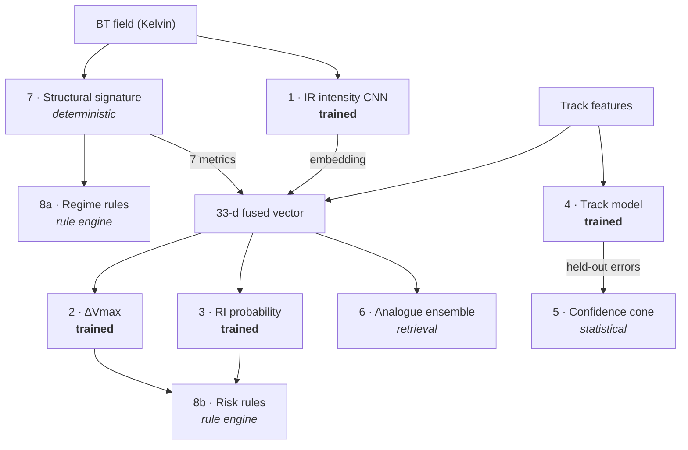

# Models and components

Every model and computational component in CycloVision.

The most important distinction in this document is between things that are **trained** and
things that are not. Four components are trained models; four are deterministic, statistical
or rule-based. Presenting the second group as the first is precisely what the provenance
system exists to prevent.

> **Status: nothing is trained.** All four `TRAINED_MODEL` components are specified here and
> implemented as placeholders. No weights exist, and no metric in this document is a
> measured result — every numeric target is marked as such.

---

## The eight components

| # | Component | Class | Provenance | Phase 0 |
|---|---|---|---|---|
| 1 | IR intensity estimator | **Trained** — CNN | `TRAINED_MODEL` | placeholder |
| 2 | ΔVmax 24 h | **Trained** — GBM | `TRAINED_MODEL` | placeholder |
| 3 | Rapid intensification | **Trained** — GBM | `TRAINED_MODEL` | placeholder |
| 4 | Track forecast (CLIPER-style) | **Trained** — GBM | `TRAINED_MODEL` | persistence baseline |
| 5 | Confidence cone | Statistical | `STATISTICAL_BASELINE` | no radii |
| 6 | Analogue ensemble | Retrieval | `ANALOGUE_ENSEMBLE` | empty index |
| 7 | Structural signature | Deterministic | `DERIVED_MEASUREMENT` | **working** |
| 8 | Regime + risk rules | Rule engines | `RULE_ENGINE` | uncalibrated |

---

# 1. IR intensity estimator — `ir_intensity`

| | |
|---|---|
| **Purpose** | Estimate maximum sustained wind from the infrared image alone |
| **Input** | 224×224 render of the storm-centred IR field, single channel replicated to 3 |
| **Output** | `vmaxKt` (regression), `category` (classification), `confidence`, 1280-d embedding |
| **Algorithm** | EfficientNet-B0 via `timm`, ImageNet-initialised, two heads |
| **Training data** | HURSAT frames labelled with the matched IBTrACS Vmax |
| **Split** | Storm-wise |
| **Baseline** | Mean predictor (always predict the training-set mean Vmax) |
| **Metric** | MAE (kt) |
| **Artifact** | `models/ir_intensity_v1.pt` |
| **Provenance** | `TRAINED_MODEL` |

**Why EfficientNet-B0.** Better accuracy per FLOP than ResNet at 224², and `timm` provides
clean feature extraction and a well-defined Grad-CAM target layer. Single-channel IR is
replicated to three channels so the ImageNet weights stay usable rather than discarding the
pretrained first convolution.

**Why a CNN at all.** It is the only way to extract information from the *image* that is not
already in the best track. That claim is tested, not assumed — see the ablation in
[`ml-pipeline.md`](ml-pipeline.md). If the image adds nothing, we report that.

**Fallback ladder** (each step changes no interface):
ResNet-18 → freeze the backbone, train only the head → reduce the storm subset → report the
honest, worse MAE. **A lower-accuracy model that works beats a perfect one that is not
ready.** The other three trained components carry the product regardless.

**Phase 0:** `PlaceholderIntensityEstimator` returns `None` for every field. An untrained
network genuinely has nothing to say about an image, and saying nothing is the accurate
representation of that.

**Limitations:** trained on a subset, so expect MAE worse than published literature values;
the relationship between cloud-top structure and surface wind is indirect; a sensor domain
shift arises if the fallback training dataset is used.

---

# 2. Intensity change — `dvmax_ri` (regression head)

| | |
|---|---|
| **Purpose** | Predict 24-hour change in maximum sustained wind |
| **Input** | The **fused 33-d vector** |
| **Output** | `deltaVmax24hKt`, `predictedVmax24hKt`, `trend`, `confidence` |
| **Algorithm** | XGBoost regressor |
| **Training data** | Joined IBTrACS + HURSAT features |
| **Split** | Storm-wise |
| **Baseline** | Persistence (ΔVmax = 0) |
| **Metric** | MAE (kt) |
| **Artifact** | `models/dvmax_ri_v1.json` |
| **Provenance** | `TRAINED_MODEL` |

**Why gradient boosting.** The input is tabular and modest in size — exactly where GBMs beat
neural networks — and TreeSHAP gives per-feature attributions essentially free, which is
what fills the Evidence drawer.

**This is where fusion is demonstrated.** Image-derived features and track features enter
the same vector for the same model, and the ablation reports track-only vs image-only vs
fused on identical held-out storms.

`trend` is derived from `deltaVmax24hKt` with a ±5 kt band. That band is a **presentation
choice**, not a model output.

**Fallback:** if the fused model does not beat track-only, ship track-only and report the
finding. The ablation table tells a real story either way.

**Phase 0:** returns `None`. **Limitations:** confidence is model-reported and not yet
calibration-checked.

---

# 3. Rapid intensification — `dvmax_ri` (classification head)

| | |
|---|---|
| **Purpose** | Probability of ≥30 kt intensification in 24 hours — the operationally hardest case |
| **Input** | The same fused 33-d vector |
| **Output** | `riProbability`, always with `riBaseRate` |
| **Algorithm** | XGBoost classifier with `scale_pos_weight` |
| **Definition** | RI = ΔVmax ≥ **30 kt in 24 h** (the standard operational definition) |
| **Split** | Storm-wise |
| **Baseline** | The climatological base rate |
| **Metric** | **PR-AUC and lift over base rate** |
| **Provenance** | `TRAINED_MODEL` |

**Never reported as accuracy.** RI occurs in roughly 5% of over-water cases
(basin-dependent). A model that always predicts "no" scores 95% accuracy and is useless.
PR-AUC and lift are the only honest summaries.

**The base rate always travels with the probability**, in the API and on screen. A 34%
probability is meaningless until the reader knows the background rate is about 5%.

**Fallback if the model has no skill.** If lift ≈ 1, say so on the Model Card and **lead the
demo with the analogue ensemble's empirical RI fraction instead** — that path needs no
classifier at all and is arguably more honest.

**Phase 0:** returns `None`. The `riBaseRate` field and the 0.25 warning threshold used by
verification already exist.

**Limitations:** severe class imbalance; the 0.25 threshold is a fixed choice, not
optimised.

---

# 4. Track forecast — `track_cliper`

| | |
|---|---|
| **Purpose** | Predict position at 12, 24 and 48 hours |
| **Input** | Track history: lat, lon, Vmax, heading, translation speed, persistence terms, day-of-year |
| **Output** | `TrackPoint[]` — Δlat/Δlon per horizon |
| **Algorithm** | **CLIPER-style** gradient-boosted regression; one model per (horizon, coordinate) |
| **Training data** | IBTrACS only — no imagery |
| **Split** | Storm-wise |
| **Baseline** | **Pure persistence** (straight-line extrapolation) |
| **Metric** | Mean track error (km) at each horizon |
| **Provenance** | `TRAINED_MODEL` |

**Why CLIPER and not a GRU or Transformer.** Three reasons, and they compound:

1. A deep sequence model cannot be trained *and validated* in the available time, and an
   under-trained one is worse than useless.
2. CLIPER (**CLI**matology and **PER**sistence) is the *actual operational benchmark*
   forecasters measure themselves against. A meteorologically literate judge will recognise
   it as the correct choice, not a compromise.
3. It is fully explainable and takes roughly 40 minutes to build.

**Why not a Kalman filter** (which the original blueprint proposed): a Kalman filter on
lat/lon is persistence in disguise. It has no skill beyond extrapolating the current
heading, and anyone who knows the field will spot that.

**We do not claim to beat official forecasts.** IMD and other agencies are considerably
better. We report our error honestly and note the comparison.

**Phase 0:** `PersistenceTrackModel` — the straight-line baseline the real model must beat,
wired in now so the Phase 3 comparison is already plumbed. Registered unavailable, so it
stamps `DEMO_DATA`.

**Limitations:** no environmental steering flow, so it cannot anticipate a recurvature it
has not seen the beginnings of.

---

# 5. Confidence cone — `track_cone`

| | |
|---|---|
| **Purpose** | Communicate track uncertainty as a measured shape, not a chosen one |
| **Input** | The distribution of the track model's own held-out errors, per lead time |
| **Output** | `coneRadiusP67Km`, `coneRadiusP90Km`, plus a `coneBasis` string stating *n* |
| **Algorithm** | **Empirical percentiles. Not a model.** |
| **Baseline** | n/a — it *is* a baseline |
| **Metric** | Observed containment vs nominal (a p67 radius should contain ~67% of truths) |
| **Provenance** | **`STATISTICAL_BASELINE`** — stamped separately from the track model |

**This is a whole component because the alternative is dishonest.** The obvious approach is
to pick radii that look right. The cone's width *is* the product's entire visual statement
about uncertainty, so an invented radius would be the single most misleading number on
screen.

Deriving it from measured error makes the demo line defensible: *"that radius isn't a guess
— it's the 67th percentile of our model's actual held-out errors across N forecasts."*

**An uncalibrated cone draws nothing.** The map layer skips any point whose radii are null.

**Phase 0:** radii are `null`; `coneBasis` reads "Not yet calibrated."

**Limitations:** circular bands rather than a swept envelope (a real cone tapers between
lead times); percentiles pooled across all storms rather than conditioned on regime or
basin.

---

# 6. Analogue ensemble — `analogue`

| | |
|---|---|
| **Purpose** | An independent second forecast drawn from history |
| **Input** | The storm's last 24 h of evolution as a z-scored feature vector |
| **Output** | k matches with similarity, plus the **aggregate of what they did next** |
| **Algorithm** | `sklearn.NearestNeighbors`, **k = 20** |
| **Training data** | The historical feature matrix — an index, not a fitted model |
| **Exclusions** | Same storm, same season |
| **Baseline** | The climatological base rate, for the RI fraction |
| **Provenance** | `ANALOGUE_ENSEMBLE` |

**Not a trained model** — it fits no parameters. It is retrieval plus aggregation, which is
why it gets its own provenance tag rather than borrowing `TRAINED_MODEL`.

**Why it earns a place.** Analog Ensemble is a real, published forecasting method. Because
it is *statistically independent* of the gradient-boosted models, agreement between the two
is genuine evidence rather than one model repeating itself. It costs roughly 120 lines and
queries in sub-milliseconds.

Full methodology and interpretation limits:
[`analogue-ensemble.md`](analogue-ensemble.md).

**Phase 0:** `PlaceholderAnalogueIndex` returns `k: 0` with no matches. Inventing
plausible-looking storm names would be the worst kind of demo fakery.

---

# 7. Structural signature — `structure`

| | |
|---|---|
| **Purpose** | Identify and classify cyclone *patterns* from measurable physics |
| **Input** | Raw brightness temperature in **Kelvin** + `km_per_pixel` |
| **Output** | Seven metrics + eye geometry |
| **Algorithm** | **Deterministic.** Polar regrid, azimuthal Fourier decomposition, thresholded eye detection |
| **Training data** | **None — nothing is fitted** |
| **Baseline** | n/a |
| **Validation** | Unit tests against synthetic fields with known answers |
| **Provenance** | `DERIVED_MEASUREMENT` |

**The only component that fully works today.** It needs no training and no dataset — only a
BT array to measure.

**Why it matters scientifically.** These are the quantities a Dvorak analyst reads by eye,
computed numerically instead of estimated visually. They are also the most faithful reading
of the problem statement's word *"patterns"*.

Full methodology, the seven metrics, and the eye-enclosure requirement discovered during
Phase 0: [`structural-signature.md`](structural-signature.md).

**Phase 0:** implemented, tested, registered *available*. It claims `DERIVED_MEASUREMENT`
whenever a BT array is present, and `DEMO_DATA` per-request when one is not.

---

# 8. Rule engines — `regime_rules`, `risk_rules`

| | |
|---|---|
| **Purpose** | Turn measurements into interpretable labels, transparently |
| **Input** | Structural metrics; and Vmax + RI probability + coast distance + category |
| **Output** | Regime + `rulesApplied[]`; risk score + level + formula + terms |
| **Algorithm** | Hand-written thresholds. **Nothing fitted.** |
| **Provenance** | `RULE_ENGINE` |

**Why rules rather than models.**

*Regime:* there is no free labelled Dvorak dataset at scale, so a supervised classifier is
not available honestly. A transparent rule engine that shows its thresholds is better than
a black box trained on labels we do not have.

*Risk:* a supervised risk model needs labelled outcome severity on a discrete scale, which
does not cleanly exist in IBTrACS. Fitting one on proxies would produce a number that looks
authoritative and means very little. A weighted rule is honest about being a judgement call.

Both return their reasoning: `rulesApplied[]` lists exactly which thresholds fired, and the
risk block returns its formula and every term alongside the score.

**Phase 0:** both registered *uncalibrated*, so both stamp `DEMO_DATA`. Phase 3 tunes the
regime thresholds on held-out storms and flips it to `RULE_ENGINE`.

> ⚠️ The risk score is **structurally uncomputable** today: `HistoryPoint` has no `category`
> field, so `categoryNorm` can never be supplied. See [`api.md`](api.md) §D2.

---

## Trained vs not — the summary that matters

| Trained models (4) | Everything else (4) |
|---|---|
| `ir_intensity` — CNN | `track_cone` — empirical percentiles |
| `dvmax_ri` regression — GBM | `analogue` — retrieval + aggregation |
| `dvmax_ri` classification — GBM | `structure` — deterministic physics |
| `track_cliper` — GBM | `regime_rules`, `risk_rules` — hand-written thresholds |

**Only the left column may ever claim `TRAINED_MODEL`**, and only with a held-out metric and
a named baseline. The registry and the database both refuse the claim otherwise.

## Failure and fallback, in one table

| Component | If it fails | Product impact |
|---|---|---|
| `ir_intensity` | ResNet-18 → frozen backbone → report honest MAE | The sparkline's dashed line is worse, not absent |
| `dvmax_ri` | Ship track-only; report the ablation finding | Intensity outlook less compelling |
| RI head | Report lift ≈ 1; lead with the analogue RI fraction | The RI headline moves, does not vanish |
| `track_cliper` | Report error vs persistence honestly | Verify still works, with a wider cone |
| `track_cone` | Draw no cone | Uncertainty stated in text instead |
| `analogue` | Empty result, correctly stamped | One differentiator lost |
| `structure` | Absent metrics for that frame | Evidence drawer degrades gracefully |
| Rule engines | Return `null` with the formula shown | Level absent, reasoning still visible |

The consistent principle: **degrade to absence with an explanation, never to a plausible
value.**

## Model versioning

Every component carries `key` and `version`, stamped onto every response and stored in
`forecast_run.model_bundle_version`. A stored result can always be traced to the bundle that
produced it.

`model_registry` holds one row per `(model_key, version)` with its metric and training time.
The database refuses a trained row without both.
