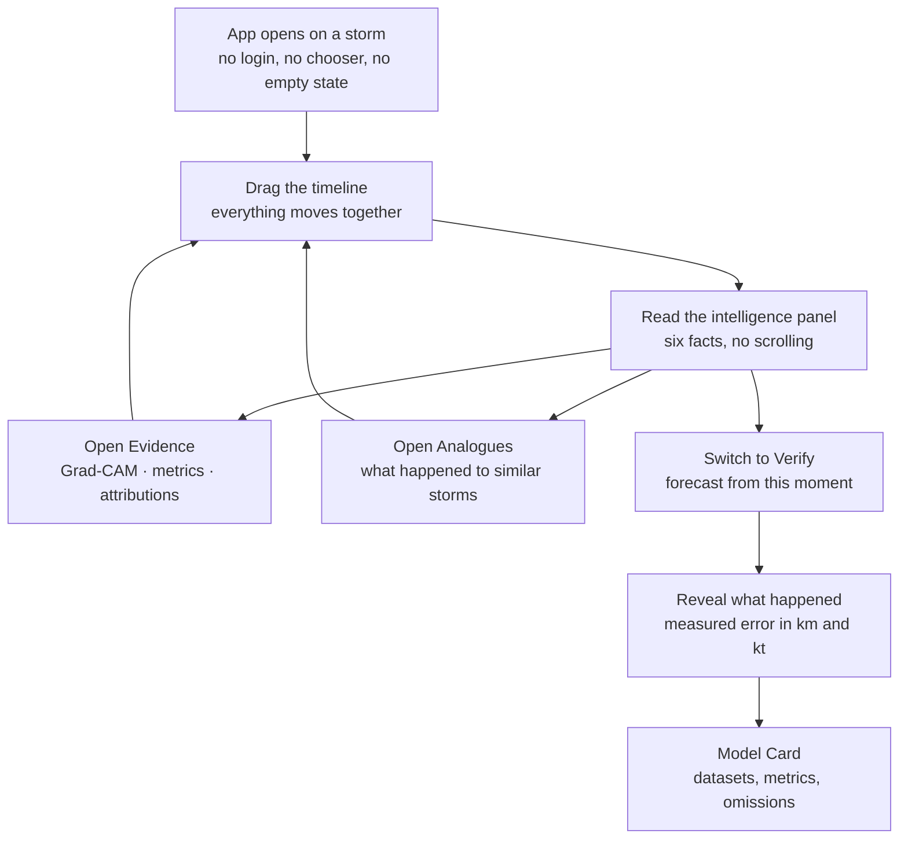
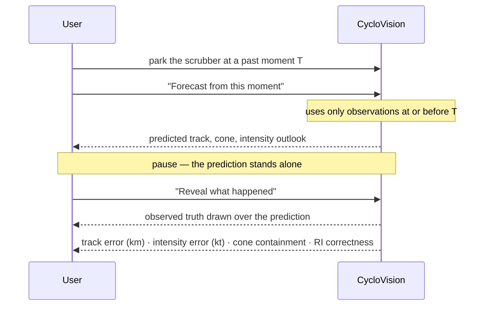

# The product

This document describes what a user sees and does. Implementation lives elsewhere —
[`frontend.md`](frontend.md) for structure, [`features.md`](features.md) for per-feature
detail.

---

## What CycloVision is

A **flight recorder for tropical cyclones**: an instrument for replaying a storm's life,
interrogating what the AI saw at any moment, and checking its forecasts against what
actually happened.

It is deliberately **not** a weather dashboard, a cyclone map, a collection of model
outputs, or an AI chatbot. Those framings all treat the storm as a snapshot. CycloVision
treats time as the primary axis, and that reframing is what turns "a map with data on it"
into something that behaves like an instrument.

## Target user

The primary audience is a **technically literate evaluator** — a hackathon judge, a
meteorologist, an engineer — who wants to know whether the AI is real and will ask hard
questions about it.

The design consequence is that the product must be legible in seconds *and* survive
interrogation. Both are served by the same choice: show a small number of facts plainly,
and put the evidence one click away rather than in the way.

A secondary audience is anyone tracking a storm's evolution — a forecaster reviewing a
past event, a student learning cyclone structure. Nothing in the design is specific to
either.

---

## The primary user journey



The journey has one hub — the Command Center — and everything else is either a drawer over
it or the one other route. There is no navigation tree, because there is nowhere else to
go.

---

## The Command Center

The single screen where roughly 85% of the product lives.

```
┌──────────────────────────────────────────────────────────────────────────┐
│ ◈ CycloVision   FANI · North Indian Ocean · 2019      [Explore|Verify] ⓘ │  header
├────────────────┬─────────────────────────────────────┬───────────────────┤
│                │                                     │                   │
│  STORMS        │                                     │  INTELLIGENCE     │
│  ┌──────────┐  │        ██ full-bleed dark map ██     │  ┌─────────────┐  │
│  │ Fani  '19│◄ │        IR frame overlaid on          │  │ 125 kt      │  │
│  │ Amphan'20│  │        the storm position            │  │ OBSERVED    │  │
│  │ Phailin  │  │                                      │  ├─────────────┤  │
│  │ Hudhud   │  │        ── observed track (solid)     │  │ Eye pattern │  │
│  └──────────┘  │        ┄┄ forecast (dashed) + cone   │  │ symmetry .89│  │
│                │        ░░ analogue tracks (faint)    │  ├─────────────┤  │
│  collapsible   │                                      │  │ ▲ +8 kt/24h │  │
│  rail          │                                      │  │ RI risk 34% │  │
│                │                                      │  ├─────────────┤  │
│                │                                      │  │ [Why?]      │  │
│                │                                      │  │ [Analogues] │  │
│                │                                      │  └─────────────┘  │
├────────────────┴─────────────────────────────────────┴───────────────────┤
│ ⏮ ⏵ ⏭   26 Apr ──────────●───────────────── 4 May   02 May 06:00 UTC     │
│         ╭─ observed intensity ── vs model estimate ┄┄ ─╮                 │  timeline
└──────────────────────────────────────────────────────────────────────────┘
```

### What is visible immediately

Six facts, no scrolling, no interaction required:

1. Which storm, which basin, which year
2. Current sustained wind and category — tagged `OBSERVED`
3. What the satellite structure reads as, in plain words ("Eye pattern, well organised")
4. The intensity trend
5. The risk level
6. Where the storm is, and where it has been

### What is hidden until asked

Grad-CAM, the seven structural metrics with their thresholds, SHAP attributions, analogue
detail, model versions and held-out metrics. All one click away, none in the way.

This is deliberate. A judge needs to understand the screen in seconds, then be able to go
as deep as they want. Putting the depth on the surface would defeat the first goal;
omitting it would defeat the second.

---

## Timeline-first interaction

**The scrubber is the primary control, and effectively the only one.**

Dragging it moves — in the same frame of animation — the satellite frame on the map, the
storm marker along its track, the structural readouts, the model's intensity estimate, the
cursor on the lifecycle chart, and the intelligence panel.

Two properties matter, and both are structural rather than cosmetic:

- **It reads data already in memory.** The storm-detail request returns every frame of the
  storm's life, so a drag issues no network request and triggers no inference. This is
  architectural invariant **I5**.
- **The scrub is 1:1 with the pointer and unanimated.** Easing a value the user is
  directly manipulating makes it feel laggy. The cursor follows the finger exactly.

Keyboard: `←` `→` step one frame, `space` toggles playback.

### The sparkline

The scrubber's track is not a plain bar. It is a chart of **observed intensity (solid)
against the model's per-frame estimate (dashed)** across the storm's entire life.

This is the product's strongest single piece of evidence and it is visible before anyone
clicks anything: two lines tracking each other over nine days says more about whether the
vision model works than any accuracy figure.

Where the model has no estimate — a frame with no matched satellite pass — the dashed line
**breaks** rather than interpolating. A gap is honest; a drawn-through line would imply an
output that does not exist.

---

## Map-first experience

The map is the page background, at full bleed, 100% width and height. Every panel floats
on top of it as a translucent glass surface.

That single layout decision is what keeps the map the centrepiece and prevents the product
reading as an admin dashboard. There is no card grid anywhere.

Layers, from back to front: the dark basemap, the georeferenced infrared frame, faint
analogue tracks, the forecast cone, the observed track, the dashed forecast, revealed
ground truth, and the storm marker.

Two colours carry meaning and are never mixed:

- **Near-white** is reserved for observed values and ground truth.
- **A single cool accent** is reserved for AI output and interactive affordances.

A viewer can therefore tell a measurement from a prediction at a glance, without reading a
legend.

---

## Explore mode

The default. The user moves through the storm's life and reads what the system understood
at each moment.

Everything in Explore mode is served from **precomputed** analysis, so it is instant and
it keeps working even if the AI service is down.

## Verify mode

The differentiator. Verify changes only the right panel and what is drawn on the map.



The user picks **T** themselves, which is what makes the result un-cherry-picked. They can
pick another moment and do it again.

The honesty guarantee behind it: the forecast is generated from data available at or
before T only, and the ground truth is attached afterwards by a different service. Details
in [`rewind-and-verify.md`](rewind-and-verify.md).

---

## The two drawers

Drawers slide from the right over a blurred map. The map stays visible behind them, so
opening one reads as *looking closer at the same thing* rather than navigating away. That
is precisely why they are drawers and not routes.

### Evidence — "Why?"

The argument, built in order:

1. The satellite frame, with a Grad-CAM attention toggle and the detected eye marked
2. The seven structural measurements, each with its threshold and note
3. The regime label and the exact rules that fired to produce it
4. SHAP attributions for the intensity-change forecast
5. A provenance explainer

The pairing in (1)–(3) is the point: the measurements say *what is physically there*,
Grad-CAM says *what the network used*. When they agree, that agreement is a real
validation signal rather than a decorative heatmap.

### Analogues

Aggregate first, individuals second:

1. The outcome distribution — how many of the retrieved analogues intensified, weakened,
   or underwent rapid intensification, shown against the climatological base rate
2. The closest matches, ranked, with what each went on to do
3. The exclusion rules, stated plainly

Presenting the storm list first would turn this back into the "similar storms" card the
design explicitly rejects. The aggregate **is** the forecast; the named storms are the
evidence for it.

---

## The Model Card

The second and only other route. It exists to answer *"how do I know any of this is
real?"* without the answer being "trust us".

It contains: datasets with counts and licences; the storm-wise split and whether demo
storms are held out; every model with its held-out metric **and the baseline it beats**;
the multi-source ablation; cone calibration; and an explicit list of **what was not built,
and why**.

That last section is not an apology. It pre-empts the hardest questions a technical judge
can ask, and it is what earns the right to decline to overclaim elsewhere.

The page is built in Phase 0, before there is anything flattering to put on it. A model
card that only appears once the numbers are good is a marketing page; one that honestly
reports an untrained bundle is an audit trail.

---

## Progressive disclosure, summarised

| Level | Where | Content |
|---|---|---|
| 0 | Command Center, always visible | Six facts about the current moment |
| 1 | Intelligence panel sections | Trend, RI probability, analogue summary, risk, narrative |
| 2 | Evidence / Analogues drawers | Grad-CAM, metrics + thresholds, SHAP, match detail |
| 3 | Model Card | Datasets, splits, metrics, ablation, omissions |

Nothing at level 2 or 3 is required to understand level 0. Nothing at level 0 is a summary
that misrepresents what is underneath it.

---

## What the user is never shown

- A number without a provenance tag
- An estimated value where the real one is unavailable — absent values render as `—` with
  an explanation, never as zero or a plausible-looking guess
- A confidence cone whose radius has not been calibrated against measured error
- A forecast presented as live when it came from cache or a stored demo scenario

The last three are enforced in code. See [`provenance.md`](provenance.md).
