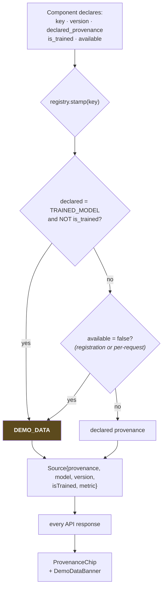

# Provenance

> Mock predictions, random outputs, hardcoded values and heuristics must never be presented
> as genuine trained AI predictions.

That is the project's founding constraint. This document describes the machinery that makes
it **structural rather than aspirational**.

The reasoning is practical as much as ethical. CycloVision is judged partly on whether the
AI is real. Overclaiming is dishonest, and if anyone probes a claim we cannot support, the
credibility of everything else goes with it. Labelling a rule engine as a rule engine reads
as rigour, not weakness.

---

## The eight tags

| Tag | Meaning | Who may emit it | Example |
|---|---|---|---|
| `OBSERVED` | Ground truth from a dataset. Never a model output. | **Backend only**, from `storm_frame` columns. The AI service may use it *solely* to echo back input it was handed. | IBTrACS wind speed; the entire verification block |
| `TRAINED_MODEL` | A model trained and evaluated on held-out storms | The registry, only when `is_trained=true` **and** a `MetricInfo` with a baseline exists | CNN intensity, ΔVmax, P(RI), track forecast |
| `DERIVED_MEASUREMENT` | Deterministic computation over real data. Not fitted. | The registry, when the component can actually run on this input | The seven structural metrics |
| `STATISTICAL_BASELINE` | Derived from the empirical distribution of held-out errors | The registry, once calibration exists | Cone radii (p67, p90) |
| `ANALOGUE_ENSEMBLE` | Empirical outcome distribution over retrieved analogues | The registry, once the index is built | "14 of 20 intensified" |
| `RULE_ENGINE` | Transparent hand-written rules, thresholds shown | The registry, when the rules are calibrated | Regime label, risk score, situation report |
| `LLM_NARRATION` | Wording generated over already-computed values | Deferred — nothing emits it today | Optional report rephrasing |
| `DEMO_DATA` | Placeholder. No trained model produced this. | The registry, as the **downgrade target** for every failed check | Everything in Phase 0 |

The enum is defined identically in three places, and changing it means changing all three:

| Language | File |
|---|---|
| TypeScript *(source of truth)* | `frontend/src/types/api.ts` |
| Java | `backend/.../domain/Provenance.java` |
| Python | `ai-service/app/schemas/common.py` |

Plus a `CHECK` constraint on `model_registry.provenance`.

---

## The three rules

**1. `TRAINED_MODEL` requires evidence.** A held-out metric **and** the baseline it is
compared against. An MAE with no baseline says nothing about whether the model beats
guessing the mean, so it is not an auditable claim and is refused.

**2. `OBSERVED` originates only in the backend.** The AI service has no database
connection, so it cannot fabricate ground truth even in principle. Its one permitted use is
echoing back the observed state it was handed.

**3. A component that cannot run returns `null`, stamped `DEMO_DATA`.** Absent, never
estimated. A missing satellite frame yields no structural metrics — not zeros.

---

## How a stamp is produced



### `Source`

```ts
interface Source {
  provenance: Provenance
  model?: string          // the registered key
  version?: string
  isTrained?: boolean
  metric?: MetricInfo     // withheld unless the claim survived as TRAINED_MODEL
}
```

`metric` is deliberately dropped when a claim is downgraded. A downgraded stamp carrying a
metric would be a mixed signal — the value is a placeholder, so no evidence should
accompany it.

---

## The four enforcement mechanisms

Any one catches a mislabelled value. All four would have to fail together for a false claim
to reach a viewer.

### 1. The registry is the only source of stamps — invariant I3

`ai-service/app/registry.py` is the **only** place a `Source` is constructed in the
inference service.

```python
def effective_provenance(self) -> Provenance:
    if self.declared_provenance == Provenance.TRAINED_MODEL and not self.is_trained:
        return Provenance.DEMO_DATA
    if not self.available:
        return Provenance.DEMO_DATA
    return self.declared_provenance
```

Registration refuses an unevidenced claim outright:

```python
raise ValueError(
    f"component '{key}' claims TRAINED_MODEL but reports no held-out metric; "
    f"a claim we cannot show evidence for is not allowed"
)
```

#### Per-request availability

```python
registry.stamp("structure", available=False)
```

The structural metrics module is genuine, tested code — but it can only measure a frame that
*has* imagery. On a frame without one it is loaded and working yet cannot run, so its output
**for that request** is `DEMO_DATA`.

**Correctness here is per-value, not per-component.** A component being generally trustworthy
does not make every one of its outputs trustworthy.

**Tested by** `ai-service/tests/test_provenance.py` — nine tests covering downgrades, the
evidence requirement, the per-request override, and the Phase 0 bundle state.

### 2. The contract requires a stamp on every block

Every analysis block in `ForecastResponse` and `FrameAnalysis` has a **mandatory** `source`.
A new block without one fails Pydantic validation, `tsc -b`, and `ProvenanceTest`.

Two blocks carry **two** stamps each, and the reason matters:

| Block | Stamps | Why |
|---|---|---|
| `StructureBlock` | `metricsSource` + `regimeSource` | The measurements are deterministic physics; the regime label is an interpretation with human-chosen thresholds. Merging them would let a threshold borrow a measurement's credibility. |
| `TrackForecast` | `source` + `coneSource` | The track is a model output; the cone is a percentile of that model's own errors. Different things, different standing. |

**Tested by** `test_contract_shapes.py` (every block stamped, on the live endpoint) and
`ProvenanceTest.everyBlockIsStamped` (structurally, by reflection).

### 3. The database refuses unsupported claims

```sql
CONSTRAINT trained_models_need_evidence
    CHECK (NOT is_trained OR (trained_at IS NOT NULL AND metrics_json IS NOT NULL))
```

And, guarding the thing verification depends on:

```sql
CONSTRAINT demo_storms_must_be_held_out CHECK (NOT is_demo OR split = 'test')
```

**Tested by** `SchemaMigrationTest`, against real PostgreSQL. Both constraints were confirmed
in Phase 0 to genuinely reject the offending insert.

### 4. Defence in depth on the Java side

The backend re-applies the rule before anything reaches the browser:

```java
public Source enforceTrainedFlag() {
    if (provenance == Provenance.TRAINED_MODEL && !Boolean.TRUE.equals(isTrained)) {
        return new Source(Provenance.DEMO_DATA, model, version, false, metric);
    }
    return this;
}
```

Applied by `StormService` when parsing stored `analysis_json`, and by `ModelCardService`
when reading registry rows. This catches **stale precomputed data**: a row written by an
earlier bundle that claimed `TRAINED_MODEL` is downgraded when the current bundle has no
such model.

---

## The consequence is visible

A provenance system whose consequence is invisible is decoration.

### `ProvenanceChip`

Renders beside every value. Small, uppercase, unfilled — the tags recede. **Except
`DEMO_DATA`**, which is styled to catch the eye, because it is the one tag that says "this
did not come from a trained model".

Hovering gives the full description, the model key and version, and the metric with its
baseline.

The wording matters as much as the colour. `DEMO_DATA` renders as **"Placeholder"** — the
honest word — not "Demo" or "Sample".

### `DemoDataBanner`

Appears whenever **anything** on screen is `DEMO_DATA`:

> **DEMO DATA** — No trained model is loaded (bundle phase0) — forecast values are absent
> rather than estimated.

**A Phase 0 build cannot look like a working AI system.** That is the entire point.

---

## Absent, never estimated

The rule that makes the tags trustworthy: when a value cannot be produced, it is `null`.

| Situation | Response | Not |
|---|---|---|
| No trained CNN | `vmaxKt: null`, `DEMO_DATA` | A plausible estimate |
| No BT array for this frame | Empty `StructureBlock`, `DEMO_DATA` | Zeros |
| Cone not calibrated | `coneRadiusP67Km: null`, map draws nothing | A guessed radius |
| Risk terms incomplete | `score: null`, formula and available terms returned | A partial score |
| No ground truth past T | `available: false` | An interpolated truth |
| Analogue index empty | `k: 0`, no matches | Invented storm names |

The frontend renders absence as `—` with an explanation of *why*, so a gap reads as
information rather than a bug.

### Placeholders return persistence, not noise

Where a placeholder must return a number, it returns a transparent extrapolation of the
observed input.

Random numbers make a demo look alive when it is not — precisely the dishonesty this system
exists to prevent. Persistence is also the baseline the real track model must beat, so
wiring it in now means the Phase 3 comparison is already plumbed.

The persistence model deliberately returns **no cone radii**, because the cone's width *is*
the product's visual statement about uncertainty.

---

## Phase 0 state

| Component | Declared | Effective | Why |
|---|---|---|---|
| `ir_intensity` | `TRAINED_MODEL` | `DEMO_DATA` | not trained |
| `dvmax_ri` | `TRAINED_MODEL` | `DEMO_DATA` | not trained |
| `track_cliper` | `TRAINED_MODEL` | `DEMO_DATA` | not trained; persistence stands in |
| `track_cone` | `STATISTICAL_BASELINE` | `DEMO_DATA` | no held-out errors to take percentiles of |
| `analogue` | `ANALOGUE_ENSEMBLE` | `DEMO_DATA` | index not built |
| `structure` | `DERIVED_MEASUREMENT` | **per-frame** | real code; needs a BT array |
| `regime_rules` | `RULE_ENGINE` | `DEMO_DATA` | thresholds not yet tuned |
| `risk_rules` | `RULE_ENGINE` | `DEMO_DATA` | the formula lacks a required term |
| `report_template` | `RULE_ENGINE` | **`RULE_ENGINE`** | interpolates computed values; originates nothing |

As Phase 3 trains each model, its registry row flips to `is_trained = true` with a metric,
and the `DEMO_DATA` chips disappear from the UI **one at a time**. Progress is visible and
honest by construction.

> ⚠️ `report_template` has no `model_registry` row, so the Model Card omits it — nine
> components in `/api/health`, eight on the Model Card. See [`api.md`](api.md) §D1.

---

## Relationship to the Model Card

The Model Card is the provenance system's public accounting.

| Provenance concept | Model Card surface |
|---|---|
| `is_trained` per component | The models table |
| `MetricInfo` (metric + baseline) | Metric and baseline columns |
| Storm-wise split, demo storms held out | The split table, `demoStormsInTest` |
| Multi-source claim | The ablation table |
| Cone calibration | Observed containment vs nominal |
| What we refuse to claim | "What we did not build, and why" |

`ModelCardService` reports a registry row as `DEMO_DATA` whenever it is not trained,
regardless of its `provenance` column — the same defensive rule as everywhere else.

The card is generated from `models/metrics.json`, written by `ml/eval/` and **never
hand-edited**. It is the only thing standing between the Model Card and marketing copy.

---

## Adding a model — the provenance checklist

1. Implement the protocol in `ai-service/app/inference/base.py`.
2. Register in `load_all()` with **truthful** `is_trained` and `available`, and a
   `MetricInfo` carrying the held-out metric and its baseline.
3. Update the `model_registry` row — the database rejects it without `trained_at` **and**
   `metrics_json`.
4. Add the metric to `models/metrics.json` so it reaches the Model Card.
5. Run `scripts\test-all.ps1`.

Miss any step and the component silently keeps reporting `DEMO_DATA`. **That failure mode is
deliberate: defaulting to the honest answer is the right direction to fail in.**

> **If a model cannot be trained in time, do not fake it.** Ship a clearly-labelled baseline
> behind the same interface and mark the trained version as a later phase.
