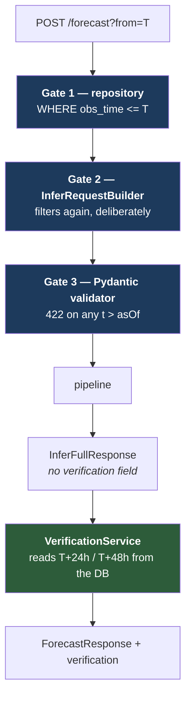

# Rewind & Verify

**Differentiator B.** The feature that converts an unfalsifiable claim into a measured,
checkable result.

Everyone's demo says *"our AI predicts X."* This one says *"at 06 UTC on 2 May it predicted
X; here is 3 May; it was 63 km off"* — on a moment the judge chose.

> **Status:** the full backend path is implemented and was verified end to end in Phase 0 —
> mask, request build, inference call, verification attach, error arithmetic. The forecast
> values are absent because no model is trained yet.

---

## Why this exists

A forward-looking prediction cannot be checked in a four-minute demo. A judge cannot
distinguish a trained XGBoost from `random.choice(["intensify", "weaken"])`.

Because our storms are **historical**, the future is already in the database. We can
therefore run the forecast *as of* a past moment and then reveal what happened — turning
the demo's weakest structural property (unverifiability) into its strongest.

The entire feature rests on one guarantee: **the forecast genuinely could not see the
future.** If that fails, everything the feature claims is worthless — and, worse, the
failure would be invisible, because a leak looks like an unusually accurate model rather
than a bug.

Hence three independent gates, described below.

---

## Worked example

Take Fani (2019), a demo storm, held out from training. The user parks the scrubber at
**T = 2019-05-02T06:00:00Z**.

### Step 1 — the user picks T

The judge chooses the moment. That is what makes the result un-cherry-picked, and it is
worth saying out loud during the demo.

### Step 2 — the request

```http
POST /api/storms/2019114N06084/forecast?from=2019-05-02T06:00:00Z&reveal=false
```

### Step 3 — the temporal mask

```java
frameRepository.findBySidAndObsTimeLessThanEqualOrderByObsTimeAsc(sid, asOf)
```

Rows returned:

| obs_time | vmax | included |
|---|---|---|
| 2019-05-01T18:00Z | 115 kt | ✅ |
| 2019-05-02T00:00Z | 120 kt | ✅ |
| **2019-05-02T06:00Z** | 125 kt | ✅ **the boundary is included** |
| 2019-05-02T12:00Z | 130 kt | ❌ |
| 2019-05-03T06:00Z | 135 kt | ❌ ← **this is the answer** |

The row at T+24h is the value the forecast will later be scored against. It is not loaded,
not passed, and not reachable by anything in the forecast path.

### Step 4 — the request is built, and filtered again

`InferRequestBuilder` re-applies the same filter. **Deliberately redundant** — see "Why
three gates" below.

```json
{
  "sid": "2019114N06084",
  "asOf": "2019-05-02T06:00:00Z",
  "history": [ /* only t <= asOf */ ],
  "frameRef": { "btPath": "…/20190502T0600.npy", … },
  "options": { "analogueK": 20, "wantGradcam": true, "wantShap": true }
}
```

`InferFullRequest` has exactly five fields. **None can carry a future observation or a
ground-truth outcome.** A test asserts that field list, so adding such a field fails the
build.

### Step 5 — the AI service validates, then infers

```python
offenders = [p.t for p in self.history if p.t > self.asOf]
if offenders:
    raise ValueError(f"temporal mask violation: … earliest offender {min(offenders)}")
```

Returns **422**, naming the earliest offender. It **rejects rather than silently dropping**,
because a caller that sends the future has a bug worth surfacing.

The pipeline then runs structure → vision → fusion → intensity → track → analogues → risk →
report, and stamps every block.

### Step 6 — the prediction is shown, alone

Dashed accented track to 12/24/48 h, the confidence cone, the intensity outlook, the RI
probability against its base rate.

**The demo pauses here.** The prediction stands on its own for a beat before anything is
revealed. That pause is the feature.

### Step 7 — reveal

```http
POST /api/storms/2019114N06084/forecast?from=2019-05-02T06:00:00Z&reveal=true
```

`VerificationService` — and **only** `VerificationService` — now reads the future:

```java
frameRepository.findFirstBySidAndObsTimeGreaterThanEqualOrderByObsTimeAsc(sid, t.plusHours(24))
```

### Step 8 — the errors

```json
{
  "available": true,
  "observedAt24h": { "t": "2019-05-03T06:00:00Z", "lat": 19.6, "lon": 85.8, "vmaxKt": 135 },
  "trackErrorKm24h": 63,
  "intensityErrorKt24h": 2,
  "insideConeP67": true,
  "riOccurred": false,
  "riWarningIssued": true,
  "source": { "provenance": "OBSERVED" }
}
```

*Illustrative values — no model is trained, so no real error has been measured.*

The observed track is drawn **solid, in the truth colour**, over the dashed prediction. The
readout appears in the panel.

---

## The three gates



### Why three, when one would do

Because of the **failure mode**, not the probability of failure.

A leak does not crash. It does not log an error. It produces an unusually accurate hindcast
— which, in a demo, looks like success. It would silently invalidate every number the
feature reports, and nobody would notice until someone competent asked the right question.

Three gates in two languages and two processes mean **three independent mistakes** are
required. Each is covered by a test.

---

## Invariant I2 — verification ownership

**The AI service can never produce a verification block.**

| Enforcement | Where |
|---|---|
| No `verification` field on `InferFullResponse` | `schemas/forecast.py`, `dto/InferDto.java` |
| Verification assembled from repository reads | `VerificationService` |
| A mocked AI response containing one is ignored | `VerificationServiceTest` |
| Structural assertion over the record's fields | Both languages |

Ground truth cannot round-trip through inference. It enters only after the response has
already been produced, in a different service, from a different query.

---

## What is measured

### Track error

Haversine distance between the predicted position at a lead time and the nearest observed
position at or after `T + lead`:

```java
GeoUtil.haversineKm(predicted.lat(), predicted.lon(), observed.getLat(), observed.getLon())
```

Reported at 24 h and 48 h.

### Intensity error

`|predictedVmax24hKt − observedVmax24h|`, in knots.

### Cone containment

`trackErrorKm24h ≤ coneRadiusP67Km` (and p90).

**Only meaningful once the cone is calibrated.** With null radii, containment is `null` —
absent, not `false`. An uncalibrated cone would make containment meaningless in a way that
looks meaningful.

### RI correctness

```java
RI_THRESHOLD_KT     = 30.0   // the standard operational definition, ≥30 kt in 24 h
RI_WARNING_PROBABILITY = 0.25
```

| | |
|---|---|
| `riOccurred` | `observedVmax24h − vmaxAtT ≥ 30 kt` |
| `riWarningIssued` | `riProbability ≥ 0.25` |

Both are reported, so a **hit** and a **false alarm** read differently. A warning that fired
without an event is a legitimate outcome to show — hiding it would be the dishonest choice.

### When there is no truth

If the storm record ends before T + 24 h, `available: false` and every field is `null`.
**Reported as unavailable, never as a partial or inferred result.**

---

## Same-storm evaluation, and why it is legitimate

Verification is performed **on the same storm** the user is looking at. That deserves an
explicit defence, because it sounds like a problem.

It is legitimate because of what is separated:

| Separated | How |
|---|---|
| **Time** | The forecast saw only `t ≤ T`. The truth is at `T + 24h`. |
| **Training** | The storm is in the `test` split, enforced by a database constraint. |
| **Service** | The forecast was produced by a process with no database access. |

This is exactly what operational forecast verification does: score a forecast against the
subsequent analysis of the same storm. Doing it on a *different* storm would be meaningless.

### The test-storm requirement

**Non-negotiable.** Every demo storm must be in the `test` split, enforced three times:

1. `ml/train/splits.py` asserts it before writing a split
2. `CHECK (NOT is_demo OR split = 'test')` — the database refuses the row
3. `demoStormsInTest` is reported on the Model Card

Verified in Phase 0 against real PostgreSQL: the constraint genuinely rejects the insert.

> **If verification results look suspiciously good, assume leakage and check before
> believing them.** That instinct is worth more than any single guard.

---

## Feature-level causality — the subtle leak

The three gates protect the *request*. They do not protect **feature engineering**, and that
is where a leak is most likely to be introduced by accident.

> Every feature at time *t* must be computable from observations at or before *t*.

`ΔVmax_12h` means `vmax(t) − vmax(t−12h)`. Never `vmax(t+12h) − vmax(t)`. A centred rolling
mean, a "next observation" difference, or any forward-looking window silently destroys the
verification story — the model would appear accurate for reasons that do not exist at
forecast time, and no gate would catch it because the request itself was perfectly masked.

This is invariant **I1** applied at the feature level, and it is a review checklist item for
every Phase 3 script.

---

## Test coverage

| Test | Asserts |
|---|---|
| `TemporalMaskTest.dropsFutureObservations` | No history point later than `asOf` |
| `…keepsBoundaryObservation` | The point at exactly `asOf` is included |
| `…frameRefIsNotFromTheFuture` | The frame reference is not taken from a future frame |
| `…rejectsEmptyHistory` | Refuses to build a request with nothing observable |
| `…requestCarriesNoGroundTruth` | The five-field structure is asserted |
| `test_temporal_mask.py::test_rejects_a_single_future_observation` | 422 |
| `…::test_rejects_rather_than_silently_dropping` | No quiet repair |
| `…::test_error_names_the_earliest_offender` | Diagnosable message |
| `VerificationServiceTest::inferResponseCannotCarryVerification` | I2, structurally |
| `…computesTrackError` | Haversine correctness on fixtures |
| `…detectsRapidIntensification` | The 30 kt boundary |
| `…reportsUnavailableWhenRecordEndsEarly` | No invention when truth is missing |
| `SchemaMigrationTest::demoStormCannotBeInTrainingSplit` | I4, against real PostgreSQL |

Runtime verification performed in Phase 0: a future observation returned **422**; the same
request without it returned **200**; the AI response contained **no** `verification` key.

---

## Demo choreography

| Beat | Action |
|---|---|
| 1 | *"Everything so far was a prediction. Let's check it."* |
| 2 | Switch to Verify. Invite the judge to pick the moment. |
| 3 | "Forecast from this moment" — cone and track draw. |
| 4 | **Pause.** Let the prediction stand alone. |
| 5 | "Reveal what happened" — truth overlays the prediction. |
| 6 | Read the errors aloud, with the cone's basis: *"…and that radius isn't a guess, it's the 67th percentile of our model's actual held-out errors."* |
| 7 | *"You can pick any moment in this storm and we'll do that again."* |

The pause at (4) is the feature. Full script: [`demo-flow.md`](demo-flow.md).

---

## Limitations

- Errors are computed at the **nearest observation** to T+24h and T+48h, not interpolated
  to exactly 24 or 48 hours.
- RI correctness is a binary hit/miss against a fixed 0.25 threshold, not a calibration
  curve.
- Single-storm verification is anecdotal. Aggregate skill lives on the Model Card; this
  feature demonstrates the *method*, and should be described that way.
- Cone containment requires calibration; it is `null` until Phase 3.
- HURSAT coverage ends in 2015, so demo storms after that are track-only — which limits
  which storms can carry the full Verify story. See [`data-sources.md`](data-sources.md).
