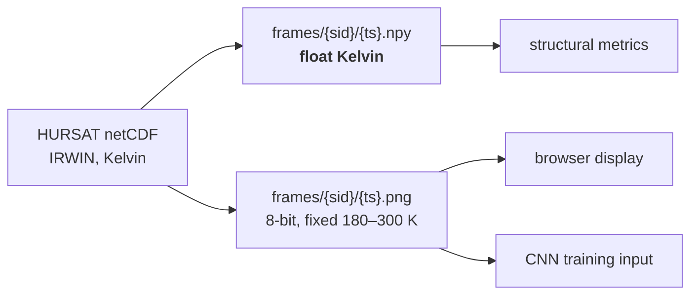
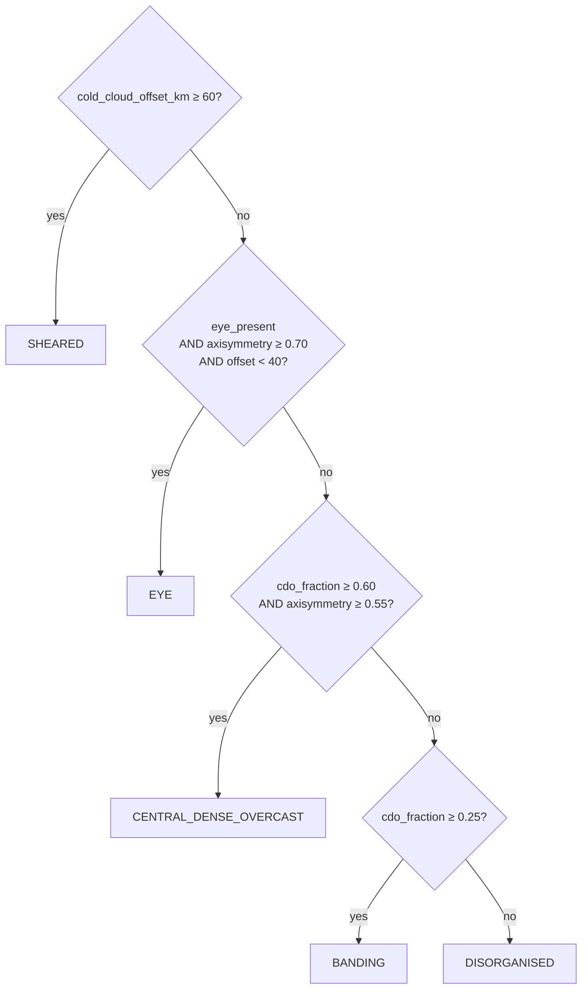
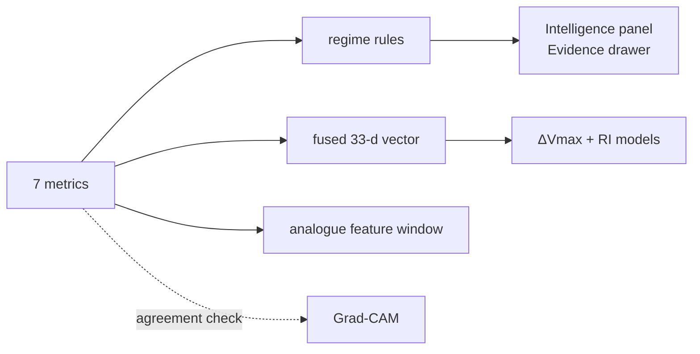

# Structural signature

The scientific core of CycloVision, and the most faithful reading of the problem
statement's word *"patterns"*.

**Implemented and tested in Phase 0.** `ai-service/app/structure/` — `polar.py`,
`metrics.py`, `regime_rules.py`. Nothing here is trained, and nothing needs to be.

---

## What this is, and what it is not

The problem statement asks for *"identification, classification, and prediction of different
tropical cyclone patterns"*. In tropical meteorology, "patterns" is the language of the
**Dvorak technique**: Curved Band, Shear, Eye, Central Dense Overcast, Banding Eye. These
are morphological cloud patterns in infrared imagery.

Reading "patterns" as *morphology* rather than *intensity category* is both more faithful
to the statement and genuinely differentiating — most systems build an intensity classifier
and call it done.

### The constraint that shapes everything

> **There is no free, labelled dataset of Dvorak pattern types at scale.**

So we do not train one, and we do not claim one.

What we do instead: compute the underlying physical quantities a Dvorak analyst reads by
eye — deterministically, from the brightness-temperature field — and assign a morphological
regime with a **transparent rule engine whose thresholds are displayed in the UI**.

This composition is defensible under questioning. A fabricated Dvorak classifier is not.

### Why this is not presented as a Dvorak classifier

| We do | We do not |
|---|---|
| Measure eye geometry, symmetry, convective vigour, cloud displacement | Estimate a Dvorak T-number |
| Assign a Dvorak-*inspired* regime name from stated thresholds | Claim agreement with the Dvorak technique |
| Show every threshold that fired | Claim the regime was learned from Dvorak labels |
| Tag measurements `DERIVED_MEASUREMENT` and the label `RULE_ENGINE` | Tag either `TRAINED_MODEL` |

The regime names (`EYE`, `CENTRAL_DENSE_OVERCAST`, `BANDING`, `SHEARED`, `DISORGANISED`) are
descriptive labels for morphologies we can actually measure. They are **not** validated
against Dvorak analyst assessments, because no such validation set is available to us.

This appears verbatim in the Model Card's "what we did not build, and why".

---

## Input: raw Kelvin, not a picture

The metrics are **physical measurements of a temperature field**. They are meaningless on a
rendered image.



**Why both artefacts.** Quantising to 8 bits over a 120 K range costs about **0.47 K per
level**. `EYE_CONTRAST_MIN_K` is 8.0 K and the deep-convection threshold is a hard cut at
220 K — quantisation error of half a Kelvin is enough to flip frames across those
boundaries. So the metrics read the array and only the browser reads the picture.

The render scale is **fixed, never per-image auto-scaled**. Auto-scaling would make
identical storms look different depending on their background and would destroy
comparability across the training set.

`compute_metrics(bt, km_per_pixel)` takes resolution as a **parameter**, not a constant —
which is what makes an INSAT-3D adapter an ingest-side change rather than a redesign.

---

## Polar representation

Every metric is an azimuthal statistic: how cold the cloud tops are at a given radius, how
much that varies with angle, where the convective ring sits. Awkward on a Cartesian grid,
natural on a polar one.

`to_polar()` resamples once:

| Parameter | Value | Why |
|---|---|---|
| `r_max_km` | 300 | Covers the storm and enough environment for a background estimate |
| `n_r` | 60 | 5 km radial spacing — finer than the ~8 km source |
| `n_theta` | 72 | 5° azimuthal resolution; ample for wavenumber-1, cheap enough for every frame |
| Interpolation | bilinear | |

**Samples outside the input grid are NaN, not clamped.** An undersized input degrades to
missing data rather than silently repeating its edge pixels — which would fabricate
symmetry that is not there.

### The background temperature

`background_temperature()` takes the **median of the 200–300 km annulus**.

Structural metrics describe the storm, not the scene it sits in. Subtracting this background
is what makes the symmetry decomposition comparable between a frame over a warm ocean and
one over a cooler one. Median rather than mean, to resist outlying cold cloud in the outer
annulus.

---

## The seven metrics

Constants are module-level in `metrics.py` and `polar.py`, and every one is a documented
starting point pending Phase 3 tuning.

### 1. `eye_present` / `eye_radius_km`

A warm core **enclosed** by a markedly colder ring. Two conditions, both required:

| Condition | Threshold |
|---|---|
| **Contrast** — warm centre vs the coldest azimuthal-mean ring | ≥ `EYE_CONTRAST_MIN_K` = **8.0 K** |
| **Enclosure** — fraction of azimuths at that ring radius that are actually cold | ≥ `EYE_ENCLOSURE_MIN` = **0.70** |

`eye_radius_km` is where the azimuthal-mean profile falls **halfway** from the warm centre
to the cold ring — a stable definition even when the eye edge is gradual.

> ### The enclosure requirement, and why it exists
>
> The first implementation used only the azimuthal **mean**. A unit test on a synthetic
> sheared storm — cold convection displaced 120 km off centre — failed: the mean profile
> showed a warm "centre" (the background, since the convection was elsewhere) and a cold
> "ring" (where the blob crossed those radii), producing a 23 K contrast. The detector
> confidently reported an eye where there plainly was none.
>
> This is a **real physics bug found by a synthetic test in Phase 0**, before any real data
> existed. The fix encodes the actual definition: an eye is defined by convection
> *encircling* the centre, not merely by a warm-cold contrast in the mean.
>
> Two tests now guard it: displaced convection, and a half-eyewall.

### 2. `min_bt_k`

The coldest cloud-top brightness temperature in the domain. A proxy for convective vigour —
colder tops mean deeper, more vigorous convection.

### 3. `cdo_fraction_100km`

Fraction of pixels colder than `DEEP_CONVECTION_K` = **220 K** within 100 km of the centre.

A proxy for the extent of the central dense overcast. A mature storm has a large,
continuous cold shield over its core; a sheared one does not.

*The literature range for deep convection is roughly 208–220 K. 220 K is a starting point,
tuned in Phase 3.*

### 4. `axisymmetry` — the one with a subtlety

How rotationally symmetric the cloud field is, on a 0–1 scale. Computed over the
50–200 km annulus, averaged across radii:

```
axisymmetry = clip( 1 − mean_r( A1(r) / A0(r) ), 0, 1 )
```

where, for the azimuthal series at radius *r*:

- `A0` = |mean of the perturbation| — wavenumber-0 amplitude
- `A1` = `2·|FFT[1]|/N` — wavenumber-1 amplitude, i.e. one-sidedness

> **The decomposition runs on the *perturbation* field — brightness temperature minus the
> environmental background — not on raw Kelvin.**
>
> This matters enormously. Against raw values, wavenumber-0 is the ~230 K absolute
> temperature, which swamps everything: `A1/A0` would be around 0.02 for every storm, and
> `axisymmetry` would sit pinned near 0.98 regardless of structure. The metric would be
> numerically fine and scientifically worthless.
>
> Removing the background makes wavenumber-0 the storm's own radial signal, so the ratio
> measures what it is meant to.

A perfectly circular storm scores ~1.0; a one-sided sheared cloud mass scores near 0. Both
are asserted by tests.

### 5. `convective_ring_radius_km`

Radius of the minimum of the azimuthal-mean profile, searched in 10–200 km.

In a storm with an eye this is the eyewall. In one without, it is simply where the deepest
convection sits — still the reference the eye contrast is measured against.

### 6. `eye_ring_bt_contrast_k`

Mean eye brightness temperature minus mean eyewall-ring brightness temperature, in Kelvin.

**Directly analogous to the Dvorak eye adjustment**, which is the single most useful thing
to say about it when a meteorologist asks.

### 7. `cold_cloud_offset_km`

Distance from the storm centre to the centroid of pixels colder than `COLD_CLOUD_K` =
**210 K**.

A proxy for vertical wind shear: when shear is strong, deep convection is pushed downshear
and no longer sits over the circulation centre. Tests confirm a constructed 120 km offset is
recovered within 15 km.

---

## The regime rule engine

`regime_rules.py`. Transparent thresholds over the metrics, returning both a label and the
exact rules that fired.



### The thresholds

| Constant | Value | Used for |
|---|---|---|
| `SHEAR_OFFSET_MIN_KM` | 60.0 | SHEARED |
| `EYE_SYMMETRY_MIN` | 0.70 | EYE |
| `EYE_SHEAR_OFFSET_MAX_KM` | 40.0 | EYE |
| `CDO_FRACTION_MIN` | 0.60 | CDO |
| `CDO_SYMMETRY_MIN` | 0.55 | CDO |
| `BANDING_CDO_MIN` | 0.25 | BANDING |

**All uncalibrated in Phase 0.** The component is registered *unavailable*, so its output
stamps `DEMO_DATA` rather than `RULE_ENGINE` — the label is not trustworthy until the
thresholds are tuned on held-out storms in Phase 3.

### Why SHEARED is checked first

Displaced convection **overrides** an apparently cold, symmetric core. The cold shield is
real, but it is no longer over the circulation centre, so calling it a CDO would misdescribe
the storm.

A test asserts this explicitly: a field with `cdo_fraction = 0.9`, `axisymmetry = 0.8` and a
150 km offset classifies as `SHEARED`, not `CENTRAL_DENSE_OVERCAST`.

### `rulesApplied[]` — the transparency mechanism

Every classification returns the thresholds that produced it, with the actual values
substituted:

```json
[
  "eyePresent == true",
  "axisymmetry (0.89) >= 0.70",
  "coldCloudOffsetKm (9) < 40"
]
```

Rendered verbatim in the Evidence drawer. **A label a viewer can check is worth more than a
confident one they have to trust** — and it is what allows this to be presented as a rule
engine without embarrassment.

### Absent input yields no label

`classify(None)` returns `regime=None`, `label=None`, `rulesApplied=[]`. A frame with no
imagery genuinely has no regime, and guessing one would be worse than saying nothing.

---

## Two provenance stamps, deliberately

`StructureBlock` carries **`metricsSource` and `regimeSource` separately**.

| | Tag | Standing |
|---|---|---|
| The seven metrics | `DERIVED_MEASUREMENT` | Deterministic physics over real data. Reproducible, unit-tested, not fitted. |
| The regime label | `RULE_ENGINE` | An interpretation layered on top, with human-chosen thresholds. |

Merging them would let a hand-written threshold borrow a measurement's credibility. Keeping
them apart is what makes it honest to display the regime prominently.

---

## Validation

Synthetic fields with known answers — which is why these tests run in Phase 0, before any
dataset exists.

| Fixture | Asserts |
|---|---|
| Perfect annulus (warm eye, cold circular eyewall) | `axisymmetry > 0.95`; eye detected; contrast ≈ constructed; ring radius ≈ constructed |
| One-sided blob, 120 km offset | `axisymmetry < 0.5`; **no eye**; offset recovered ±15 km |
| Half-eyewall | **No eye** — enclosure fails despite strong contrast |
| Uniform warm field | No eye; `cdo_fraction = 0` |
| Uniform cold field | `cdo_fraction = 1.0` |
| Field with NaN corner | Metrics remain finite |
| Non-2-D, all-NaN, zero pixel size | Raise `ValueError` |

Real-data validation is **Phase 2** work: run the metrics across a real storm's lifetime and
confirm that `axisymmetry` and `eye_ring_bt_contrast_k` behave sensibly through
intensification and decay. That is a sanity check, not a ground-truth comparison — no
labelled structural ground truth exists.

---

## Where this feeds



**The Grad-CAM pairing is the payoff.** The metrics locate the eyewall ring independently of
any network. When Grad-CAM shows the CNN attending to that same ring, the agreement is a
real validation signal rather than a decorative heatmap — and that is a sentence worth
saying out loud in a demo.

**The scientific bonus:** if `axisymmetry` and `eye_ring_bt_contrast_k` land among the top
SHAP features for 24 h intensity change, that is a genuine, reportable finding — and it
demonstrates *why* image + track fusion beats track alone. If they do not, we report that
honestly; the ablation table tells a real story either way.

---

## Limitations

- Thresholds are documented starting points, not tuned results, until Phase 3.
- Requires Kelvin values; an 8-bit display PNG is insufficient input.
- Assumes a storm-centred tile — true for HURSAT-B1, must be checked for any other source.
- Single infrared channel: no water vapour, no microwave, so nothing about the low-level
  circulation beneath the cloud shield.
- The regime taxonomy is **not validated against Dvorak analyst assessments**, because no
  such validation set is available.
- `cold_cloud_offset_km` is a shear *proxy*, not a shear measurement.
